<aside>
😀 购买境外电话卡时运营商通常会提供两种电话卡，一种是实体电话卡，就像国内三大运营商发行的手机卡。另外一种是eSIM电话卡，eSIM不是传统意义上的外置卡，它不需要卡槽，手机在出厂时就已经集成到硬件设备中了，购买电话卡后，只要扫描二维码即可将数据写入到这个eSIM芯片中，是一个支持读写可编程的SIM卡，并且支持写入多个eSIM，也就是说一部手机上可以有多个手机号码。eSIM卡多存在于境外手机上，目前国行及港行的安卓苹果手都不支持e-SIM卡。为了能使用境外的电话卡或流量卡，催生出了不同的解决方案，[像esim.me](http://xn--esim-957f.me/)，[5ber.com](http://5ber.com/)，[estk.me](http://estk.me)都是为了解决这个问题而出现的。今天我们介绍其中的一种，5ber卡。

</aside>



[ 【 **Youtube上观看** 】 ](https://youtube.com/watch?v=iDbL76m526c)

**网站链接**

* **1、5ber官网**：[https://esim.5ber.com/?language=zh-CN](https://esim.5ber.com/?language=zh-CN)
* **2、手机型号查询：**[https://esim.5ber.com/supportdevice?language=zh-CN](https://esim.5ber.com/supportdevice?language=zh-CN)
* **3、5ber-APK下载：**[https://5beresim-file.oss-cn-hongkong.aliyuncs.com/](https://5beresim-file.oss-cn-hongkong.aliyuncs.com/5berAPP/apks/030cf8906381e33847310a8e5078a907/5ber.eSIM.apk)

## 1、5ber卡是什么？

5ber卡**是一款可写入多个esim配置文件的外置SIM卡**，**是承载e-sim的容器**，特别**适合**手机**不支持原生eSIM功能的用户**。通过配套的5ber APP，可以**管理**和下载多达**15个不同国家的eSIM配置文件**，快速切换全球网络，再也不用更换实体卡。并且更吸引我的是，通过与全球的eSIM流量卡配合使用，在国内可随时使用海外的流量、及自带的国外纯净IP资源，在轻松实现手机号码及网络自由切换的同时，完成国外应用国内保号的操作。因此这款卡片不仅适合商务人士、跨国工作者，频繁出国旅行的用户、同时也适合需要境外纯净IP保号人士，不管是漫游网络还是进行本地保号，操作都很方便。

## 2、如何购买5ber卡？

购买5ber卡非常简单，只需访问[官网](https://esim.5ber.com/order?language=zh-CN)即可。

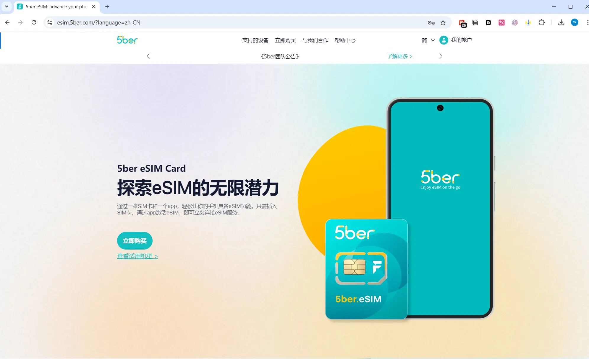

5ber卡现在有Standard、Premium和Ultra三种版本可选，价格分别是12美元、25美元、28美元。

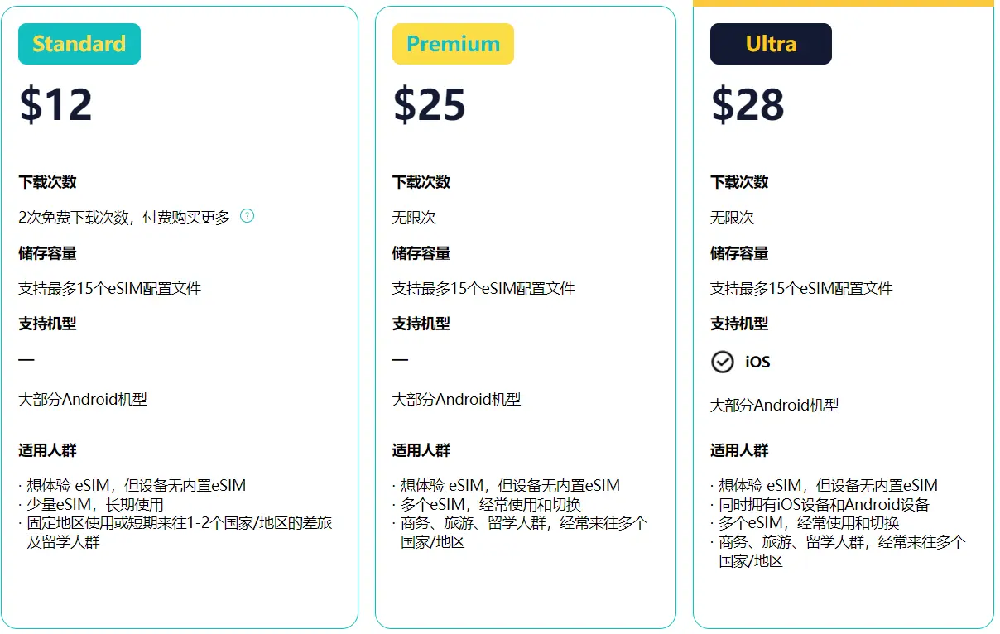

Premium支持全球网络切换，而Ultra版本对iPhone用户更加友好，现在可以直接通过iPhone切换eSIM配置。

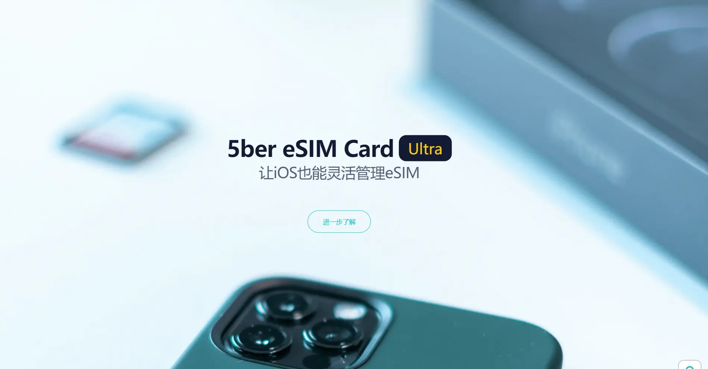

之前只有前两个版本，无法在iPhone中切换eSIM配置，Ultra版本是最近更新版本，增加了对iPhone的支持。Standard版本最便宜，只需要12美元，但只能免费下载两次e-SIM，如果超过下载次数需要单独付费。后两个版本一次性付费不限下载次数，但价格高于Standard版本。如果你是e-SIM的重度使用者，后两款会更合适。

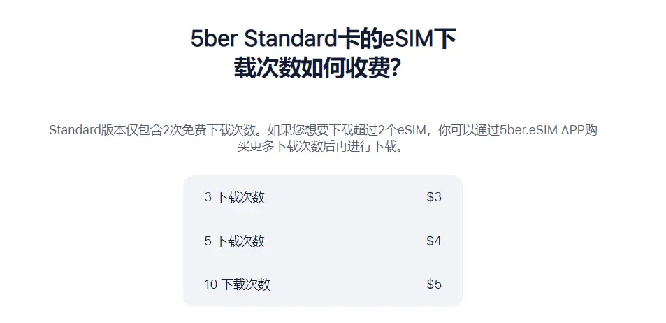

在官网选好适合你的卡片后，通过邮箱验证即可完成订单，整个购买流程不到几分钟，并且支持国内发货，简单快捷，如果你在国内大概三天就能收到。填写自己国内真实信息即可。并且支持支付宝及微信支付

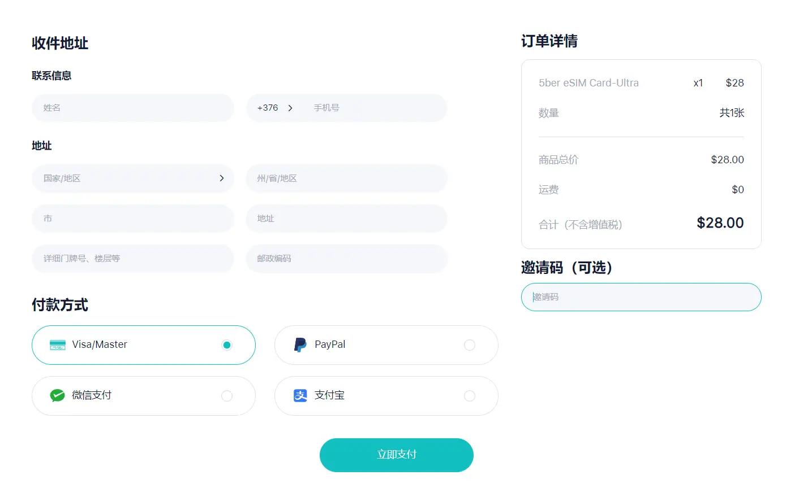

但需要注意的是，购买前一定要查询下自己的手机是否支持，
有三种查询方法，**第一种方式**是在官网直接查询支持的手机型号

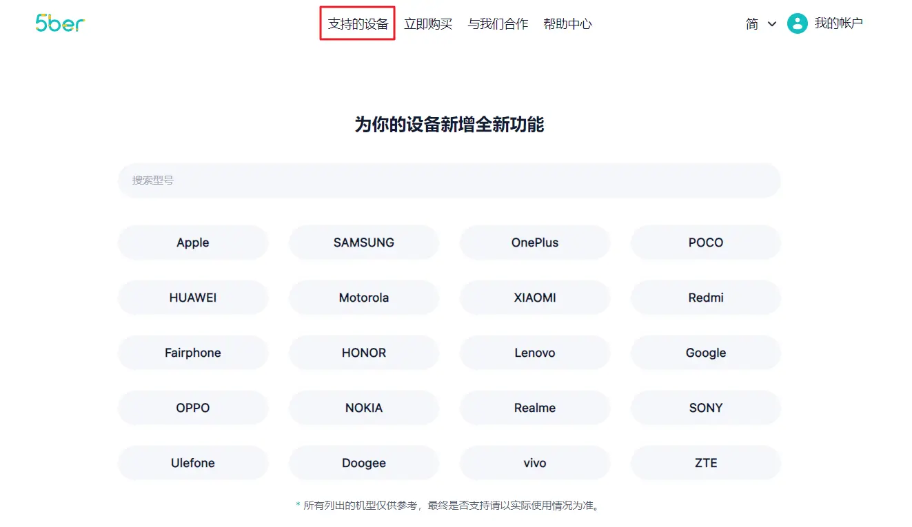

**第二种方式**在应用商店下载ber应用程序，点下面的人形图标，在点设备信息，查看兼容卡槽项下面是否显示了支持的卡槽，如果手机支持5ber卡，会显示那个卡槽是支持的，因为我的手机有两个sim卡槽，显示的是SIM1，说明只有sim1卡槽支持5ber卡，sim2卡槽不支持。

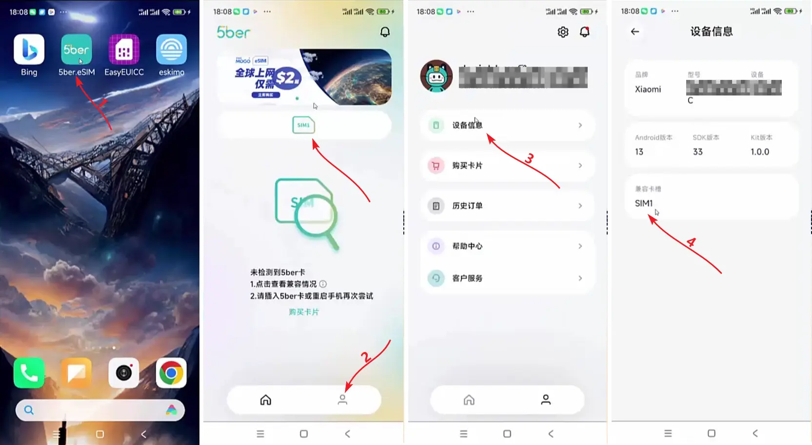

**第三种方式**直接官网联络客服，咨询自己的手机是否支持5ber卡。

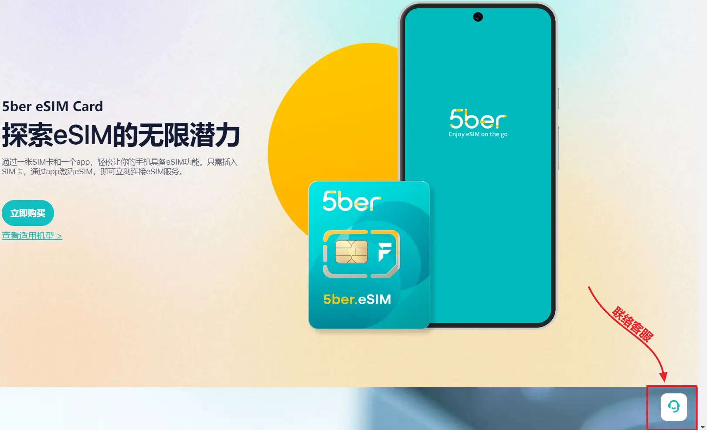

另外在购买提交后，一定留意fiveber弹出的优惠活动提示，别错过了。我在购买时免费赠送了1G的eskimo全球流量，如果这个优惠活动还在，小伙伴一定要拿到。

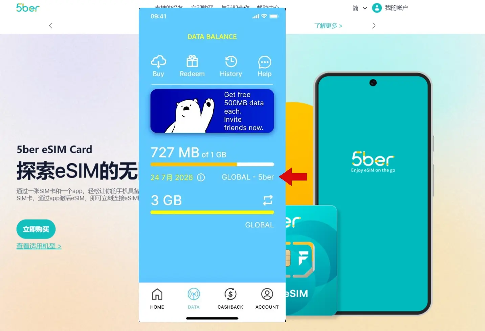

这个eskimo全球流量国内使用时走的是新加坡，获取的是新加坡移动运营商的IP地址，是双isp属于住宅IP地址，可以在国内申请注册像Talkatone这样，对网络要求严格的免费应用。

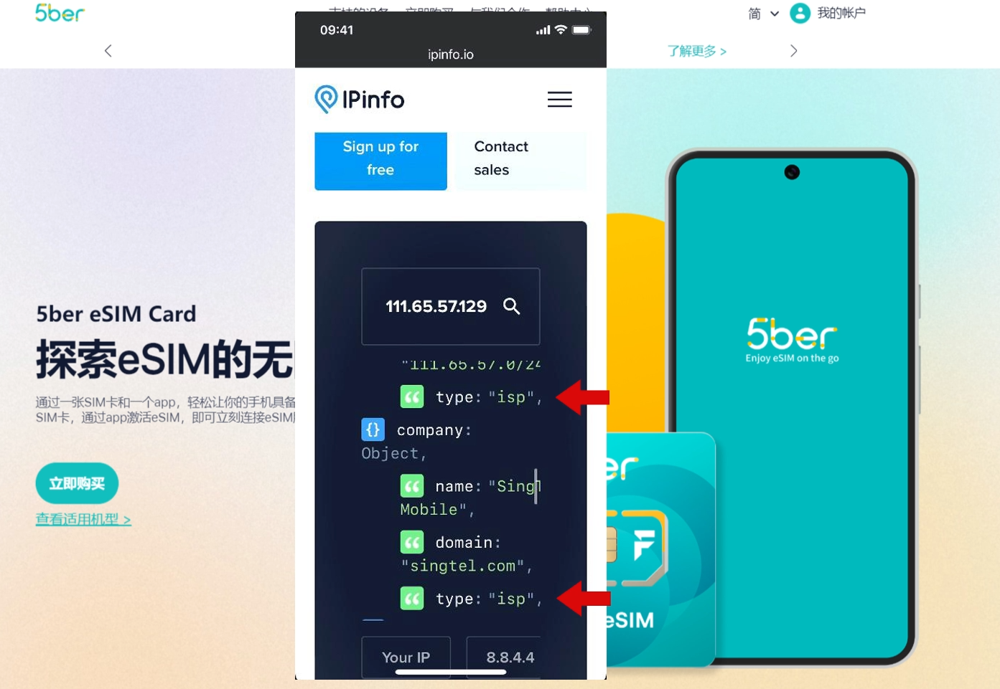

> **Eskimo流量：**[https://s.ospace.top/mw9qyz](https://s.ospace.top/mw9qyz)
Eskimo是流量卡，非电话卡不带电话号码，**支持80多个国家/地区漫游**，从第一次激活使用流量开始计算，长达**2年有效期**，并且非免费赠送流量**可结转**到其它Eskimo账户。
购买中国区域流量或全球流量，如果在中国使用走的是**新加坡网络链路**，获取的是新加坡的**住宅IP**，非常**适合申请国外应用及保号**。注册时填写邀请码（BD995）可获得500MB
免费全球数据流量。
> 

## 3、如何安装与使用5ber卡？

安装和使用5ber卡也非常直观，分几步进行：

**下载5ber APP**：通过Google Play商店或者官网下载APK文件，安装到你的设备中。

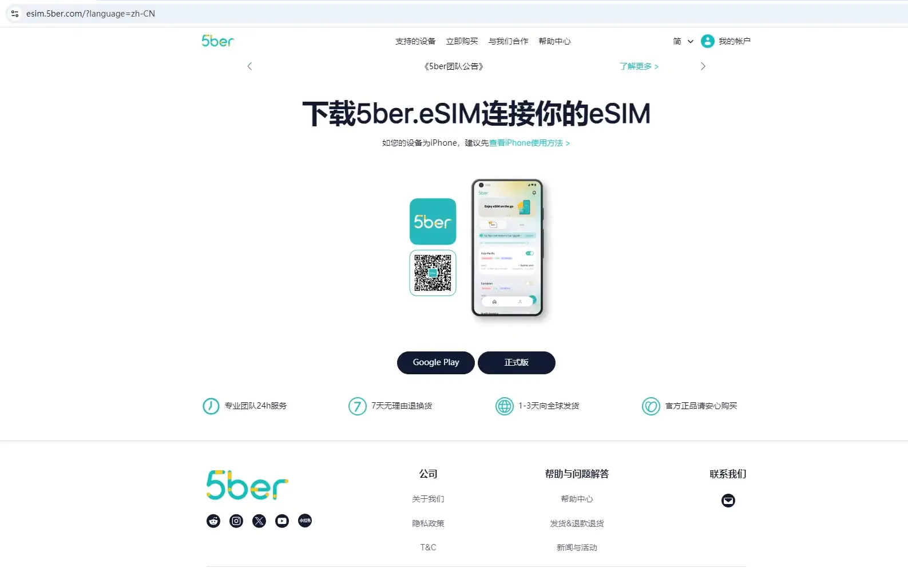

**登录APP：**使用购买时的邮箱登录5ber APP。这里你将能管理所有的e-SIM配置文件。

**下载e-SIM配置文件：通**过扫描运营商提供的二维码，将e-SIM文件下载到5ber卡中。

**切换eSIM：**当你安装了多个eSIM文件后，只需在APP内选择你需要激活的网络，即可实现全球网络的快速切换，整个过程几乎不需要插拔实体卡。

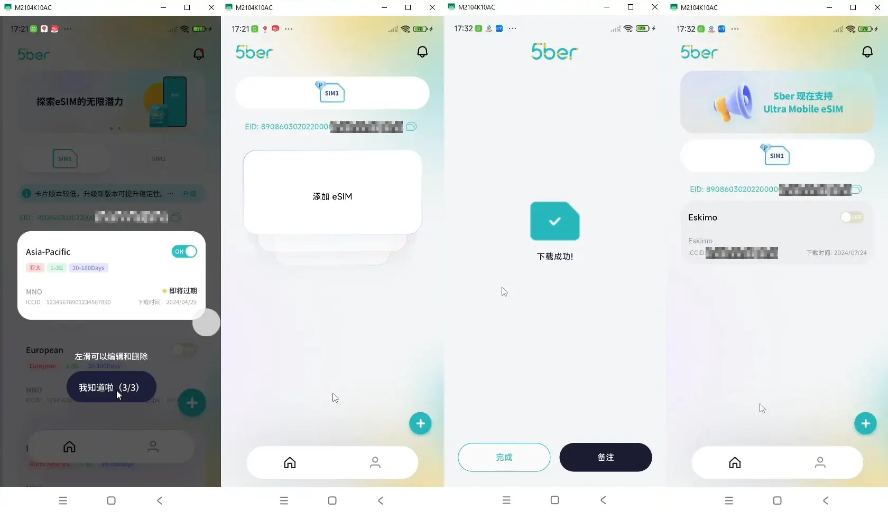

这样我们就可以在国内使用这个e-SIM电话注册国外应用，接打电话，收发短信。同时还可以写入支持国内漫游的流量套餐，让我们在国内可以随时随地开启国外流量，获取纯净的国外IP，完成对网络要求严格的应用注册访问保号操作。

## 4、注意事项

使用5ber卡时，有几点需要注意：

**存储限制：5**ber卡最多可以存储15个e-SIM配置文件，虽然已经能覆盖大多数国家，但建议你定期管理不常用的文件，避免存储空间不足。

**iPhone用户注意：**Ultra版本现在支持iPhone设备直接切换已下载安装的e-SIM，其他版本需要借助安卓设备来进行安装删除及切换操作。

**切换延时：**切换e-SIM时，可能需要几分钟时间来完成运营商的网络注册。因此建议你在切换网络前，提前进行操作，避免网络断开影响使用。

## 5、优缺点分析

### 优点

#### 全球网络切换便捷：

再也不需要频繁更换SIM卡，5ber卡通过APP轻松实现全球网络切换。

#### eSIM流量卡支持：

可以随时切换5ber中不同地区的国外流量，非常适合长时间在国外生活或出差的人士，和需要在本地使用境外流量进行保号操作的小伙伴。

#### 适用性广：

不论你的手机是否支持e-SIM，5ber卡都能适配大部分设备，尤其适合国行版手机用户。

### 缺点：

#### 需要APP管理：

所有操作必须通过5ber APP来完成，对于不习惯使用APP管理的用户来说，可能需要一些适应时间，并且还不能在iPhone中进行写入删除操作，只能在安卓手机中进行。

#### 存储容量有限：

每张5ber卡的存储容量是有限的，需要定期清理和管理安装的e-SIM配置文件。

## 6、5ber卡与其他卡的对比

与传统的SIM卡和普通e-SIM相比，5ber卡着有明显的优势

### 与eSIM的区别：

虽然e-SIM技术是国外大部分手机厂商的默认配置，但像**国航**发行的**手机**，不管是安卓还是苹果都**不支持原生的e-SIM卡**，这其中**包括香港发行的手机**。而5ber卡完美解决了这个问题，只要有一张5ber卡，无论是国行安卓手机还是iPhone手机，都能正常在国内接打电话、流量上网、接收国外短信。

### 与传统全球漫游SIM卡相比：

**一卡托多卡**，全球漫游**无需频繁插拔更换SIM卡**，通过软件**轻松**实现**网络切换**，避免了繁琐操作，无需担心错过重要的电话或短信，尤其适合那些需要频繁切换国家或运营商的用户。重要的是，通过**与eSIM流量卡配合**使用，不仅可以**漫游到世界各地**，也可让小伙伴在国内轻松**获得纯净的国外IP**及**当地流量**，更利于进行本地保号操作。

## 7、总结

总的来说，5ber卡不仅让你轻松实现全球网络切换，还能通过e-SIM流量卡的配合，解决你在国内外通信的所有问题。如果你经常旅行、跨国工作或者需要使用多个国家的网络，5ber卡无疑是你的最佳选择。现在就访问5ber官网，购买适合你的版本，开启全球畅联的自由之旅吧！

## 8、实用工具

【机场**Mitce**】：[**https://s.ospace.top/3tps6w**](https://s.ospace.top/3tps6w)
100GB/**0.60**美金/月、500GB/**1.2**美金/月、1000GB/**2**美金/月，不计量套餐/**3**美金，四款套餐可选。
关键是他们每款套餐中都包含**住宅IP**链路。
支持Windows、Android、macOS、iOS/iPadOS、Router多种客户端订阅，注册、养号、上网好帮手。
**9折优惠码：**（S4E6U9）