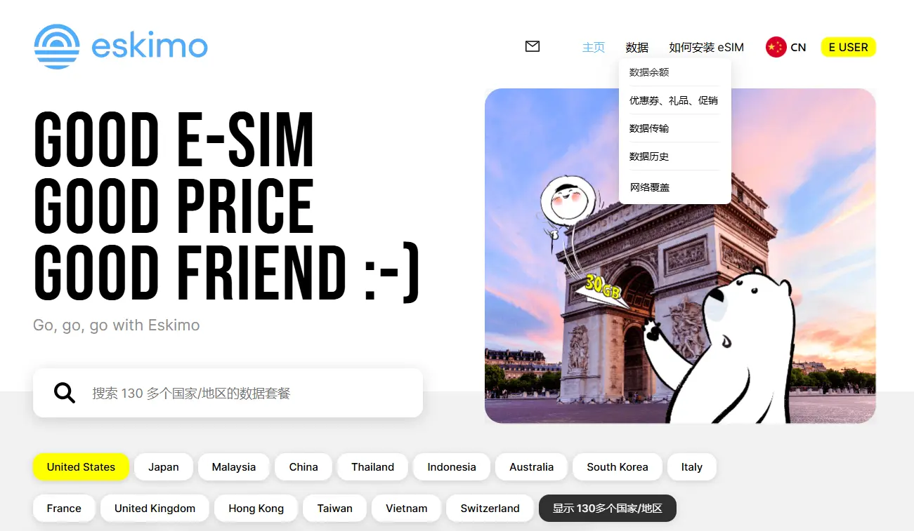
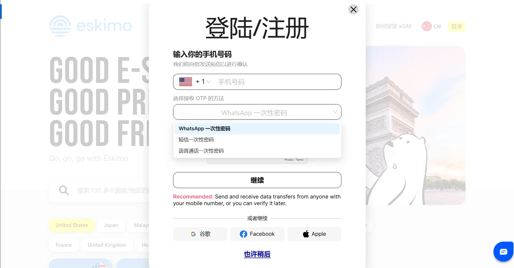
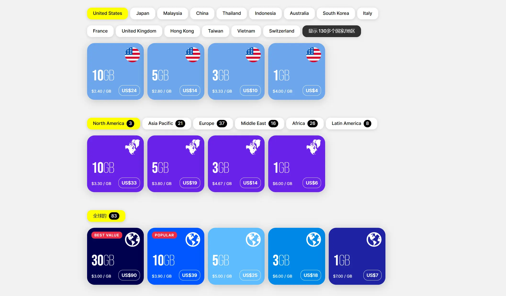
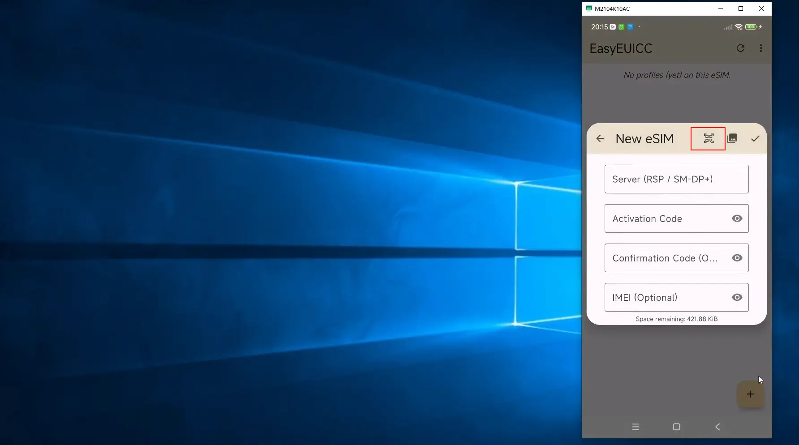

<aside>
😀 这期内容分享的是一款可注册海外应用，并可作为长期保号的eSIM流量卡，【eskimo流量卡】。这个卡可在国内漫游，有超长的有效期，属于新加坡电信运营商，拥有纯海外流量及原生家庭宽带IP，能支持无障碍访问注册多种海外应用，是一款不可多得的流量卡。

</aside>



[ 【 **Youtube上观看** 】 ](https://youtube.com/watch?v=ovrrXjMgnCY)

## 前期准备

### 支持 eSIM 的手机或有外置eSIM实体卡
### 需要科学上网

## Eskimo应用下载

* **安卓商店：**[https://play.google.com/store/apps/details?id=travel.eskimo.esim](https://play.google.com/store/apps/details?id=travel.eskimo.esim)
* **苹果商店：**[https://apps.apple.com/app/id1590276868](https://apps.apple.com/app/id1590276868)

## Eskimo能带给我们什么？

### 1、新加坡本地网络

Eskimo可通过**联通4G网络**在**国内漫游**，访问的是**新加坡当地SINGTEL网络**，分配的是**新加坡本地家庭宽带IP**，使用的是**新加坡本地原生流量**，有多种套餐支持漫游130多个国家和地区。拥有[双isp属性]()。

### 2、超长有效期：

这是一款拥有超长有效期的流量卡，Eskimo所有数据计划都拥有**长达 2 年的有效期**，是我知道时效最长的流量卡，没有之一。

### 3、人性化的时效设计

eskimo的**计时周期**是**从第一次联网激活时开始计算**，不是从购买时开始计算。也就是说买了新套餐在**没有使用**的情况下，**不计算时效**。如果中有多个套餐，上一个套餐用完会自动衔接下一个套餐，并且新套餐下同样从第一次联网时开始计算时效，不像其它运营商购买后就开始计时了。让我们拥有更长的有效期。

### 4、流量可转移给他人：

购买的流量可以转送给其它eskimo账户，并且可以无限次发送/接收转送的流量。只有付费流量才可转送。

### 5、支持个人热点：

eskimo虽然不支持多端同时使用，但支持手机热点，可以作为其它设备的wifi热点共享流量数据。并且使用过程中不限速不限量

### 6、客服专业：

通常使用在线提问或邮件方式进行咨询，提到的问题都能快得到回复，并且支持中文提问沟通无障碍。

## 手中设备是否支持Eskimo？

如果目前使用的是,中国/澳门或香港购买的安卓或iPhone手机，目前是不支持 eSIM的。

如果想使用e-SIM，可以通过[5ber卡]()或[estk卡]()这种外置卡来使用eskimo流量卡。

如果您使用的是原生支持eSIM的手机，打开eskimo网站，在如何安装eSIM中，可以看到检测设备兼容性的选项，打开支持设备列表能看到eskimo目前支持的所有手机设备。

## Eskimo账户是如何注册的？

账户注册过程非常简单，输入手机收验证码验证即可，国内国外手机都可注册，
接码有三种方式，whatsAPP接码，短信接码，语音电话接码，默认是whatsApp方式，可选其中任意一种。注意注册或登录时要验证是否是机器人，所以需要开启科学上网，并且有无法接到验证码的现象，如果无法接码可考虑在手机上安装eskimo应用APP。后面的姓名，国籍、生日等信息可以任意添加，但邮箱要填写真实的邮箱。注册时填写邀请码可得到500MB免费全球流量，500兆看着不多但足够完成多次e-sim配置文件下载了，而且这500兆流量同样拥有长达两年的有效期。

## 怎么购买流量套餐？

Eskimo流量卡有三种形式的套餐，**全球套餐**，**区域套餐**和**单独国家套餐**，购买流量套餐，
注意Eskimo是纯流量卡不带手机号码，PC端可以通过 Eskimo网站进行购买，手机上可以通过eskimo应用程序进行购买。
购买完成后系统会将eskimo卡配置文件发送到注册邮箱，只要扫描二维码就可添加到e-sim手机或外置e-sim卡中。
再次购买新套餐无需重新安装 eSIM，当套餐用完时，它将无缝连接到您的新套餐（国家/地区/全球），不会浪费数据。

可用国内发行的Master，VSIA外币卡支付费用，
流量自带新加坡IP地址，打开即外网无需vpn，可直接访问，注册保号无限制
第一次激活使用开始计算时效，有效期两年，eskimo的流量套餐都拥有长达两年的有效期

## Eskimo eSIM 怎么安装 ？

eskimo为我们提供了下载链接，或者到安卓或苹果的应用市场中搜索'eskimo'然后下载安装，详细安装过程可参考【[5ber卡]()或[estk卡]()】这两篇文章。

Eskimo 流量卡默认接入中国联通网络，因此需要开启手机数据漫游功能
Eskimo eSIM卡支持5次下载写入，每次写入前需删除上一次写入的eSIM

## **优点与不足：**

**优点：**

1、超长有效期：**拥有两年超长有效期
**2、人性化时效设计：“**有效期从第一次激活时开始计算：购买的流量从激活时开启计算有效期，卡中其它流量套餐遵循先买先用瞬间激活，也就是只要有流量没用户，新购买的流量就不会激活。
**3、套餐之间无缝衔接：**上一个套餐用完自动衔接到下一个套餐
**4、流量可互转：**流量可转移给他人：除了免费赠送的流量外，购买的流量可转送他人的eskimo账户，500兆起送。
**5、支持个人热点：**eskimo不支持多端同时使用，但支持热点共享流量数据。
**6、不限速不限量：**每日流量不限制使用数量，也不限制使用速率。
**7、支持免费下载：**拥有最多5次免费下载次数
**8、原生本地流量：**
**9、中文客服：**支持中文提问和回复。

**不足：**

**1、是纯流量卡：**eskimo是纯流量卡不含手机号，如果只为接码eskimo不太适合
**2、需要验证登录：**需要机器人登录验证，并需开启科学上网
**3、电脑端有时不能接码：**有时国内网页端登录收不到验证码（可通过eskimo手机应用登录），只能在手机端操作
**4、手机注册限制：**每个手机号只能注册一个eskimo账户，不能再次注册新账户

## [ 实用工具 ]

* **1、自用机场Mitce：** [https://s.ospace.top/3tps6w](https://s.ospace.top/3tps6w) **9折优惠码**：（ **S4E6U9** ） 
100GB/0.60美金/月、500GB/1.2美金/月、1000GB/2美金/月，不计量套餐/3美金，四款套餐可选。
关键是他们的套餐中包含住宅IP链路。
支持Windows、Android、macOS、iOS/iPadOS、Router多种客户端。

* **2、Eskimo流量卡：** [https://s.ospace.top/mw9qyz](https://s.ospace.top/mw9qyz)
**邀请码：BD995** 得500MB两年有效期的免费全球数据流量。
Eskimo是流量卡不含号码，支持80多个国家/地区漫游，从第一次激活使用流量开始计算，长达2年有效期，并且非免费赠送流量可转送到其它Eskimo账户。
购买中国区域流量或全球流量，如果在中国使用走的是新加坡网络链路，获取的是新加坡的住宅IP，非常适合申请国外应用及保号。
* **3、ReadteaGO流量卡:** 
ReadteaGO链接: [https://esim.redteago.com/?c=i5oq82b3](https://esim.redteago.com/?c=i5oq82b3) 
ReadteaGO优惠码（**5% 折扣**）：**RTGF8F49L**
* **4、域名注册Namesilo：**[https://www.namesilo.com/](https://www.namesilo.com/)  （**Coupons优惠码：092368xb**）
* **5、SMS-Activate优惠链接：**[https://s.ospace.top/9tz](https://s.ospace.top/9tzyrx)