<aside>
😀 ESTK卡的购买安装及使用，安卓系统中使用ESTK，iPhone中使用ESTK，说明为什么要提前写入流量卡，哪些情况下需要提前写入流量卡，Cloud Enhance云增强功能开启设置，与5ber的不同之处

</aside>



[ 【 **Youtube上观看** 】 ](https://youtube.com/watch?v=oICwwfwktGo)

## 工具链接

* **1、ESTK官网：**[https://www.estk.me](https://www.estk.me/)
* **2、EasyEUICC工具（安卓）：**[https://gitea.angry.im/PeterCxy/OpenEUICC/releases/download/unpriv-v1.0.0/app-unpriv-release.apk](https://gitea.angry.im/PeterCxy/OpenEUICC/releases/download/unpriv-v1.0.0/app-unpriv-release.apk)

* **[ 视频内容介绍：]**
ESTK卡的购买安装及使用，安卓系统中使用ESTK，iPhone中使用ESTK，说明为什么要提前写入流量卡，哪些情况下需要提前写入流量卡，Cloud Enhance云增强功能开启设置，与5ber的不同之处

## 1、Estk卡是什么？

estk卡是与5ber卡功能类似的外置esim卡，能让我们在安卓或iPhone手机中直接下载，切换，删除esim卡，无需借助App管理程序。

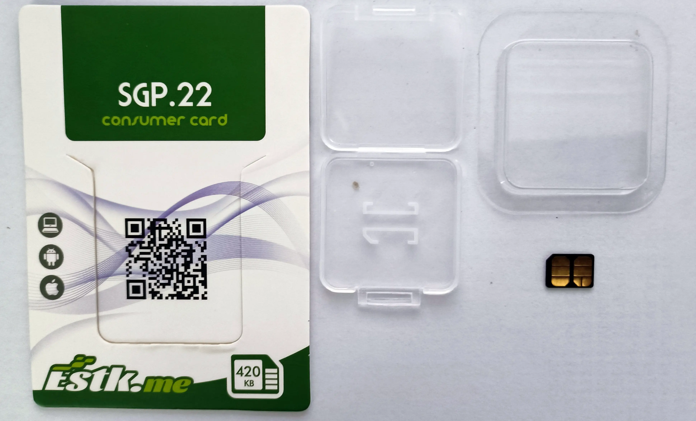

与5ber不同之处在于，5ber卡以前的版本都不支持iPhone上中管理e-sim。虽然新推出了Ultra卡实现了iPhone中切换esim，并不能完全在iPhone上进行管理，还需安卓系统的协助。
目前大部分小伙伴选择外置e-sim实体卡，主要还是为了方便**办理海外运营商的电话卡**。由于e-sim**可以在线购买**，**电子邮件发送**，并且只需**扫描二维码即可添加**，**不用邮寄实体卡**，快捷方便。所以无论是接收验证短信，注册海外服务，还是流量保号，或iPhone中使用完整的esim管理功能，estk卡一定是iPhone重度使用者的首选。

## 2、如何购买ESTK卡？

打开官网，打开产品页面就能看到产品介绍及订购按钮

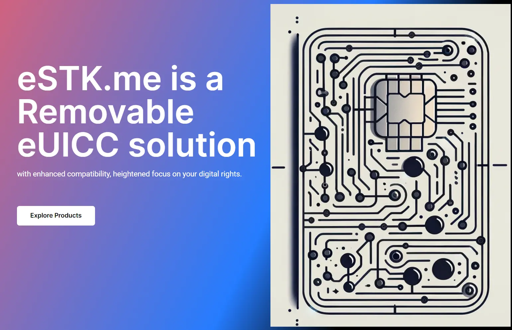

目前estk有两个版本，**lite版本**和**eco版本**，lite版本只能写入3张esim卡，并且不支持iPhone写卡操作，功能被限制了很多，如果想使用受限功能需要额外购买授权。eco版本是全功能版本，支持在安卓手机和iPhone上顺畅管理e-sim，没有下载次数限制，可自由切换、添加、删除eskt中的esim，是全功能的外置esim卡，因此高级版本更具优势。

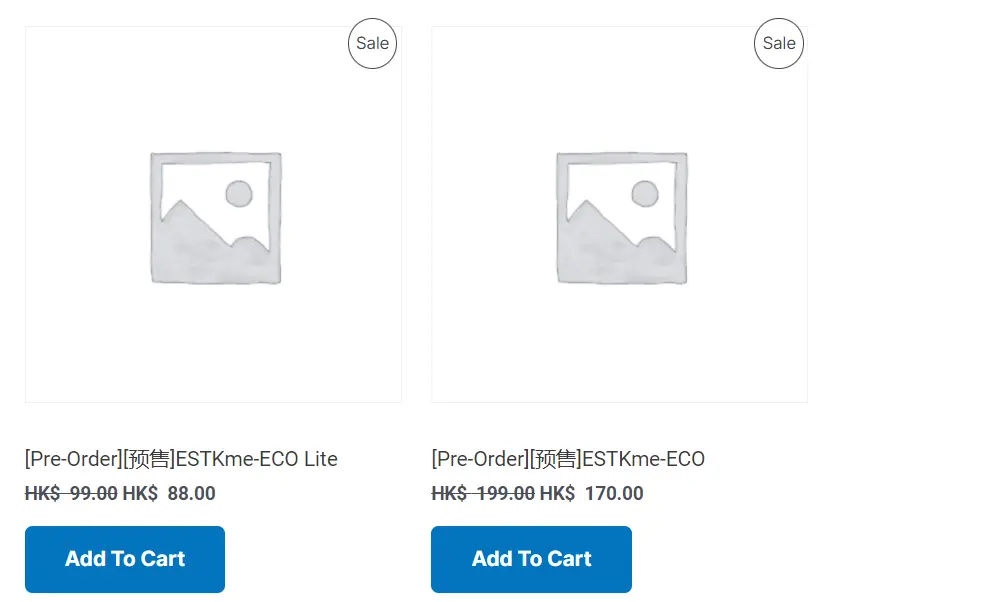

另外要特别注意的是，如果你手中只有**iPhone手机**，拿到这张estk卡后并不是即插即用的，**需要**使用安卓手机**事先写入一张流量卡**，并且设置为激活状态，才能在iPhone中正常添加esim。

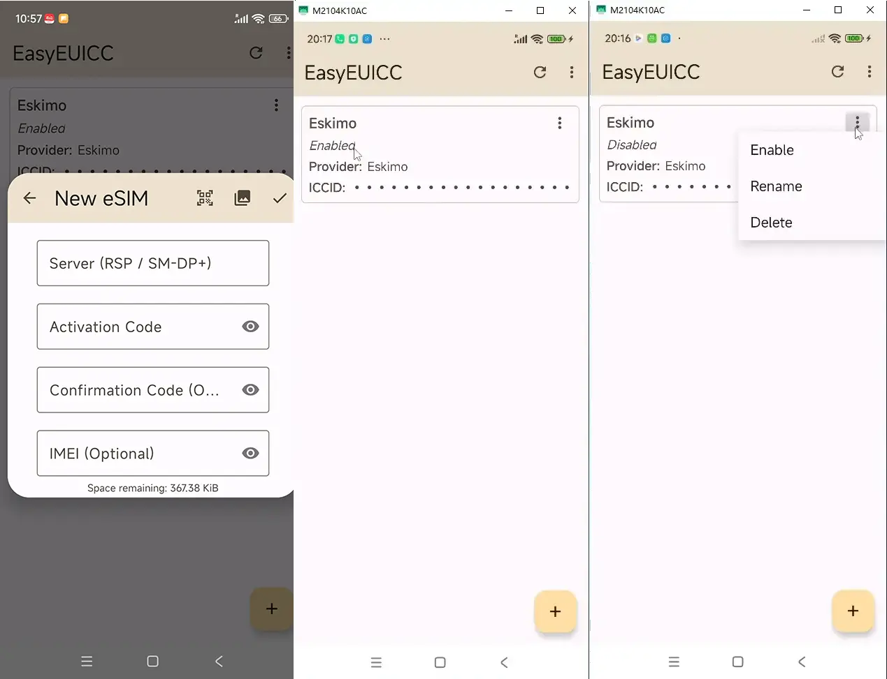

购买过程很简单，提交订单付款即可，收取的是港币，可以使用信用卡支付，也可使用微信，支付宝支付。收件地址中可直接填写中文，快递从国内发出几天就能收到。

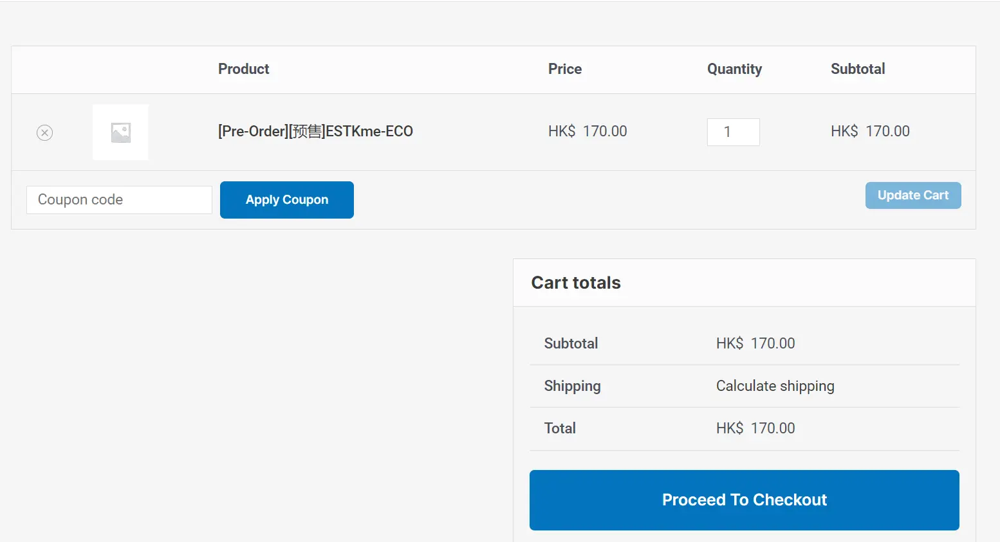

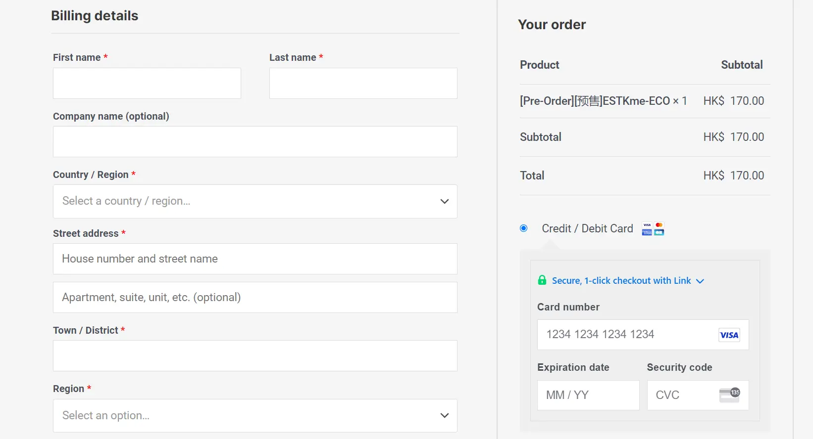

收到后是这样的，是个简易包装，

## 3、检测手机是否支持管理estk卡

安装 [**EasyEUICC](https://www.estk.me/wp-content/uploads/2024/07/EasyEUICC-1.0.0.apk)** 开源软件检测安卓手机是否支持，EasyEUICC是托管到github上的开源项目，可免费下载使用。官方提示EasyEUICC目前只能运行在安卓9以上的系统中。

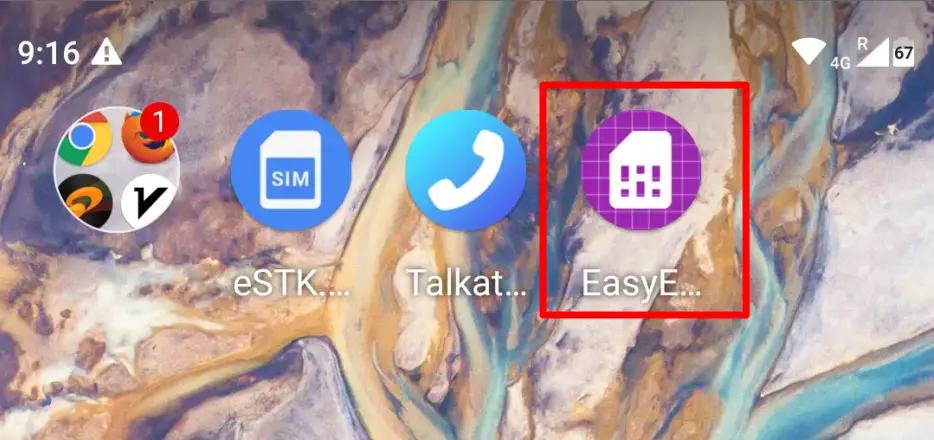

**兼容性检测（Compatibility Check）**

如果**System Features，OMAPI Connectivity**这两项是勾选状态，说明手机支持ESTK卡。

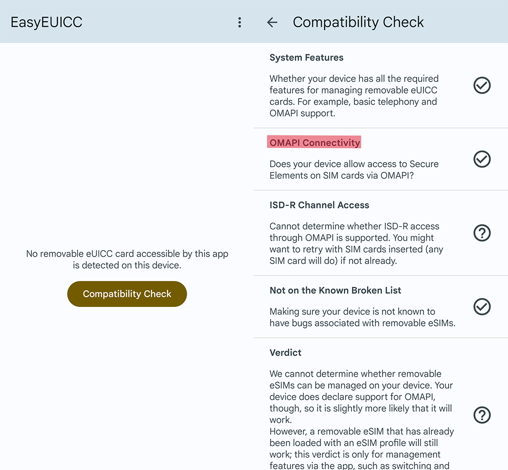

如果**EasyEUICC提示不支持**，初次下载esim之前要先写入一张带流量的esim卡，这张卡可以是一张带流量的e-sim电话卡，也可以是一张纯流量卡。这个操作只有在手机不支持时才会用到。

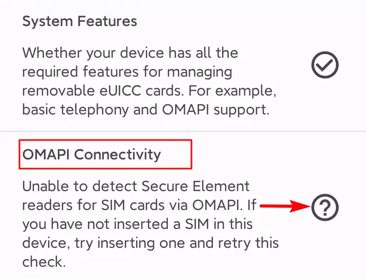

比如带电话号码及流量的 [**ReadteaGO**](https://esim.redteago.com/?c=i5oq82b3) 卡，只有流量的[**Eskimo**](https://s.ospace.top/mw9qyz)卡，或者其它任何一种卡都可以，只要卡中有可以使用的流量。

ReadteaGO优惠码（**5% 折扣**）：**RTGF8F49L**

Eskimo邀请码**：BD995**

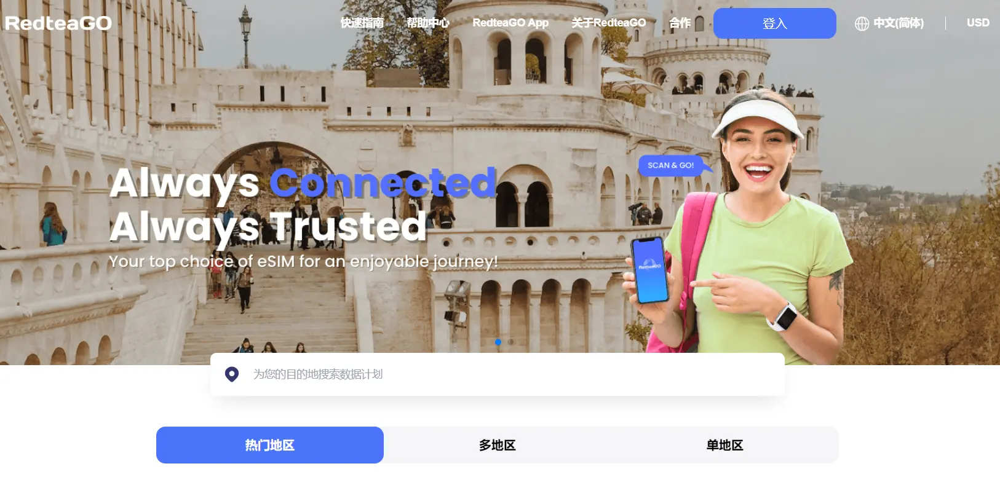

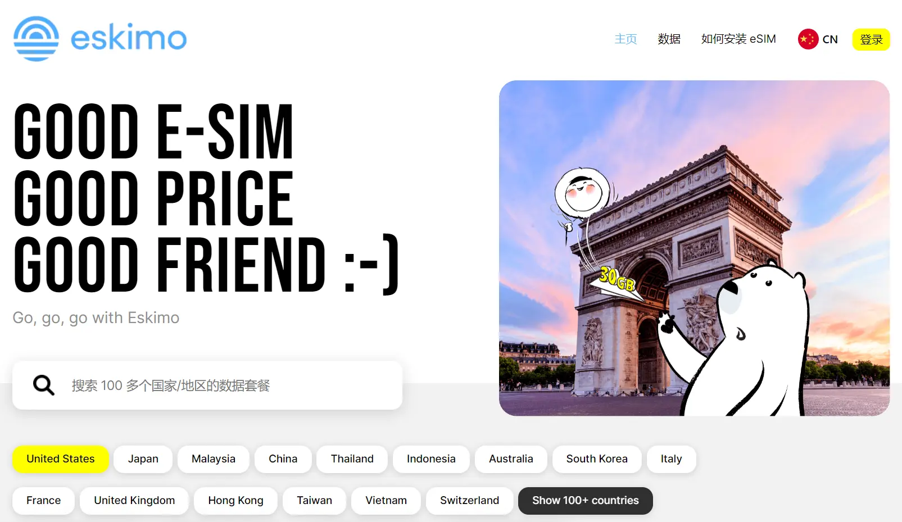

## 4、安卓端管理e-sim

 安卓手机中管理e-sim有两种方式

### 第一种方式：通过EasyEUICC工具管理estk
手机打开EasyEUICC应用程序，点击添加，点击扫描二维码添加，稍等片刻就下载完成了，点击右面三个点，选择Enable就能启动这张esim卡。
下载e-sim配置文件时间有点长，多等一下就好，不要进行其它操作，直到下载完成出现成功下载提示。

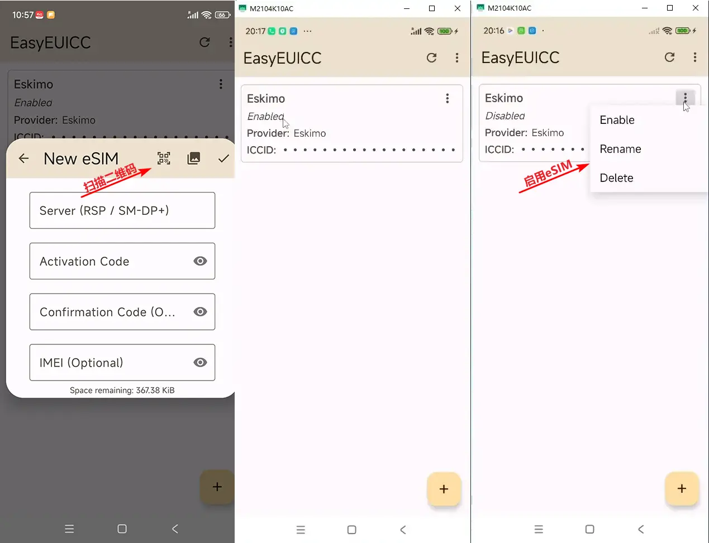

### 第二种方式，通过estk原生应用管理esim
原生应用：指的是estk卡自带的应用，通过这个应用管理estk中的esim配置文件，每部手机都支持这种原生应用，只是位置会因手机品牌不同而不同，

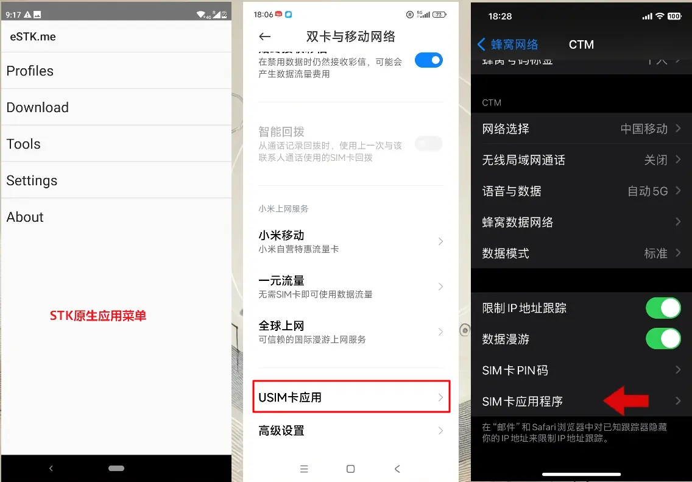

**切换eSIM卡：** 打开USIM卡应用界面，点击进入，这里就能看到SRK菜单，我们主要用到的是Profiles，download和Settings。在profiles中可以启动、关闭、删除esim配置文件

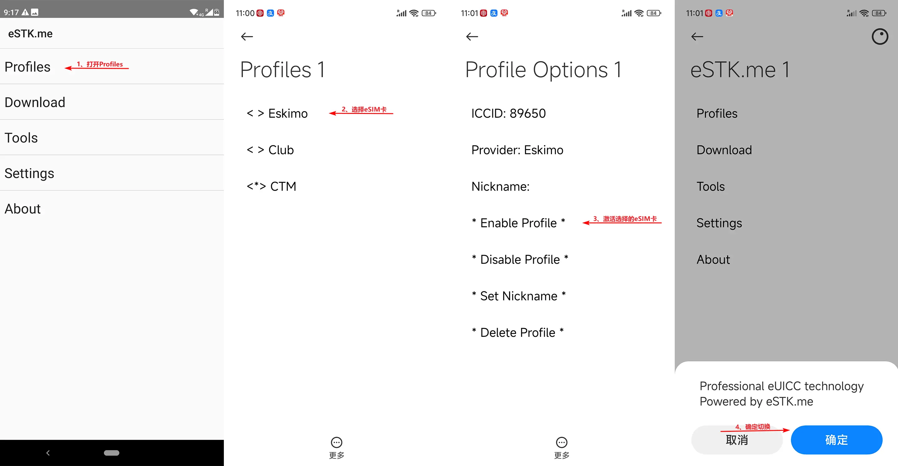

**开启云增强功能：**原生应用中下载新eSIM之前，需要下开启Cloud Enhance云增强功能

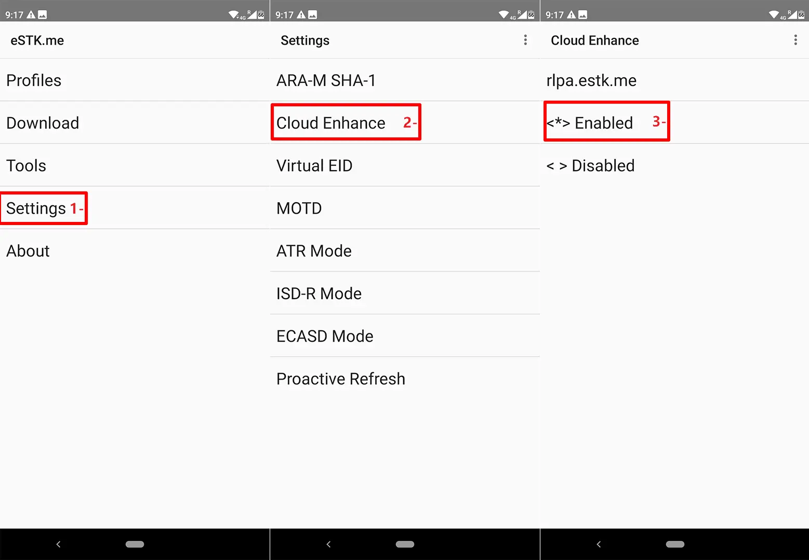

**下载eSIM卡：**点击download添加新的配置文件

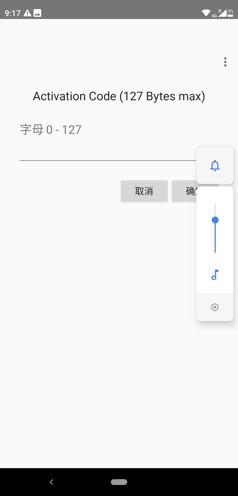

原生应用中无法使用扫描二维码的方式下载配置文件，需要配合其它第三方的扫描工具获取激活码
如果无法直接扫描，可通过微信，支付宝或其他第三方应用工具，扫描二维码获取下载密匙，粘贴到下载框中进行下载。

## 5、iPhone端管理e-sim

由于苹果设备上无法使用EasyEUICC这样的第三方应用程序管理eSTK，
因此在苹果设备上只能通过estk所带的原生工具进行操作。与安卓中e-s-tk原生应用操作方法相同，注意苹果手机中操作之前，需保证estk中要有一张可提供蜂窝数据的流量卡。
操作方法与安卓端原生应用操作方法基本相同，可通过estk原生应用直接管理e-sim卡不需要App，
苹果手机中，管理程序通常会在【设置】-》【蜂窝网络】-》【SIM卡下主号或副号】-》【SIM卡应用程序】，打开后会看到STK菜单，其中包括Profiles和download两个常用的设置项，操作方法与安卓手机中原生应用一样。这个位置会因ios版本不同有所变化。

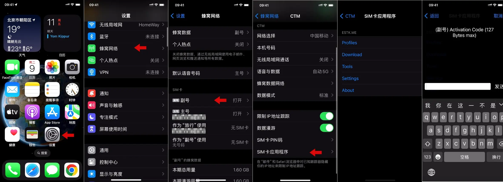

另外：iPhone无法直接扫描二维码添加e-sim，需要手动输入，或者微信、支付宝，或其他第三方的二维码扫描工具扫描获取下载密钥，然后粘贴到管理界面的download中即可，下载过程有些长多等一下，过程中不要进行其它操作，直至提示下载成功。

## 6、为什么要提前写入一张流量卡

在整个使用过程中始终有个疑问，就是使用estk之前**是否一定要提前写入一张流量卡**，之前也看过许多网友讲解安装estk卡的视频，都提到了要提前安装一张流量卡，只是没说到底**为什么要写入这张流量卡**，**什么时候才需要写入这张流量卡**。
经过查阅官方文档并与官方沟通后了解到，如果使用的是**iPhone手机**，由于ios系统的限制，estk卡只能使用自身的流量联网下载e-sim配置文件，因此**iPhone中第一次使用estk卡下载esim之前**，需**要先写入一张流量卡**，并且要设置成激活状态，之后其它e-sim写入操作，都会通过这个卡的蜂窝数据下载e-sim的配置文件，如果有多张流量卡，可以任意切换到其它蜂窝数据卡上，实现e-sim的下载操作，也就是iPhone中下载新esim时，要保证至少有一个蜂窝数据是启用状态。

如果使用的是**安卓手机**，**分两种情况**，一是**安卓手机支持本身OMAPI功能**，OMAP是一种标准API，用于与设备的安全元件进行通信，也就是在安卓手机上可以使用EasyEUICC软件管理esim，这种情况下**不用事先写入流量卡**，可以直接通过EasyEUICC软件工具添加e-sim，当然手机得是联网状态可以上网。
二是**安卓手机不支持OMAPI功能**，也就是在EasyEUICC中检测手机时，OMAPI链接不被支持，这时就**需要提前写入一张流量卡**，通过estk自带的原生应用，才可以正常下载e-sim配置文件，

另外官网提到了云服务**Cloud Enhance方式**，官方回复是**Cloud Enhance和正在启用的带流量的esim缺一不可**。

除了上面的这几种情况外，官方还提供了**另外一种方式**，就是使用**外置的写卡器**，直接将e-sim配置文件写入estk中，是一种完全摆脱了手机的独立操作方法，通过读卡器程序可以对estk中的e-sim进行全方位管理，并且可以对estk的固件程序进行升级，**直接使用**，**不需要提前写入一张流量卡**，感觉读卡器的功能更强大些，只是这些操作需要拔卡在电脑端进行，步骤有些繁琐，并且添加管理等操作需要在另一个软件工具中进行，需要单独学习软件的操作方法。

总之estk官方已经想的非常周到，为我们可正常写入esim提供了多种解决办法，具体使用哪种就看小伙伴自己的需求了。小布自己感觉，使用e-s-tk的最终目的就是能添加多张e-sim卡，方便接收短信，注册海外应用，数据漫游服务，以及方便保号，升级固件并不是最主要的需求，所以如果手机上能搞定就没必要再增加使用难度。

## [ 推荐视频：]

* 1-5ber卡：[https://www.youtube.com/watch?v=iDbL76m526c](https://www.youtube.com/watch?v=iDbL76m526c)
* 2-Reality打造自己的专属机场：[https://youtu.be/lPvOC2XlWe8](https://youtu.be/lPvOC2XlWe8)
* 3-Workers脚本设置免费科学上网：[https://youtu.be/1Jvo9I37yAU](https://youtu.be/1Jvo9I37yAU)
* 4-创建自己的优选域名，锁住IP区域：[https://youtu.be/ngiXH9YuByQ](https://youtu.be/ngiXH9YuByQ)

## [ 博客文章：]

* 1-[ 2024年新 ]最便捷使用eSIM的方式：[https://www.smallstep.one/article/5ber-card-setup](https://www.smallstep.one/article/5ber-card-setup)
* 2-Workers脚本设置免费科学上网：[https://www.smallstep.one/en/article/workers-deployment](https://www.smallstep.one/en/article/workers-deployment)
* 3-自建专属机场：[https://www.smallstep.one/article/aws-vps](https://www.smallstep.one/article/aws-vps)

## [ 实用工具 ]

* **1、Eskimo流量卡：** 
[https://s.ospace.top/mw9qyz](https://s.ospace.top/mw9qyz) **邀请码：BD995**  
得500MB两年有效期的免费全球数据流量。
Eskimo是流量卡不含号码，支持80多个国家/地区漫游，从第一次激活使用流量开始计算，长达2年有效期，并且非免费赠送流量可转送到其它Eskimo账户。
购买中国区域流量或全球流量，如果在中国使用走的是新加坡网络链路，获取的是新加坡的住宅IP，非常适合申请国外应用及保号。
* **2、ReadteaGO流量卡:** 
ReadteaGO链接: [https://esim.redteago.com/?c=i5oq82b3](https://esim.redteago.com/?c=i5oq82b3) 
ReadteaGO优惠码（**5% 折扣**）：**RTGF8F49L**
* **3、域名注册Namesilo：**[https://www.namesilo.com/](https://www.namesilo.com/)  （**Coupons优惠码：092368xb**）
* **4、SMS-Activate优惠链接：**[https://s.ospace.top/9tzyrx](https://s.ospace.top/9tzyrx)