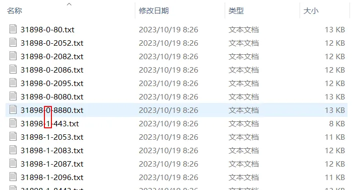
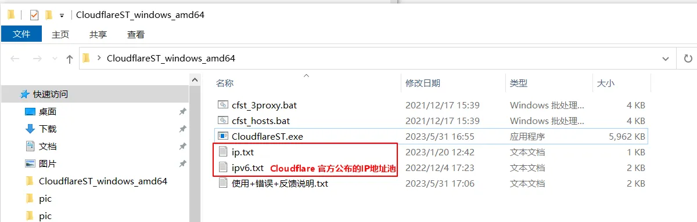

<aside>
第一集开启了科学上网，第二集解锁了奈菲、ChatGPT，这一集我们说说IP优选。用过warp客户端部署过workers的小伙伴，是不是都觉得warp慢，workers-ip跳对吧，一会儿日本、一会儿美国、一会儿香港，ChatGPT访问不稳定，一会行一会不行。会疑惑是部署的代码有问题吗?其实并不是。今天小布就与大家一起探究下背后的原因，并手把手带大家对cloudflare的cdn-ip、反代cf-ip进行优选，将ip锁定在某个区域。并利用cloudflare这个平台创建属于自己的优选域名。

</aside>



[【 **YouTube上观看** 】](https://youtube.com/watch?v=ngiXH9YuByQ)

# 工具：

## Cloudflare CDN节点服务器地址段

[https://www.cloudflare-cn.com/ips/](https://www.cloudflare-cn.com/ips/)

## CDN优选IP在线获取工具

 [https://stock.hostmonit.com/CloudFlareYes](https://stock.hostmonit.com/CloudFlareYes)：

 提供针对联通、移动、电信三网优化的Cloudflare-CDN-IP，提供了丢包、延迟、速度和发布实际，可根据自己网络情况选取。

 [https://vfarid.github.io/cf-ip-scanner/](https://vfarid.github.io/cf-ip-scanner/)：

可自定义最大延迟数值、可搜索IP数量、地址范围、及要排除的地址范围

## CDN-IP本地优选工具

[https://github.com/badafans/better-cloudflare-ip](https://github.com/badafans/better-cloudflare-ip)

基于bat和bash，简单通用，可针对ipv4、ipv6及是否套用Tls等情况进行检测

 [https://jdssl.top/wp-content/uploads/2023/07/works专用ip优选.zip](https://jdssl.top/wp-content/uploads/2023/07/works%E4%B8%93%E7%94%A8ip%E4%BC%98%E9%80%89.zip)

## FOFA在线IP筛选工具

URL：[https://fofa.info/](https://fofa.info/)

通过输入不同指令来搜索ip地址，搜索出的地址需要再次通过筛选工具进行处理

**fofa网站查询语法：**

```jsx
/**
*搜索服务器为CF，端口是443，http响应头部信息包含forbidden，国家是日本，城市是*东京的IP，这里国家和城市根据需要修改（US、JP、KR、CN 等等）
*/
server=="cloudflare" && port=="443" && country=="JP" && city=="Tokyo" 
/** 
*如果搜索的是反代IP，CF的IP要排除掉
*/
/*排除CF地址：*/ asn!="13335" && asn!="209242"
/*甲骨文韩国：*/server=="cloudflare" && asn=="31898" && country=="KR"
/*搬瓦工：*/server=="cloudflare" && asn=="25820"
/**
 *asn代表自治域编号感兴趣的朋友可通过下面连接查询
 *自治域查询网址：http://ipblock.chacuo.net/
 *以上代码来自于网络，感兴趣的朋友可自行研究修改使用
*/
```

## 反代IP在线获取工具

 在线获取大佬整理的CF反代IP：[https://zip.baipiao.eu.org/](https://zip.baipiao.eu.org/)



> **文件名格式：**31898-0-8880 / 31898-1-443
31898：ASN自治域号，代表地区
0/1：未加密/加密，即是否套了Tls
8800/433：端口号
> 

 Telegram频道获取CF反代IP：[https://t.me/cf_push](https://t.me/cf_push)  

## CDN-IP及反代IP本地优选工具：

  * Github：[https://github.com/XIU2/CloudflareSpeedTest/](https://github.com/XIU2/CloudflareSpeedTest/)
  * 国内下载：[https://pan.lanzouj.com/b0742hkxe](https://pan.lanzouj.com/b0742hkxe)

解压后看到六个文件，我们主要关注CloudflareST.exe、ip.txt、ipv6.txt文件，两个ip~.txt文件中是Cloudflare官方公布的CF地址段。



```jsx
//使用CloudflareSpeedTest优选IP需要手动操作
//第一步打开命令行窗口
cmd  //资源管理器中输入cmd打开命令行窗口后，回车，打开命令行窗口，输入下面命令
type *.txt>>all.txt //将目录中所有txt文本内容合并到all.txt中，all.txt需要提起建立。

/**
* 第二步在命令行窗口中允许优选程序
* 方式一：直接运行CloudflareST.exe
*/
CloudflareST.exe
/**
* 方式二：添加自定义参数
* 1、自定义IP地址库
*/
CloudflareST.exe -f all.txt -o result-nrt.csv

/**2、自定义区域，IP地址库，输出文件名*/
CloudflareST.exe -httping -cfcolo NRT -f all.txt -o result-nrt.csv

/**3、自定义-tl 平均延迟上线，-dn 下载测速数量*/
CloudflareST.exe -httping -cfcolo NRT -tl 350 -dn 15 -f all.txt -o result-nrt.csv

/**4、自定义 -url 测速地址*/
CloudflareST.exe -url https://jp.cloudflarest.link -sl 3 -tl 350 -dn 15 -f ip.txt -o result.csv

/*例子*/
CloudflareST.exe -url https://pencilfiles.annonymus.cf/cloudflarest-200mb.rar  -httping -cfcolo NRT  -sl 3 -tl 300 -dn 15 -f ip.txt -o result-nrt.csv

-httping -cfcolo NRT// 匹配指定地区；地区名为当地机场三字码，英文逗号分隔，支持小写
-url https://pencilfiles.annonymus.cf/cloudflarest-200mb.rar //测速地址
-sl 3      //下载速度下限；只输出高于指定下载速度的 IP
-tl 300    //平均延迟上限；只输出低于指定平均延迟的 IP
-dn 15     //下载测速数量；延迟测速并排序后，从最低延迟起下载测速的数量
-f ip.txt  //IP段数据文件
-o result-nrt.csv //写入结果文件；如路径含有空格请加上引号；值为空时不写入文件

/*其他参数可参考作者网站：*/ [https://github.com/XIU2/CloudflareSpeedTest/](https://github.com/XIU2/CloudflareSpeedTest/)
```

```jsx
其中 **NRT** 是机场三字码：
**HKG**（香港）**KHH**（台湾高雄市）**NRT**（日本国千叶县成田市）**LAX**（洛杉矶）**SEA**（东南亚）**SJC**（加利福尼亚州圣何塞）**FRA**（法国）**MAD**（马达加斯加）...
/**
* Cloudflare 所有节点（机场三字码）：[https://www.cloudflarestatus.com/](https://www.cloudflarestatus.com/)
* 根据实际情况选择机场三字码
* 如果下载速度为零，查看下是否关闭了代理，或者更换下载连接（-url后面部分）
* 测速地址获取网址：https://github.com/XIU2/CloudflareSpeedTest/issues/168
*/
```

## 批量查询IP地区工具

  * 英文：[https://reallyfreegeoip.org/bulk](https://reallyfreegeoip.org/bulk)
  * 中文：[https://lwebapp.com/zh/ip-batch](https://lwebapp.com/zh/ip-batch)

这两个网站可以在线批量查询IP所在的国家、地区、城市，可免费导出csv、txt等格式，免费并且没有数量限制。但对大数据量的处理会比较慢需耐心等待。像我们合并后的文本中会包含3万多条IP数据，处理的时间很长。

**筛选步骤：**

上传IP地址 → 查询IP所在区域 → 下载IP地址文件 → 在文件中筛选出需要的IP保存为txt文件 → 使用本地IP优选工具进行筛选

## 临时邮箱：

  * [https://temp-mail.org](https://temp-mail.org/)
  * [https://tempmail.plus](https://tempmail.plus/zh/#)

## IP检测工具

 * [https://ip.gs/](https://ip.gs/)
 * [https://ipdata.co/](https://ipdata.co/)

## 合并文件命令

 资源管理器导航栏中输入 cmd 回车

 命令提示符中输入：type *.txt>>all.txt