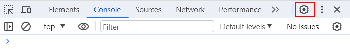
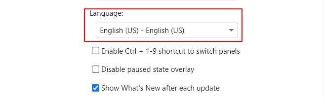
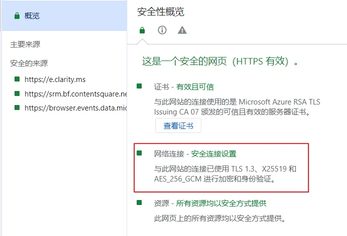
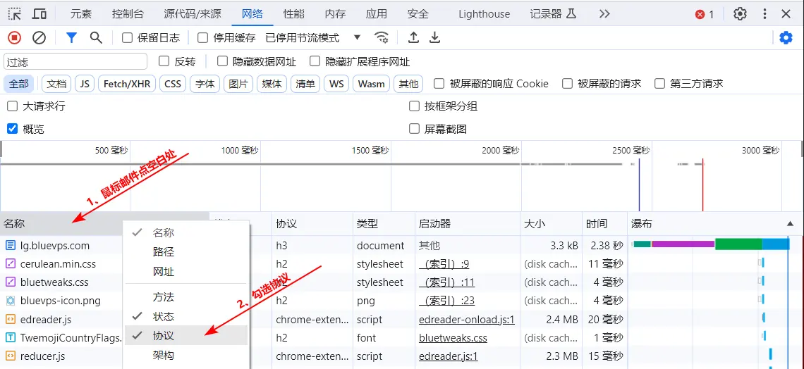
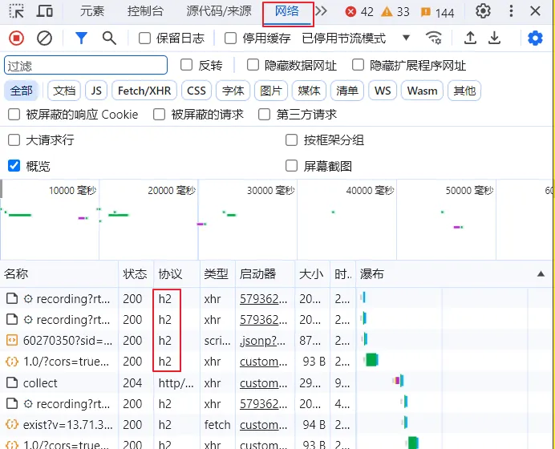
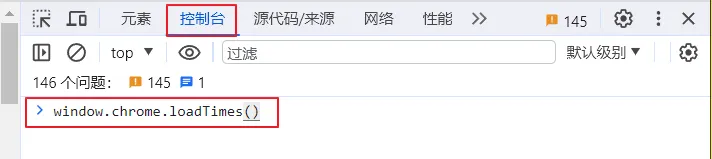
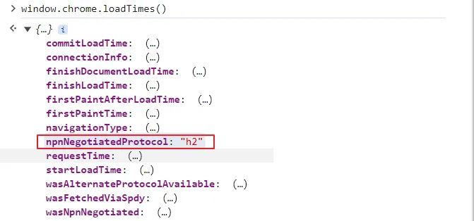
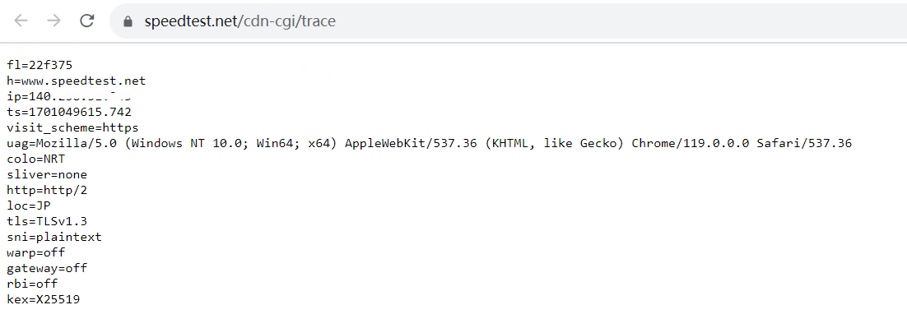
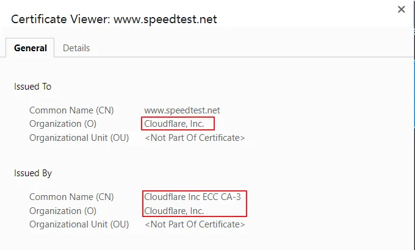
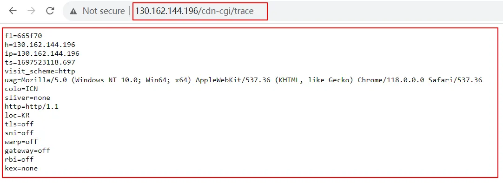

<aside>
😀 网络传输离不开TCP协议和UDP协议，而以TCP为代表的Reality协议和以UDP为代表Hysteria协议，被称为目前伪装最好的科学上网协议。许多博主也在力推这两种协议搭建节点。上一期我们安装了x-ui，并通过简单的几步搭建了reality代理节点，只是配置过程中需要慎重选择目标网站，选择不好就会成为别人的免费反代加速节点。虽然X-UI开发者已经内置了目标网站资源库，但当使用的人太多时也难免不被屏蔽。今天我们就说说怎么识别网站套了CDN，怎么自己选择realiyt目标网站。

</aside>



[【 **YouTube上观看** 】](https://youtube.com/watch?v=5JxqhhvH0)

## 自选Reality的目标网站

目标网站指的就是一个可国内直接访问的国外网站，可以是国外大厂网站、也可以是当地特色站，新闻站，只要是正规合法的网站都行。但不能是擦边、非法的网站。因为目标网站出问题，会直接影响reality节点的正常使用。许多网友说要选大厂的网站，在小布看来大有大的好处，小有小的优势，大网站访问太多也会出问题，像之前的微软修改Tls协议版本就是这种情况，小网站说小不一定真的小，是那些正规有一定访问量且不被大众广泛认知的网站，使用的人少，反而能用的更长久。另外如果reality节点突然不能使用了，首先需检查目标网站是否还能正常访问。

## 选择目标网站需满足的条件

目标网站要满足4个条件：最主要的是TLs1.3、H2协议和是否套了CDN

* **使用Tls1.3协议 ：** tls是传输层安全协议，1.3是Tls1.2的升级版，访问速度更快刚安全
* **X25519：** 是一种签名算法，TLS 1.3 标准支持使用 X25519，速度快，数据量小，用来申请证书
* **H2协议：** 即HTTP2.0，简称h2，引入了Stream，实现对一个 TCP 连接的多路复用，极大提高了传输性能
* **未套CDN：** 对于非reality节点的数据转发到dest时，如果reality的dest目标网站套了CDN，这些数据会被自动转发到CF的CDN节点，CDN节点我们的reality节点就变成了别人的反代加速节点。因此目标网站不能使用套CDN的域名，如怎么判断是否套了CDN后面会说到。

## 检测方法

这个方法需使用谷歌浏览器打开网站

### 查看是否支持Tls 1.3

谷歌浏览器打开网站，按**`F12`**功能键，点右上角齿轮图标修改显示语言。





【安全】选项卡→【网络链接】看到“TLS 1.3，X25519和AES_xxxx”字样，表示支持 TLS1.3 协议、并且使用的是 x25519签名算法



### **查看是否支持H2协议：

如果没有协议这一列，按下图操作，然后按F12退出，再按F12进入。





### 控制台命令查看H2

在空白处输入window.chrome.loadTimes()



如果npnNegotiatedProtocol的值是“h2”，说明支持H2协议



## **查看是否套用了CDN：

在目标网站域名后添加  **/cdn-cgi/trace**

`/cdn-cgi/trace` 是Cloudflare的CDN 调试接口，所有托管在 Cloudflare 上的网站都存在这个接口，并且套了CDN的网站都会使用Cloudflare签发的证书

如：[https://www.speedtest.net/cdn-cgi/trace](https://www.speedtest.net/cdn-cgi/trace)

如果出现下面图片中的内容，说明这个网站套用了CDN



并且使用了Cloudflare签发的证书





## Reality目标网站获取方式

目标网站获取有三种方式，一是选取第三方平台测试完的网站，二是自己动手搜索合适的网站，三是通过工具本地搜索获取。第一种方式简单，网站已经为我们筛选好了，只要符合目标网站的几个特征可拿来直接使用，但无法指定区域与自己的VPS离得可能很远，对访问速度会有影响。第二种方式可以自定义查找离自己服务器近的可用网站，操作相对灵活，但操作上稍微繁琐需要一定的动手能力。第三种方式可以方便获得目标网站，但与第一种一样无法指定区域。

### 第一种方式：网站直接获取

[https://www.ssllabs.com/ssltest/index.html](https://www.ssllabs.com/ssltest/index.html)

[https://securityheaders.com/](https://securityheaders.com/)

### 第二种方式：FOFA手动搜索获取

**ASN查询工具：**[https://tools.ipip.net/as.php](https://tools.ipip.net/as.php)

**目标网站查询工具：**[https://fofa.info](https://fofa.info)

**查询命令：**

asn=="[16509](https://whois.ipip.net/AS16509)" && country=="US" && port=="443" && cert!="Let's Encrypt" && cert.issuer!="ZeroSSL" && status_code="200"

这句话的意思是查询自己vps自治域美国区域，端口为443，不是由临时证书颁发机构颁发的证书，且http请求成功的网站。Let's Encrypt与ZeroSSL都是免费证书，有效期都是90天

**asn：**（自治域号码）

**country=="SG"** （国家地区两字码，新加坡：SG，美国：US，日本：JP，韩国：KR，香港：HK，英国：GB，泰国：TH，台湾：TW）两字码查询：[https://baike.baidu.com/item/世界各国和地区名称代码/6560023](https://baike.baidu.com/item/%E4%B8%96%E7%95%8C%E5%90%84%E5%9B%BD%E5%92%8C%E5%9C%B0%E5%8C%BA%E5%90%8D%E7%A7%B0%E4%BB%A3%E7%A0%81/6560023)

**port=="443"** （端口）

**cert!="Let's Encrypt"** （不是Let's Encrypt类型的证书）

**cert.issuer!="ZeroSSL"**（证书颁发者不是ZeroSSL）

**status_code="200"**（HTTP 响应状态码，200的意思是Http请求成功）

### 本地工具获取目标网站

**RealiTLScanner：**[https://github.com/XTLS/RealiTLScanner/releases](https://github.com/XTLS/RealiTLScanner/releases)

#### 在软件目录打开命令行窗口 CMD

#### 运行命令：

将命令行中的1.1.1.1IP地址更换为自己VPS的IP地址

```html
RealiTLScanner-windows-64.exe -addr **1.1.1.1** -port 443 -thread 100 -timeOut 5 
```

### 域名推荐

```
# 可作为目标网站的域名推荐
www.icloud.com
www.airbnb.com/sitemaps/v2
www.airbnb.co.uk/
www.airbnb.ca/
www.airbnb.com.sg
www.airbnb.com.au
www.airbnb.co.in
addons.mozilla.org
www.microsoft.com
www.lovelive-anime.jp
www.tesla.com
wareval.com
www.nvidia.com
www.sap.com
```