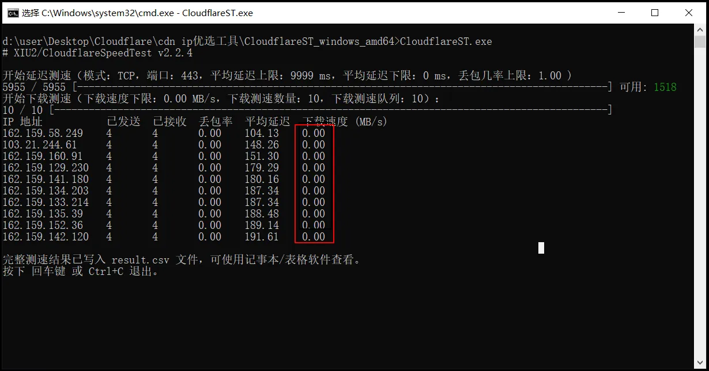
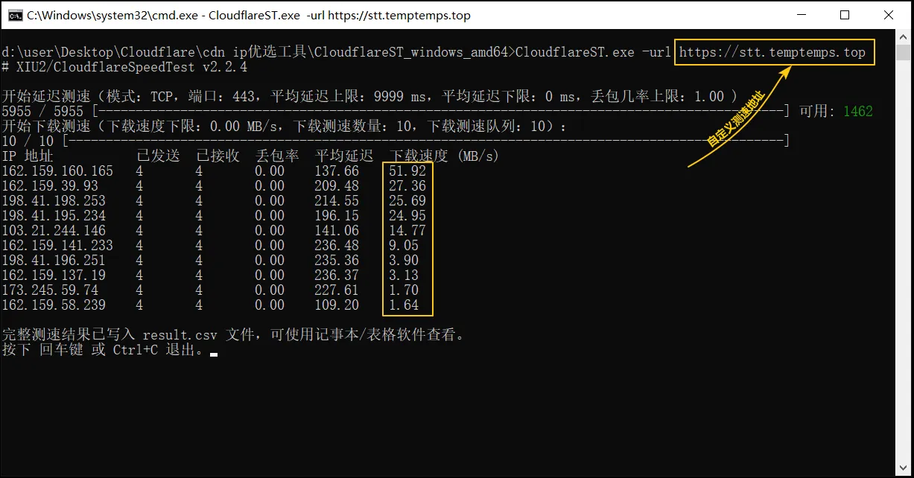
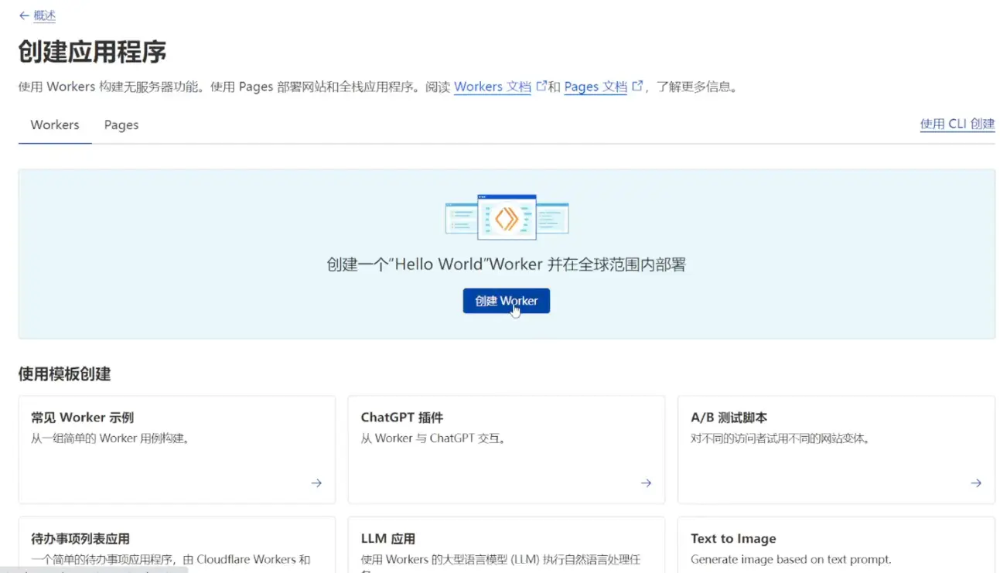
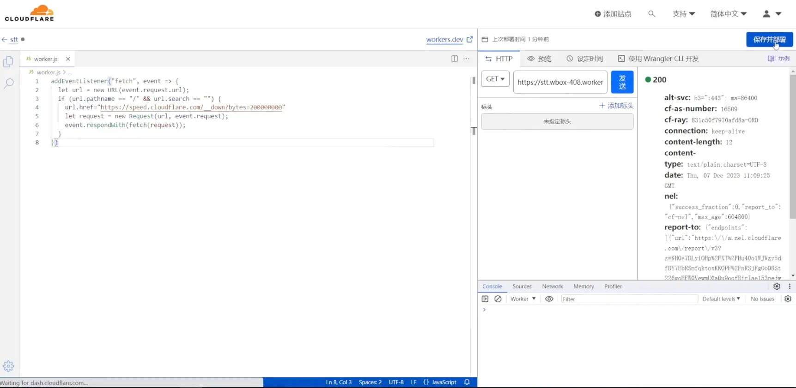
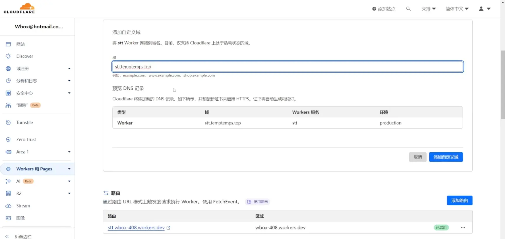
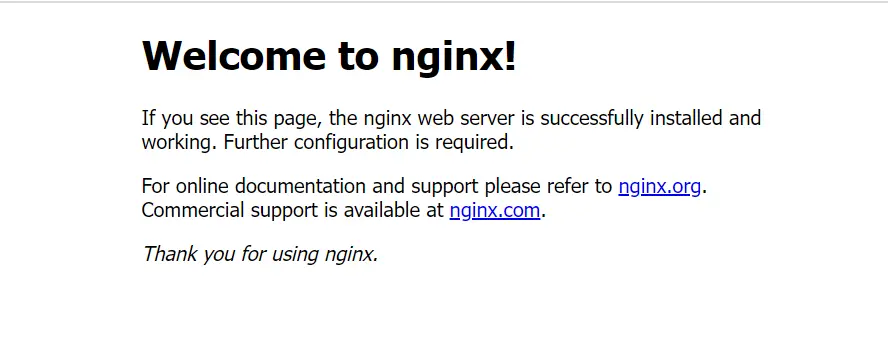
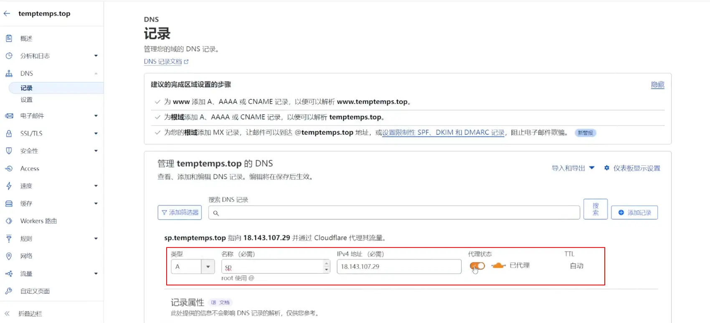
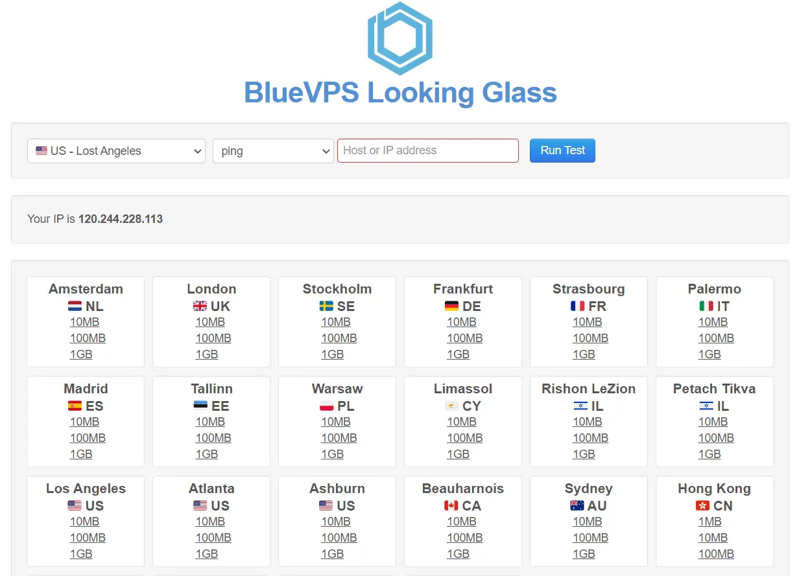

<aside>
😀 许多小伙伴在本地ip优选时总遇到下载速度为零的情况，并且想知道如何获取可用的测速链接地址，以及怎么建立自己的测速地址，今天我们这期内容就来告诉大家该怎么做。
我们都知道本地测速使用的是第三方的测速工具，工具开发者提供了许多自定义参数和使用建议，其中也为我们提供了解决这些问题的办法，今天小布就将这些内容整理出来分享给大家，并手把手带大家查找可用测速链接，并搭建自己的测速地址。

</aside>



[ 【 **Youtube上观看** 】 ](https://youtube.com/watch?v=rOZEURBN20)


## 为什么本地测速时显示下载速度为零

> 这是测速软件作者的一段话：
发现 cf.xiu2.xyz 最近流量太大，因此暂时限制了速度、流量优先级等，直到流量降低到 "正常" 水平时才会恢复。我试了下发现还能勉强访问，但已经被限制成龟速了。。。可以说是**慢至不可用**了，干脆就先暂停了。<br>
也就是说，如果不使用**-url**参数时，软件会默认使用**cf.xiu2.xyz**这个地址进行测速，但使用量过大停掉了导致测速为零。当我们添加**-url**参数并直接使用作者或网友提供的测速地址时，也同样因为用量大被发布者、本地运营商或者CF官方限速降级，导致优选IP时测速为零，如下图所示。因此软件开发者也给出了解决方法。
> 



下面图片是按照作者推荐方法搭建自有测速地址后的检测结果



接下来结合软件开发者的建议，搭建自己的测试地址。下面的搭建方法在软件作者的Github上也可找到，我只是把与下载测试有关部分摘出来分享给大家

## 可用测速地址需满足的条件

1. 该地址用的是 Cloudflare CDN。
2. 访问该地址可以直接下载文件。
3. 文件大小建议不低于 200 MB（建议不高于 512 MB，避免因无法缓存而回源影响下载测速准确度）。

> 注意：如果下载测速地址大小低于 200MB，建议同时调低下载测速时间（如：-dt 5 ），以提高测速结果准确性。
> 
另外：自建的测速链接不仅可以作为优选ip的测速地址，也可以作为v2rayN的测速地址。

## 自建测速地址的两种方式

### 第一种方式：配置Cloudflare Workers 文件反代

> **配置前提：** <br>
需要将域名托管到Cloudflare,这种方式无需服务器，但需要域名。<br>
注意：因为 *.workers.dev 域名被 DNS 污染，所以默认分配的子域名将无法使用，需要绑定域名才能访问。
这个方法是利用 Cloudflare Workers 服务，因workers服务只限制访问次数不限制流量，免费版**每日10万次数**限制（每天 8 点重置）。
> 
**CloudflareSpeedTest作者公布的测速地址：**

[https://github.com/XIU2/CloudflareSpeedTest/issues/168](https://github.com/XIU2/CloudflareSpeedTest/issues/168)

**Cloudflare自己的测速地址：**
```html
https://speed.cloudflare.com/__down?bytes={**size**}
https://speed.cloudflare.com/__down?bytes=**104857600**

其中size的单位为Bytes，
1MB = 1024KB = 1048576 Bytes
100MB = **104857600** Bytes
200MB = 209715200 Bytes
500MB = 524288000 Bytes
1000MB(1GB) = 1073741824 Byte

在线换算工具：[https://www.yum.im/calcdata/](https://www.yum.im/calcdata/)
```

**自建测速地址workers部署脚本：**
```jsx
addEventListener("fetch", event => {
  let url = new URL(event.request.url);
  if (url.pathname == "/" && url.search == "") {
    url.href="**https://speed.cloudflare.com/__down?bytes=200000000**"
    let request = new Request(url, event.request);
    event.respondWith(fetch(request));
  }
})
```

**搭建过程：**

**1、登陆Cloudflare，创建workers应用**



**2、编辑代码替换测试链接并部署应用**



**3、为部署的worker代码添加自定义域**



### 第二种方式：服务器套 Cloudflare CDN（需要服务器+域名）

> **配置前提：**<br>
可用的服务器（VPS）+域名并且以托管到Cloudflare<br>
**方法：**在服务器上面创建一个虚拟主机（如 Nginx/Caddy），并在其目录下生成一个空文件，将VPS地址套上CDN.<br>
> 

如果有自己的网站空间或者有VPS服务器可使用这个方法

#### **Ubuntu 22.04 上安装 NGINX**

nginx部署在Linux上，安装非常简单几条命令就能完成，这里也只是简单介绍搭建步骤，未涉及nginx建站安全相关设置，如有这方面的要求的朋友需自行查询资料解决。

```html
**0、打开SSH工具登陆VPS，然后逐步复制下面代码部署nginx**

**1、更新系统的软件包**
sudo apt update

**2、安装nginx**
sudo apt install nginx

**3、验证安装版本**
nginx -v

**3.1、获取nginx服务的状态**
sudo systemctl status nginx

**3.2、系统启动时自动启动该服务**
sudo systemctl enable nginx

**3.3、重新启动并启动NGINX服务**
sudo systemctl restart nginx
sudo systemctl start nginx

**4、配置防火墙开放80和443端口**
sudo ufw allow 'Nginx full'

**5、重新加载防火墙**
sudo ufw reload

**6、从 Ubuntu 22.04 中删除 NGINX**
sudo apt autoremove nginx --purge
```

**验证NGINX是否正在运行**
http://1.1.1.1   //浏览器中输入vps-ip地址回车，注意前面是http不是https

如果输出显示下面的欢迎页面说明nginx安装成功。



#### **生成可用于测试的空文件**

```
**生成空文件命令：**
# 以下命令会在 /XXX 目录下，生成一个文件名为 cfst.bin 大小为 200MB 的文件
# （超过 512M 的文件不会被 CDN 缓存，会导致次次回源，即大量消耗服务器流量不说，还会影响下载测速准确度，因为多了个回源环节）
# 记得修改命令中的 /XXX/ 示例路径，否则直接运行会提示找不到文件夹！

# **登陆VPS运行下面的命令：**
dd if=/dev/zero of=/XXX/cfst.bin bs=1M count=0 seek=200

**创建不同大小的空文件
/var/www/html**是nginx默认网站根路径
dd if=/dev/zero of=/var/www/html/cfst100.bin bs=1M count=0 seek=100
dd if=/dev/zero of=/var/www/html/cfst200.bin bs=1M count=0 seek=200
dd if=/dev/zero of=/var/www/html/cfst512.bin bs=1M count=0 seek=512

# 因为是空文件，所以 Cloudflare 在缓存时 300MB 就会被压缩为 300KB 了，不占用 Cloudflare 的节点缓存空间，因此 Cloudflare 并没有追究文件正不正常的问题，顶多像我这样因流量太大（每天 10TB）而被域名限速了。。。
# 另外，不建议搞太多不同大小的文件，这样不利于缓存，因此 Cloudflare 的缓存机制还会看文件热度，如果流量分散到几个文件上，可能会导致文件热度不足早早就被清理，从而增加回源次数，消耗服务器流量。
```

#### **CF中创建可用于下载测试的域名链接**

1. **登陆Cloudflare**
2. **解析一个二级域名指向VPS并开启代理**



3. **完整的测试链接：**

https://域名/可拥于下载的文件名<br>
如：https://sp.temptemps.top/cfst200.bin

### **如何查找可用于反代的文件**

> 1、IDC 的官方测速文件
2、谷歌搜索 **`VPS looking glass`** 或 **`testfile MB`**，建议优先选择美西，选择**512MB以下**且**支持 CDN** 缓存的文件后缀，太大Cloudflare无法缓存，且会消耗服务器的流量。
3、将找到的文件链接配置到workers中（第一种方式）
> 

```html
# 这几个小于 512 MB，且都是会被 CDN 缓存的 .zip 文件后缀（7Z、GIF、MP3、DOC、DOCX、CSS...）
http://ipv4.download.thinkbroadband.com/200MB.zip
http://ipv4.download.thinkbroadband.com/512MB.zip
https://testfileorg.netwet.net/500MB-CZIPtestfile.org.zip

# 这几个 .test 的后缀是不支持缓存的，可以用但会影响下载测速准确度
https://cachefly.cachefly.net/200mb.test
https://lg-seattle.cloudzy.com/500MB.test
https://lg-miami.cloudzy.com/500MB.test
https://lg-chicago.cloudzy.com/500MB.test
https://lg.my.controlvm.com/500MB.test
http://23.145.48.48/500MB.test
http://speedtest-sfo3.digitalocean.com/1gb.test
```

> 注意：这些文件地址是让你Workers反代用的，不能直接用于-url 参数！
**这个地址可以配置到第一种方式搭建的workers脚本中**
> 

**通过谷歌搜索 `VPS looking glass`**



**Cloudflare默认缓存文件后缀**

> URL：[CF认可的缓存文件后缀](https://developers.cloudflare.com/cache/concepts/default-cache-behavior/#default-cached-file-extensions)
Cloudflare only caches based on file extension and not by MIME type. The Cloudflare CDN does not cache HTML by default. Additionally, Cloudflare caches a website’s robots.txt.
> 

|  |  |  |  |  |  |  |
| --- | --- | --- | --- | --- | --- | --- |
| 7Z | CSV | GIF | MIDI | PNG | TIF | ZIP |
| AVI | DOC | GZ | MKV | PPT | TIFF | ZST |
| AVIF | DOCX | ICO | MP3 | PPTX | TTF |  |
| APK | DMG | ISO | MP4 | PS | WEBM |  |
| BIN | EJS | JAR | OGG | RAR | WEBP |  |
| BMP | EOT | JPG | OTF | SVG | WOFF |  |
| BZ2 | EPS | JPEG | PDF | SVGZ | WOFF2 |  |
| CLASS | EXE | JS | PICT | SWF | XLS |  |
| CSS | FLAC | MID | PLS | TAR | XLSX |  |