<aside>
这期视频是Reality搭建上网环境视频的补充。之前视频中分享过基于Xui+Reality的方式搭建自己的外网访问服务，设置完成即可通过PC端正常访问chatgpt，但由于openai对移动端的访问审查比较严格，导致安装chatgpt手机端应用的小伙伴，无法通过自建的环境正常访问chatgpt。今天我们就在之前配置的基础上，通过增加分流配置的方式，打通移动端对chatgpt的访问。这个视频基于ipv4，通过指定域名（openai.com）分流到socks5，实现移动端对chatgpt的。其他vps中也可以用xui+reality+socks5这种方式进行分流，按步骤操作即可。

</aside>



[ 【 **Youtube上观看** 】 ](https://youtube.com/watch?v=lhop-zZJXMg)

## 前期准备：

一台已经安装好Ubuntu 22的VPS

## 第一步：安装X-UI

### 一、登录VPS

**SSH客户端（FinalShell）：**[https://www.hostbuf.com/t/988.html](https://www.hostbuf.com/t/988.html)

### 二、安装x-ui

Github链接：[https://github.com/FranzKafkaYu/x-ui](https://github.com/FranzKafkaYu/x-ui)

```jsx
bash <(curl -Ls https://raw.githubusercontent.com/FranzKafkaYu/x-ui/master/install.sh)
```

### 三、添加一条Reality链接

## 第二步：安装WARP分流脚本

### 运行WARP解锁脚本

#### 安装脚本：

Github链接：[https://github.com/fscarmen/unlock_warp](https://github.com/fscarmen/unlock_warp)

```jsx
wget -N https://gitlab.com/fscarmen/warp/-/raw/main/menu.sh && bash menu.sh
```

### 配置命令：

```jsx
warp [option] [lisence]
```

### 安装步骤

1、输入安装脚本

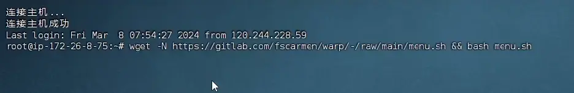

2、选择简体中文

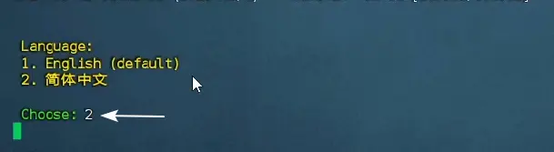

3、选择第13项

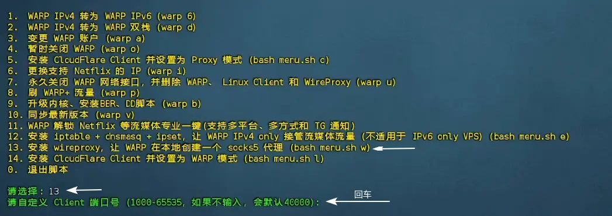

4、安装Coudflare账户类型，这里可以任选一个。这里我们选warp+，如果您有自己的warp+账户，可以输入自己的licerse。

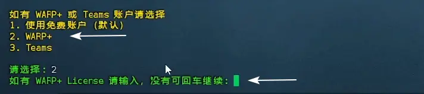

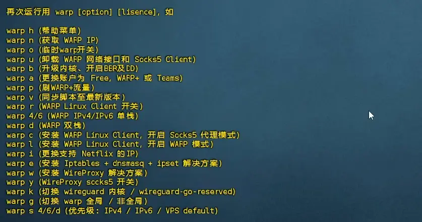

5、wireproxy安装完成后输入warp，看看是否安装成功


6、如果看到warp free wireproxy 已开启，sokcs5：127.0.0.1：40000说明安装成功

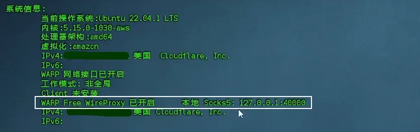

6、输入0，退出脚本

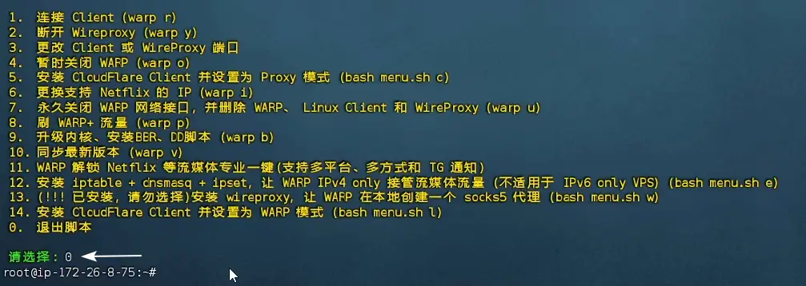

## 第三步：修改X-UI配置

通过对xui中模板配置，将指定网站分流到 socks5，实现移动端访问ChatGPT。

下面给出了分布设置代码及完整设置代码，完整代码中已经集成了openai分流设置。如果是按照上面步骤安装的脚本，直接复制粘贴完整代码到X-UI的配置项中即可完成配置。操作步骤查看下面的第4项。

### 出站流量设置

```jsx
//"outbounds"中添加下面代码（注意使用英文逗号）：
    {
      "tag": "warp",
      "protocol": "socks",
      "settings": {
        "servers": [
          {
            "address": "127.0.0.1",
            "port": 40000
          }
        ]
      }
    },
    {
			"tag":"WARP-socks5-v4",
			"protocol":"freedom",
			"settings":{
        "domainStrategy":"UseIPv4"
        },
        "proxySettings":{
            "tag":"warp"
        }
			}
```

### 路由设置

```jsx
//"routing"的"rules"中添加下面代码（注意使用英文逗号）：
    "rules": [
			  {
	        "type": "field",
	        "outboundTag": "WARP-socks5-v4",
	        "domain": [
	          "geosite:openai",
	          "geosite:disney"
	        ]
	      }
      ]
```

### 完整代码

```jsx
{
  "api": {
    "services": [
      "HandlerService",
      "LoggerService",
      "StatsService"
    ],
    "tag": "api"
  },
  "inbounds": [
    {
      "listen": "127.0.0.1",
      "port": 62789,
      "protocol": "dokodemo-door",
      "settings": {
        "address": "127.0.0.1"
      },
      "tag": "api"
    }
  ],
  "outbounds": [
    {
      "protocol": "freedom",
      "settings": {}
    },
    {
      "tag": "warp",
      "protocol": "socks",
      "settings": {
        "servers": [
          {
            "address": "127.0.0.1",
            "port": 40000
          }
        ]
      }
    },
    {
	"tag":"WARP-socks5-v4",
	"protocol":"freedom",
	"settings":{
        "domainStrategy":"UseIPv4"
        },
        "proxySettings":{
            "tag":"warp"
        }
	},
    {
      "protocol": "blackhole",
      "settings": {},
      "tag": "blocked"
    }
  ],
  "policy": {
    "levels": {
      "0": {
        "handshake": 10,
        "connIdle": 100,
        "uplinkOnly": 2,
        "downlinkOnly": 3,
        "statsUserUplink": true,
        "statsUserDownlink": true,
        "bufferSize": 10240
      }
    },
    "system": {
      "statsInboundDownlink": true,
      "statsInboundUplink": true
    }
  },
  "routing": {
    "rules": [
		  {
        "type": "field",
        "outboundTag": "WARP-socks5-v4",
        "domain": [
          "geosite:openai",
          "geosite:disney"
        ]
      },
      {
        "inboundTag": [
          "api"
        ],
        "outboundTag": "api",
        "type": "field"
      },
      {
        "ip": [
          "geoip:private"
        ],
        "outboundTag": "blocked",
        "type": "field"
      },
      {
        "outboundTag": "blocked",
        "protocol": [
          "bittorrent"
        ],
        "type": "field"
      }
    ]
  },
  "stats": {}
}
```

### 操作步骤

#### 登录X-UI控制面板

#### 复制完整代码

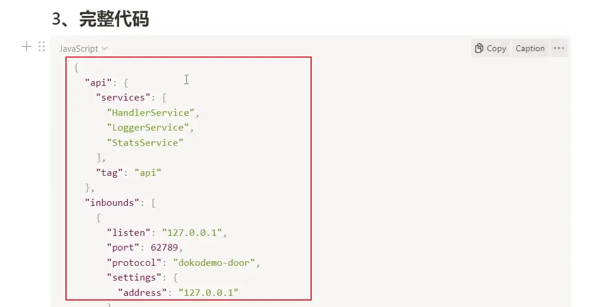

#### 清空源代码

setting -》Xray Config

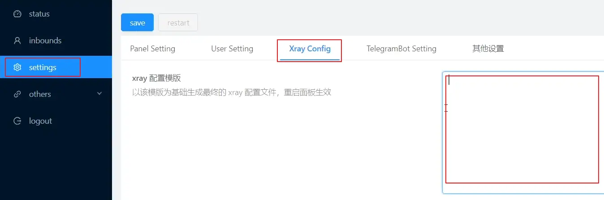

#### 粘贴代码

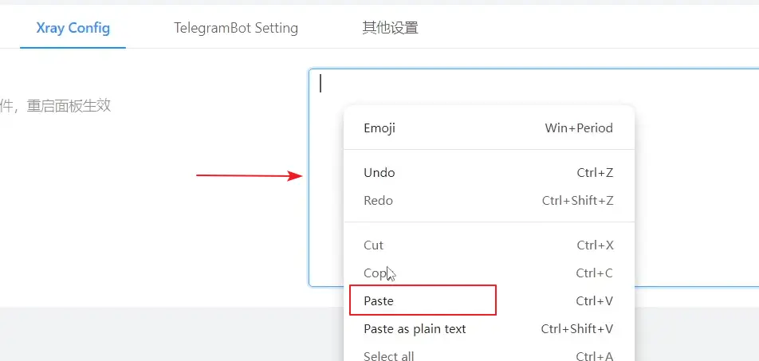

#### 保存

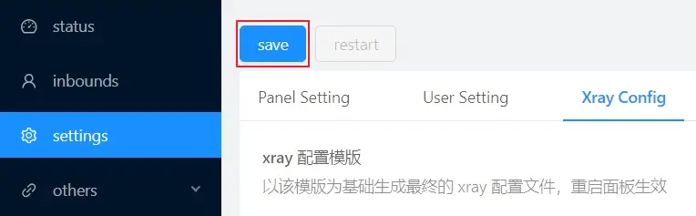

#### 重启X-UI面板

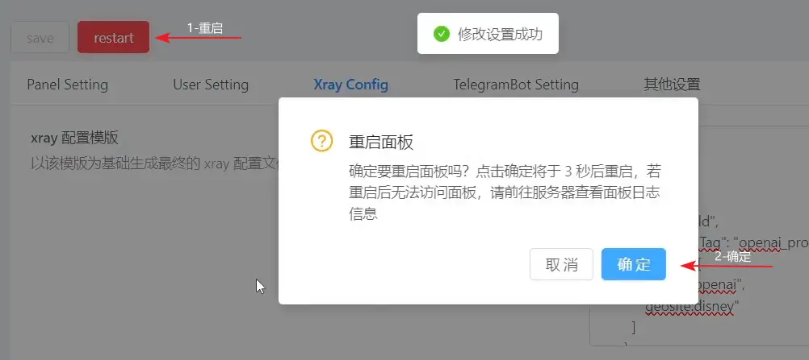