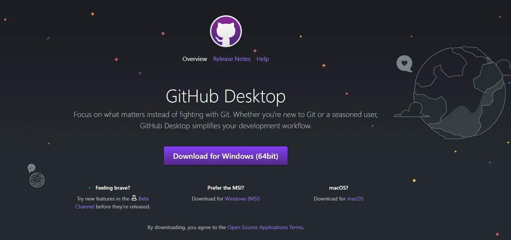
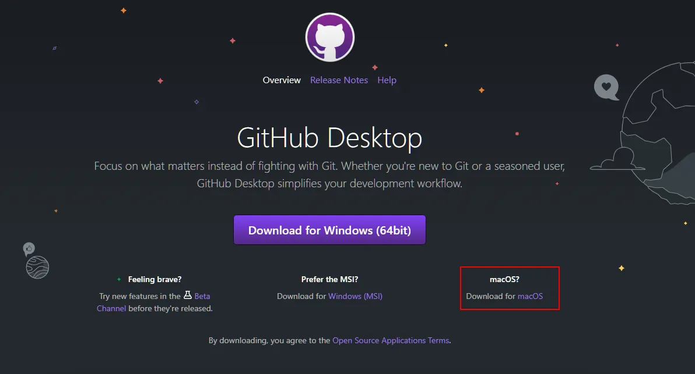
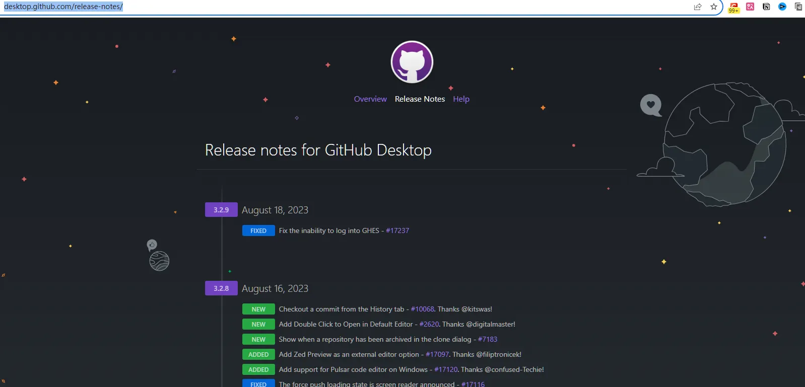
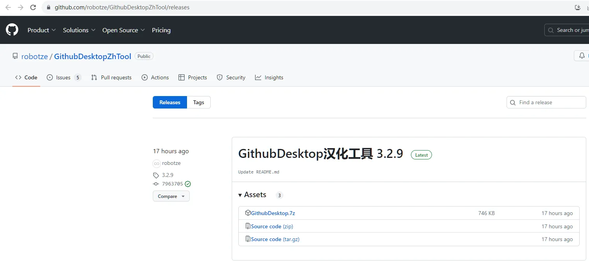
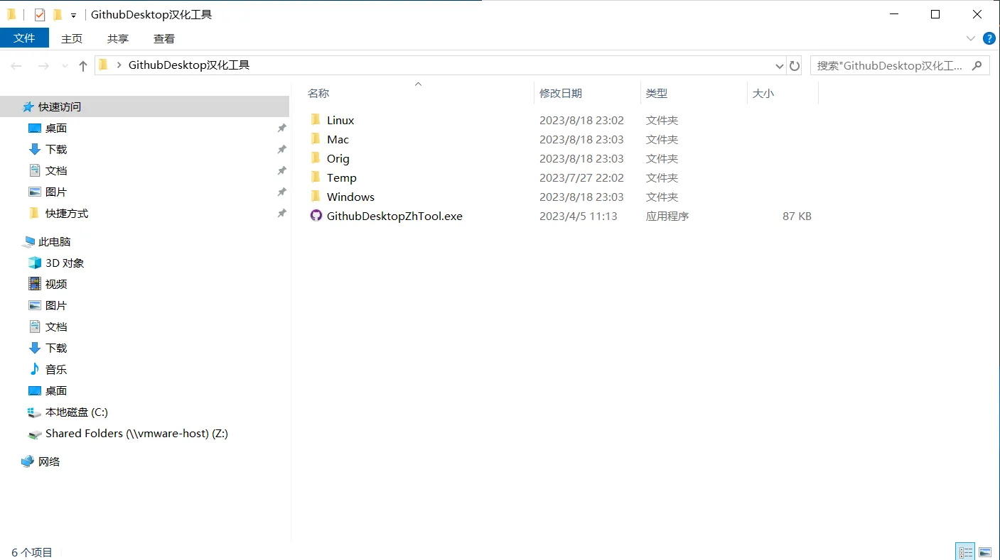
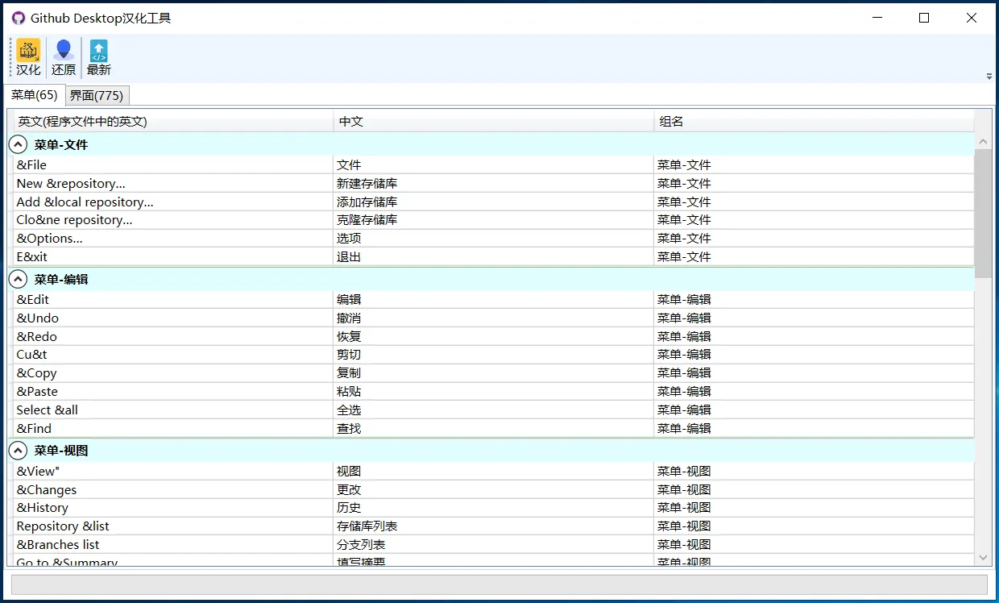
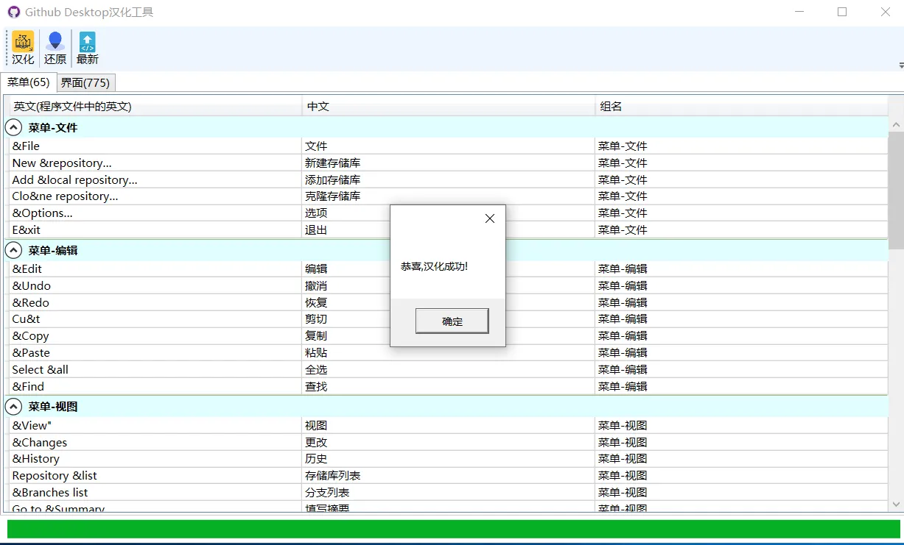
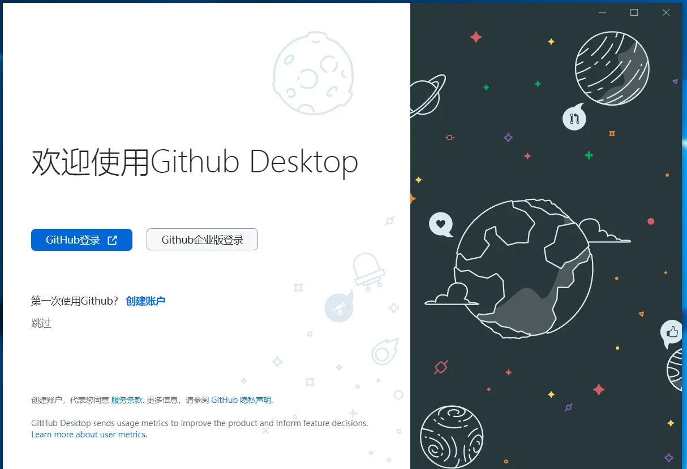

<aside>
😀 这是一款由GitHub官方开发的，针对GitHub的Git桌面应用程序，支持Win/Mac。随着Github版本的不断升级，按照这个方法下载不同版本的汉化包即可。

</aside>

## 1、官网下载GitHub3.2.9

Windows版下载：[https://desktop.github.com/](https://desktop.github.com/)

MAC版本：[https://central.github.com/deployments/desktop/desktop/latest/darwin](https://central.github.com/deployments/desktop/desktop/latest/darwin)

## 2、查看GitHub当前更新版本

[https://desktop.github.com/release-notes/](https://desktop.github.com/release-notes/)

## 3、安装GitHub3.2.9

双击GitHubDesktopSetup安装文件，等一会就安装完成了，没有任何选择项。安装完成后即刻弹出欢迎页面（如下图），如果不需要汉化，至此GitHub桌面版就安装完成了，点击sing in 按钮即可登录。如果想汉化成中文，继续往下看。

## 4、下载GitHub3.2.9 的汉化包

### 4.1、选择对应版本的汉化包

[https://github.com/robotze/GithubDesktopZhTool/releases](https://github.com/robotze/GithubDesktopZhTool/releases) 工具执行文件托管在GitHub上，需要魔法上网才能访问下载。

### 4.2、解压下载的汉化工具包

双击运行汉化工具程序（GithubSesktopZhTool.exe）。如下图所示

### 4.3、点击 【汉化】按钮

### 4.4、看到恭喜字样表示汉化成功。

### 4.5、汉化后的GitHub DeskTop 界面

