> 在了解了 Hugo 的强大之后，现在我们正式开始动手实践。本文将手把手带你在各个主流操作系统（Windows/Mac/Linux）上安装最新鲜出炉的 **Hugo v0.158**，并创建你的第一个 Hugo 基本站点结构。
>

## 1. 安装 Hugo
* **Hugo教程-官网**：<br>https://gohugo.io/installation/windows/（或搜索 “Hugo installation Windows”）。
<br>（支持 Sass/CSS 等高级功能）的 .exe 文件（例如 hugo_extended_0.158.0_windows-amd64.exe），选择 64-bit 版。
* **Windows版下载（Github）：**
https://github.com/gohugoio/hugo/releases/download/v0.158.0/hugo_extended_0.158.0_windows-amd64.zip
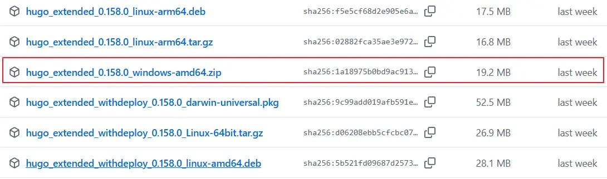
**目前最新版本是0.159.1，Hugo社区活跃版本更新较快，访问下面链接可下载最新版本。**
https://github.com/gohugoio/hugo/releases

* **macOS 平台安装**：<br>
Mac 用户请直接使用 Homebrew：
brew install hugo

* **Linux 平台安装**：<br>
对于 Ubuntu / Debian 系统，可直接从 [Hugo GitHub Releases](https://github.com/gohugoio/hugo/releases) 下载官方的 `.deb` 安装包，<br>然后执行：
sudo dpkg -i hugo_extended_0.158.0_linux-amd64.deb <br>或使用包管理器安装：如 sudo apt install hugo 

## 2.本地部署：
* **创建一个文件夹**（如 D:\hugo），把下载的 hugo.exe 放进去。
* **添加到环境变量（PATH）**：右键 “此电脑” > 属性 > 高级系统设置 > 环境变量 > 系统变量 > Path > 编辑 > 新建 > 添加 D:\hugo > 保存。

* 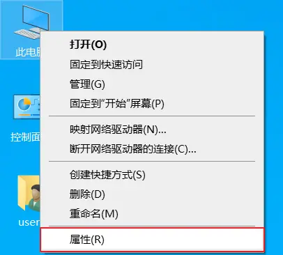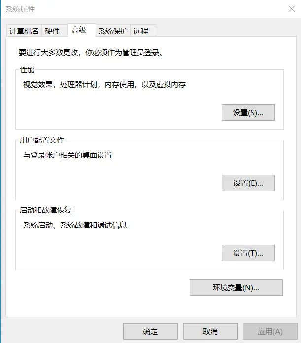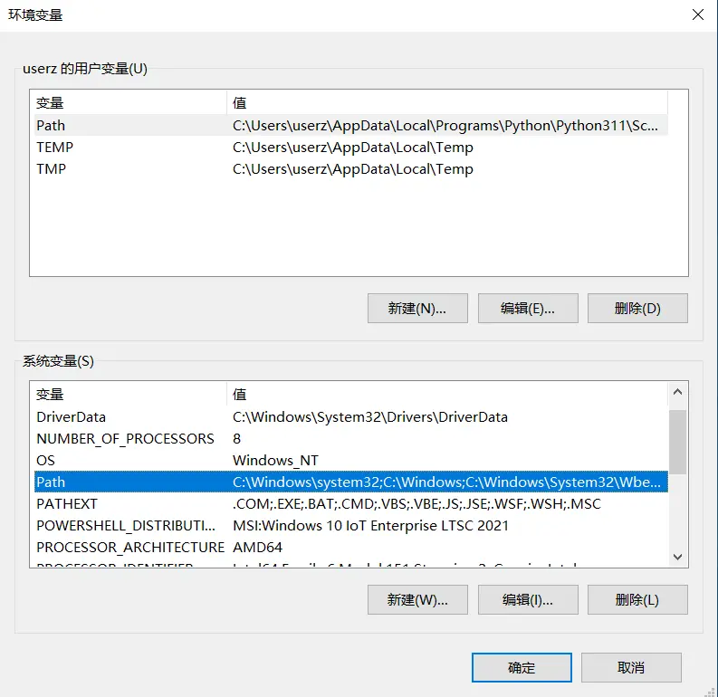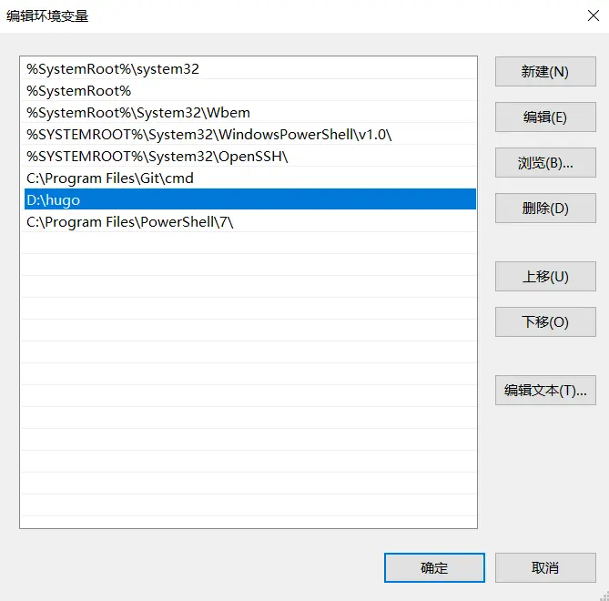

**验证安装**：
打开命令提示符（cmd）或 PowerShell，输入 hugo version。如果显示版本号（如 v0.158.0），说明安装成功。**注意事项**：这里下载的版本不同版本号也会随之变化。
只要输出中包含类似 `v0.158.0` 和 `+extended` 字样，即代表安装成功。
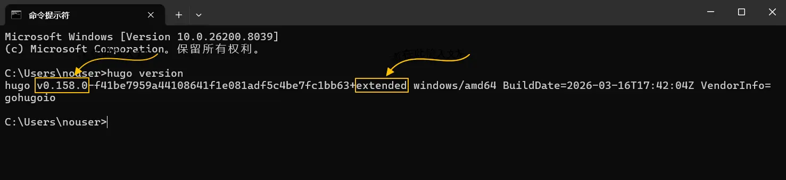

## 3.安装Git
后续部署中会用到Git仓库管理工具，因此这里需要安装Git环境。**下载地址**： [Git官网](https://git-scm.com)<br>
Git安装只要跟着提示下一步，下一步逐步安装即可。安装完成打开powershall或cmd，运行git命令，如果看到下面内容说明安装成功。
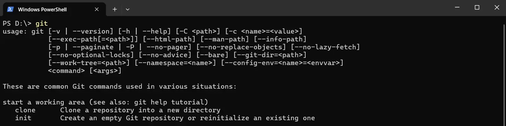

## 4. 创建你的首个 Hugo 站点
打开命令行，切换到你准备存放博客源码的目录（比如 `C:\web\`），运行如下命令：
```code
hugo new site my-hugo-blog
```
此时会生成一个名为 `my-hugo-blog` 的新文件夹。其核心目录结构如下：
1. `archetypes/`：文章模板定义
2. `content/`：这里存放你所有的 Markdown 文章（很重要！）
3. `layouts/`：自定义 HTML 结构
4. `static/`：存放静态资源如图片、CSS 和 JavaScript 
5. `themes/`：存放所有的第三方主题
6. `hugo.toml`：全站的核心配置文件
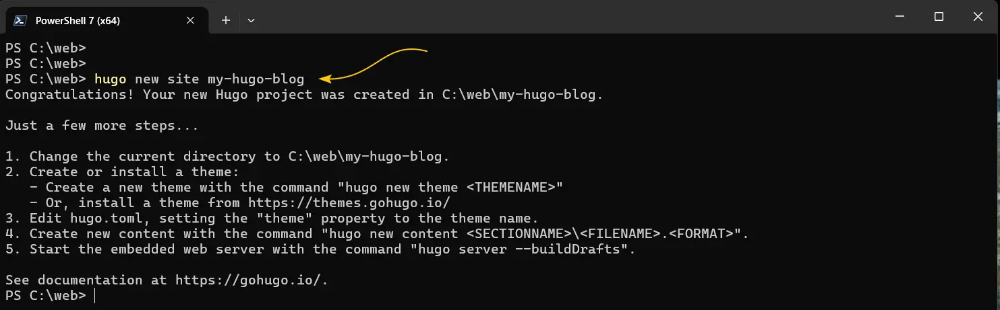
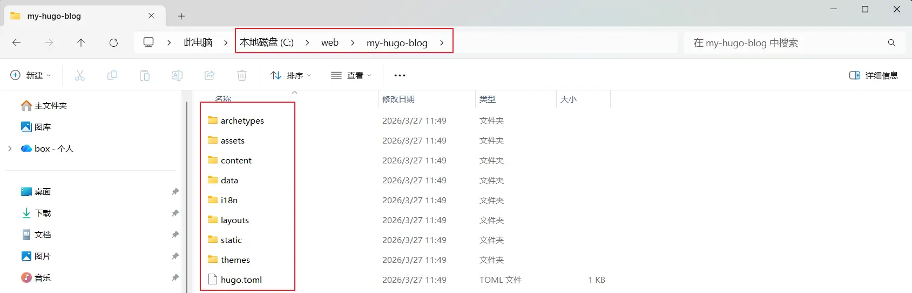

## 5. 本地运行新站点
打开命令行`PowerShell` or `PowerShell`，切换到新建的站点目录（比如 `C:\web\my-hugo-blog`），运行如下命令：
```code
hugo server -D 命令，或 hugo server -D  命令
```
hugo server -D 与 hugo server 的核心区别在于 是否包含“草稿（draft）内容”。<br>
**draft: true** 表示这篇文章是草稿<br>
**draft: false** 表示此文章是正文，`hugo server`只能看到正式发布的文章，无法看到草稿内容。
* **hugo server -D** 表示可以看到草稿+正式发布的文章
* **hugo server**  表示只能看到正式发布的文章
 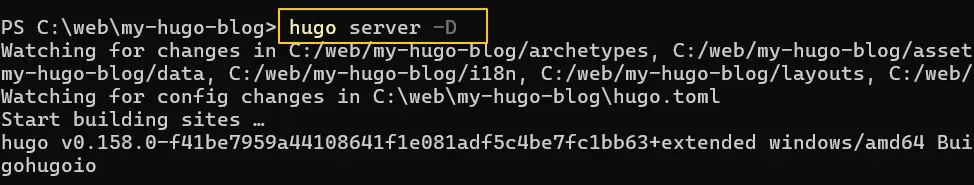
  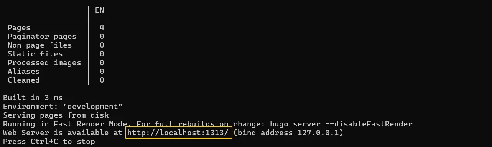

**访问Hogo本地站点** ：<br>
服务器启动成功后，Hugo提供了一个访问本地静态站的链接，修改了内容这个链接会自动刷新，我们会看到实时修改的内容。打开浏览器输入访问地址，或点击命令行窗口中的链接


```code
http://localhost:1313/
```
> **注意事项：**
> 刚建好的站点是没有任何样式的，直接运行 `hugo server` 会看到一片空白。这是因为我们还没有为站点安装任何“主题（Theme）”。
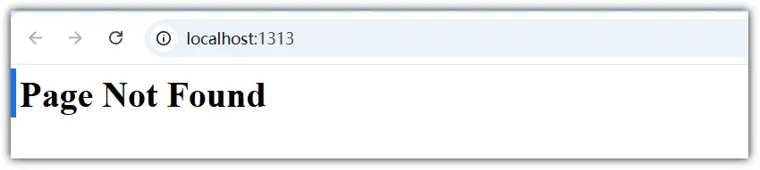
---

## 系列文章导航

我们已经成功迈出了本地环境搭建的重要一步，接下来的重点就是“装修”我们的网站了。

👉 **本系列下一篇预告：** [2026 最推荐 3 个 Hugo 主题实操：PaperMod / Stack / Hugo Blox](/2026-best-hugo-themes)

**查看全系列教程：** 返回 [Hugo建站](/categories/hugo建站/) 查看所有文章！
