“人靠衣装马靠鞍”，一个好的 Hugo 站点离不开优秀的页面设计。在 2026 年，生态里依然活跃着众多精美的 Hugo 主题。今天我们将精选三款最受欢迎的主题，并重点演示如何通过 `git clone` 方式来安装配置 **Stack** 主题。


## 1. 2026 最受推崇的两款主题对比

1. **PaperMod**：极致极简风、超快加载速度、SEO 极其优秀。如果你推崇文字为主的纯净阅读体验，这是不二之选。
2. **Stack**：卡片式设计、精美的暗色模式切换、流畅的交互动画。这是目前最适合搭建个人博客、图文并茂站点的主题。目前使用的博客系统正是这种偏科技风的**Stack** 主题。

## 2. 安装主题的方式对比：
**Git Clone 方式 vs Hugo Module 方式**

在操作之前，我们需要了解在 Hugo 中常用的两种主题安装方式：

1. **Git Clone 方式（适合深度自定义）**：使用 `git clone` 将主题代码完整地下载到站点的 `themes/对应主题名` 文件夹中。**优点**是你拥有该主题所有源代码，并且如果该主题不再维护，你可以非常自由地对其源文件进行魔改。**这也是此文档中采用的安装方式。**
2. **Hugo Module 方式（适合版本管理）**：基于 Go Modules 生态，不需要手动下载代码，只要在配置中声明模块地址即可。**优点**是保持你的博客源码极致精简，且一行命令更新主题；**缺点**是不太顺应深度代码级别的二次开发（重载组件需要额外映射）。

## 3. 实操：
**通过 Git Clone 安装 Stack 主题**<br>
假设我们刚刚创建了 `my-hugo-blog` 目录，现在我们将 [Hugo Theme Stack](https://github.com/CaiJimmy/hugo-theme-stack) 部署进来。

### 步骤 1：进入主题目录并把主题 Clone 下来

打开命令行工具，进入你刚刚新建的站点的根目录，分别运行下面命令：

```bash
cd my-hugo-blog
git init 
git clone https://github.com/CaiJimmy/hugo-theme-stack/ themes/hugo-theme-stack
```
<P>看到下图中的提示说明 <b>Stack主题模板</b> 已经成功下载了，在Themes目录下会看到刚刚安装的 / hugo-theme-stack / 主题文件夹。</P>

 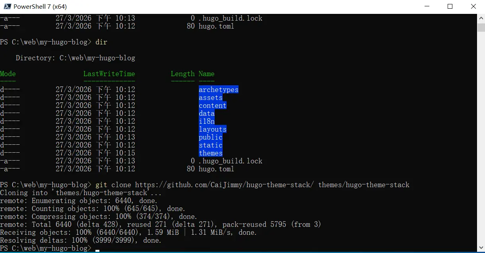

 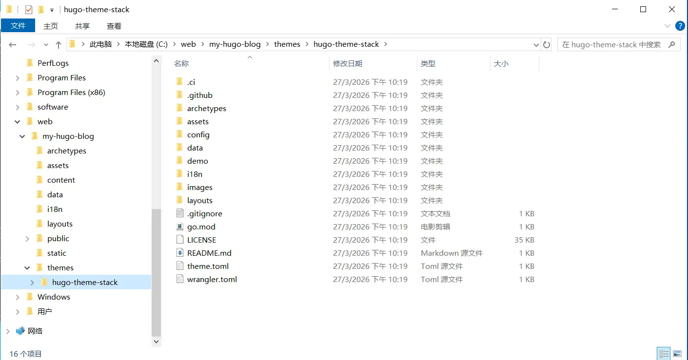

> **注意事项：**
> 如果你打算把整个博客作为 Git 仓库推送到 GitHub，也可以使用 `git submodule add` 代替 `git clone`。但如果你想直接将主题变成自己项目的一部分以便于自由发挥修改，直接 clone 再解除主题自带的 `.git` 关系也是一种做法。<br>
> 当然这种方式需要在命令行窗口敲代码，如果更习惯通过Windows客户端管理仓库，也可安装Github自主开发的免费Git Windows客户端或其他Git管理工具。
> 下载地址： [ **[GitHub Desktop](https://desktop.github.com/download/)** ]
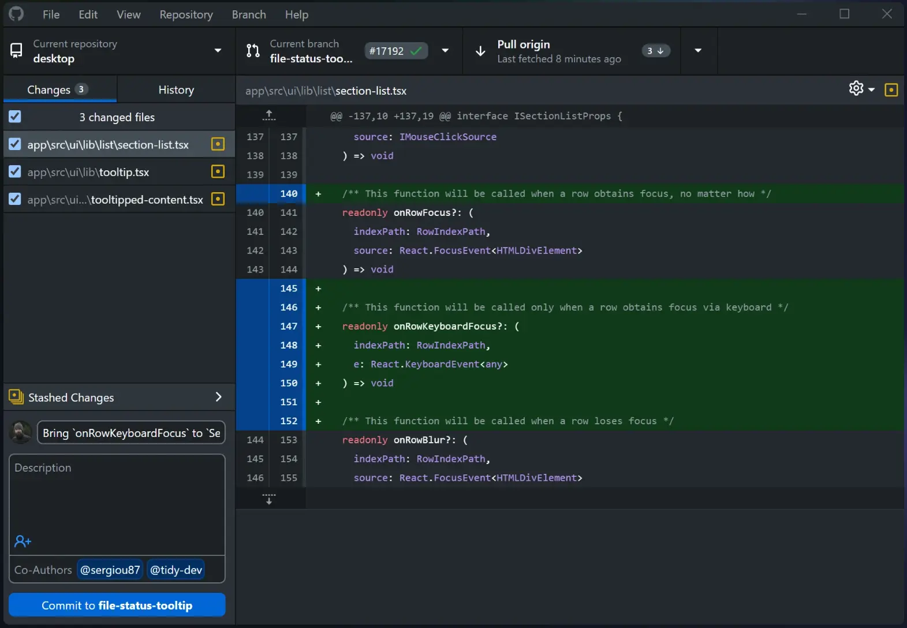

### 步骤 2：激活主题配置

为了让主题生效，我们需要将主题添加到站点配置中。使用编辑器 **打开站点根目录** 下的hugo.toml文件，添加主题参数。注意：要使用 **纯文本编辑器**（比如，windows自带的纯文本编辑器，vscode，notepad++，sublime，vim ... 都可以），不要使用Word。

```yaml
# 添加主题参数（主题名称即 themes/主题文件夹名）
# 路径：站点根目录/hugo.toml (注意是站点根目录，不是主题模板目录)
theme = 'hugo-theme-stack'
```
### 步骤 3：启动本地预览

现在预览一下效果，用以下命令即可启动热更新预览服务：

```bash
hugo server -D
```

打开浏览器访问 `http://localhost:1313`，就能看到那个充满现代感的 Stack 界面了！但此时看到的只是一个简单的页面，这是因为目前只有网站结构还没有实际的内容，下面我们继续将Stack主题模板示例补充完整 ...

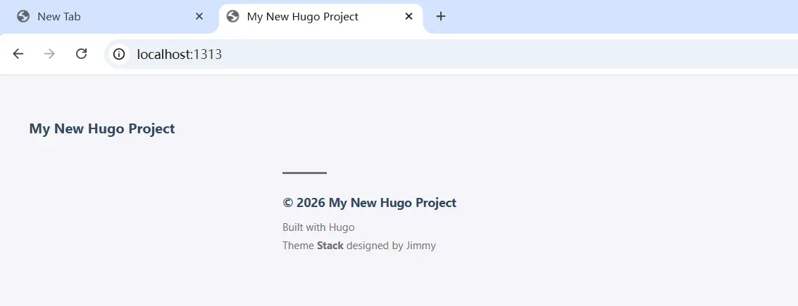

### 步骤 4：完善Stack主题模板

#### 4.1：恢复Stack主题示例内容
* 4.1.1：进入 **Stack主题的示例目录**（C:/本地磁盘/站点/themes/hugo-theme-stack/demo）
  
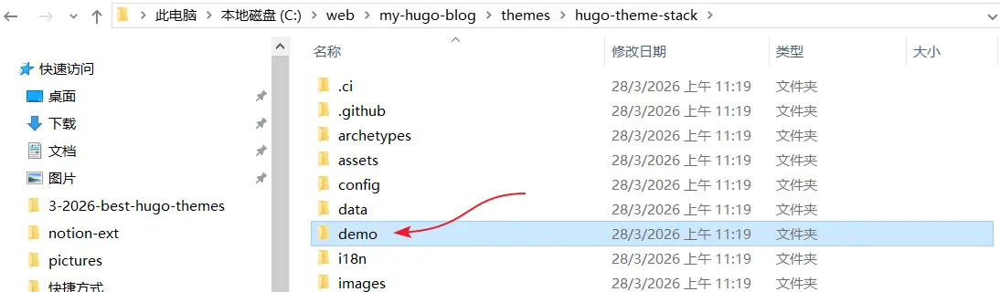

* 4.1.2：复制 **assets**，**config**，**content** 三个文件目录
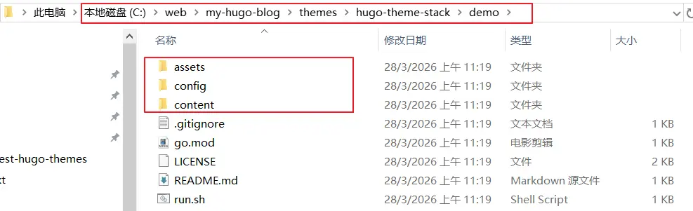

* 4.1.3：粘贴到站点根目录（my-hugo-blog） 
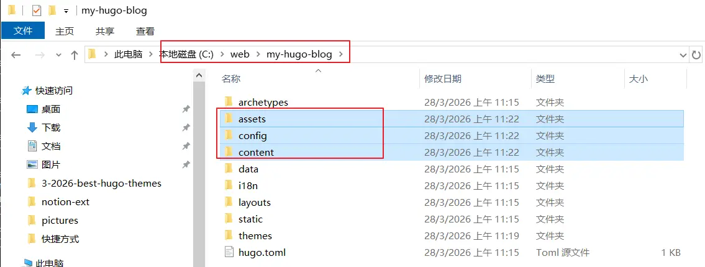

#### 4.2：调整配置参数
由于Stack是比较早期的Hugo主题，虽然Stack原作者最近将版本升级到V4，但源码中依然保留了一些低版本中的命令，在Hugo 0.158版本下运行偶尔会报错。因此在设置中屏蔽和删除了个别参数。
* **4.2.1：启动本地服务错误修正**<br>
当我们粘贴 **assets**，**config**，**content** 三个文件目录后，启动本地服务会报出下面的错误。
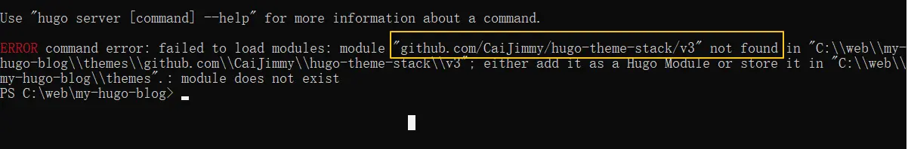
打开（my-hugo-blog/config/_default/hugo.toml）文件
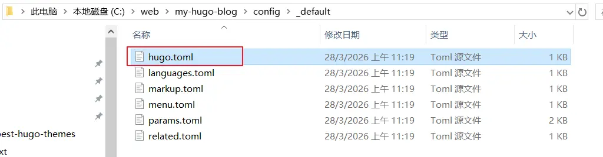
将下面这行注释掉(最前面添加一个#号)<br>
path = "github.com/CaiJimmy/hugo-theme-stack/v3"
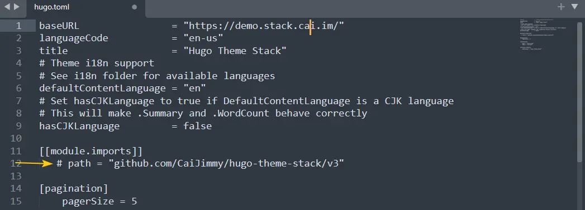
* **4.2.3：删除shortcodes内容文件夹**<br>
文件夹位置：my-hugo-blog/conten/post/<br>
由于服务器加载这个内容页面时会报shortcode错误，为更快快演示，这里就不调试直接删除了，感兴趣想折腾的朋友可以在Stack主题正常运行后，再将shortcodes这个文件夹粘贴回来调试。
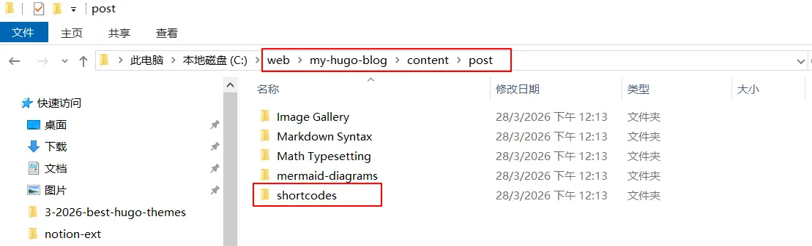

### 步骤 5：重新启动本地预览
在站点根目录重新启动热更新预览服务：

```bash
hugo server -D
```
如果看到了下面的画面说明Stack主题示例安装成功了
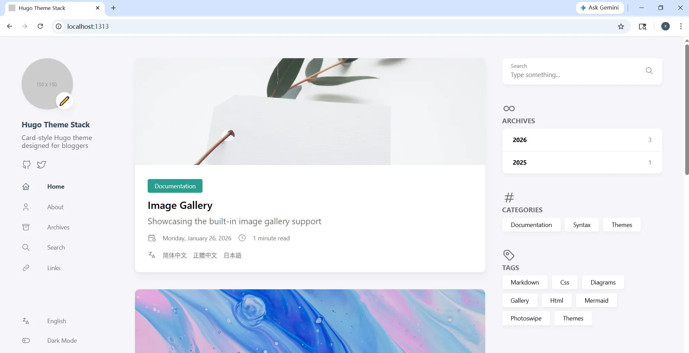

---

## 系列文章导航

恭喜你，你的博客已经拥有了一件漂亮且科技感十足的“外衣”。接下来就是如何源源不断地为它输出文章啦。

👉 **本系列下一篇预告：** <br>[Hugo 写文章全攻略：front matter、分类/标签、多语言配置详解](./hugo-writing-guide.md)

**查看全系列教程：** 返回 [Hugo建站](/categories/hugo建站/) 查看所有文章！
