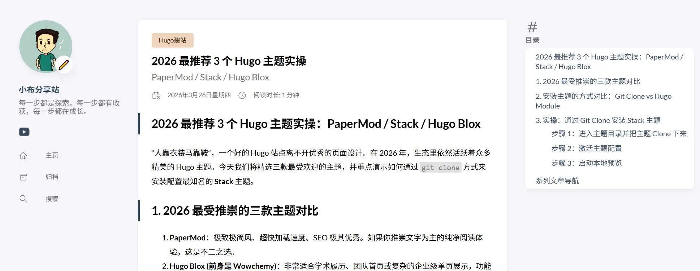

“人靠衣装马靠鞍”，一个好的 Hugo 站点离不开优秀的页面设计。在 2026 年，生态里依然活跃着众多精美的 Hugo 主题。今天我们将精选三款最受欢迎的主题，并重点演示如何通过 `git clone` 方式来安装配置最知名的 **Stack** 主题。


## 1. 2026 最受推崇的三款主题对比

1. **PaperMod**：极致极简风、超快加载速度、SEO 极其优秀。如果你推崇文字为主的纯净阅读体验，这是不二之选。
2. **Hugo Blox (前身是 Wowchemy)**：非常适合学术履历、团队首页或复杂的企业级单页展示，功能无比繁复庞大。
3. **Stack**：卡片式设计、精美的暗色模式切换、流畅的交互动画。这是目前最适合搭建个人博客、图文并茂站点的主题。我们小步的博客系统正是受到这种偏科技风的卡片设计所启发。

## 2. 安装主题的方式对比：Git Clone vs Hugo Module

在动手之前，我们需要了解在 Hugo 中安装主题的两大流派：

1. **Git Clone 方式（适合深度自定义）**：使用 `git clone` 将主题代码完整地下载到站点的 `themes/对应主题名` 文件夹中。**优点**是你拥有该主题所有源代码，并且如果该主题不再维护，你可以非常自由地对其源文件进行魔改。**这正是作者目前在 smallstep.stack 中采用的安装方式。**
2. **Hugo Module 方式（适合版本管理）**：基于 Go Modules 生态，不需要手动下载代码，只要在配置中声明模块地址即可。**优点**是保持你的博客源码极致精简，且一行命令更新主题；**缺点**是不太顺应深度代码级别的二次开发（重载组件需要额外映射）。

## 3. 实操：通过 Git Clone 安装 Stack 主题

假设我们刚刚创建了 `my-hugo-blog` 目录，现在我们将 [Hugo Theme Stack](https://github.com/CaiJimmy/hugo-theme-stack) 部署进来。

### 步骤 1：进入主题目录并把主题 Clone 下来

打开命令行工具，进入你刚刚新建的站点的根目录：

```bash
cd my-hugo-blog
git init 
git clone https://github.com/CaiJimmy/hugo-theme-stack/ themes/hugo-theme-stack
```

> **注意事项：**
> 如果你打算把整个博客作为 Git 仓库推送到 GitHub，也可以使用 `git submodule add` 代替 `git clone`。但如果你想直接将主题变成自己项目的一部分以便于自由发挥修改，直接 clone 再解除主题自带的 `.git` 关系也是一种做法。

### 步骤 2：激活主题配置

为了让主题生效，你需要把刚下载主题文件夹中的示例配置，复制到你站点的根目录中。对于 Stack 主题，推荐你将其 `exampleSite/hugo.yaml` 复制出来，并将原本空的 `hugo.toml` 删除。

```bash
# 复制示例配置（在 Windows 下你可以手动拷贝）
cp themes/hugo-theme-stack/exampleSite/hugo.yaml ./
```

在你的新站根目录打开 `hugo.yaml`，确保其中的主题参数被激活：

```yaml
theme: hugo-theme-stack
```

### 步骤 3：启动本地预览

现在一切就绪，用以下命令即可启动热更新预览服务：

```bash
hugo server -D
```

打开浏览器访问 `http://localhost:1313`，你就能看到那个充满现代感的精美 Stack 界面了！



---

## 系列文章导航

恭喜你，你的博客已经拥有了一件漂亮且科技感十足的“外衣”。接下来就是如何源源不断地为它输出文章啦。

👉 **本系列下一篇预告：** <br>[Hugo 写文章全攻略：front matter、分类/标签、多语言配置详解](./hugo-writing-guide.md)

**查看全系列教程：** 返回 [smallstep.top 系列导航提示](/categories/hugo建站/) 查看所有文章！
