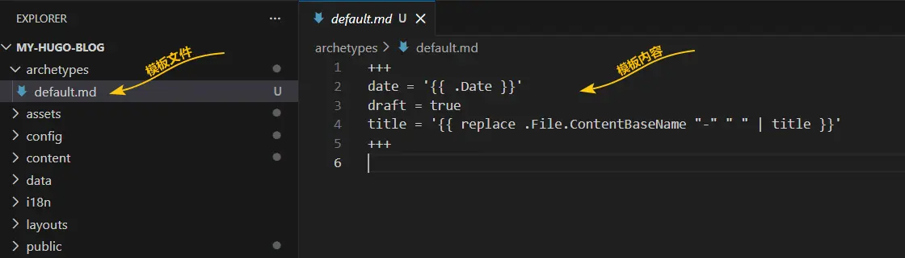
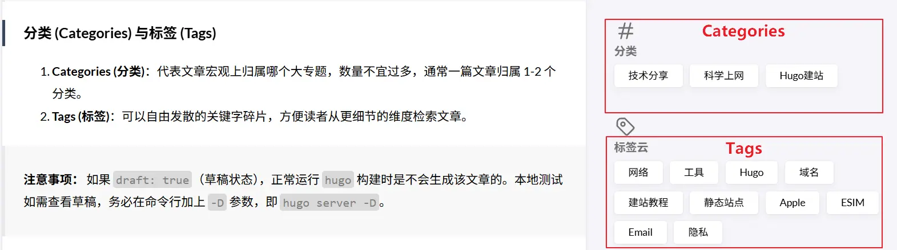

在前几篇文章中，我们已经成功搭建了具有现代设计感的 Hugo 本地站点。今天，我们将拆解这套博客平台中最核心的环节：**如何用标准化的 Markdown 语言进行优雅写作。**

Hugo 的本质，是将你写的 Markdown 文件通过内置模板，渲染成漂亮的静态 HTML 文件。要驾驭它，你必须先了解它的头部描述标准。

## 1. 使用命令行创建新文章

建议始终使用 Hugo 提供的内置命令行来新建文章，这样它能自动带上正确的日期和基础头信息：

```bash
# 在站点根目录下执行
hugo new post/my-first-post.md
```

以上命令会在 `content/post/` 下生成 `my-first-post.md`。

## 2. 深入理解 Front Matter

打开新建好的 `my-first-post.md`，你会看到夹在 `---` 之间的 YAML/TOML/JSON 部分，这就是 Front Matter。它是 Hugo 解析你文章元数据（时间、标题、分类、甚至特定主题自定义缩略图）的核心。如下图是我们刚刚创建文档的 **Front Matter**
```toml
+++
date = '2026-03-28T15:23:08+08:00'
draft = true
title = 'My First Post'
+++
```
而文件中Front Matter的内容，来自于 archetypes目录下的 default.md模板，在default.md模板中可自定义需要的Front Matter内容。就像下面“科技教程类博客结构”


一个标准的科技教程类博客结构通常是这样的：

```yaml
---
title: "深入浅出介绍 Hugo Front Matter" 
description: "一篇详细讲解 Markdown 头部配置的文章"
date: 2026-03-26T10:00:00+08:00
draft: false 
categories: ["技术分享", "Hugo建站"]
tags: ["教程", "Markdown", "2026"]
image: "images/cover-front-matter.png"
---
```
>到这里你会发现两个文档有不太一样，新建的 My First Post 文档是使用 **( +++ )** 三个加号包裹起来且使用的是 **( = )** 等号，而科技教程类博客结构文档却使用 **( - - - )** 三个减号包裹且使用的是 **( : )** 冒号。这是由于 “My First Post”文档使用的是( toml )格式，“标准科技教程类博客结构”文档使用的是( yaml )格式。yaml格式是早期Hugo官方默认格式，也是Stack这个主题模板的格式。toml是目前官方首推的默认格式，虽然是Hugo官方首推，但并未强制转换为toml格式，yaml格式依然可以在Hugo站点中使用。因此后期教程中有关Stack主题模板内容的编写，我们依然延续使用yaml格式。
>

### 分类 (Categories) 与标签 (Tags)

1. **Categories (分类)**：代表文章宏观上归属哪个大专题，数量不宜过多，通常一篇文章归属 1-2 个分类。
2. **Tags (标签)**：可以自由发散的关键字碎片，方便读者从更细节的维度检索文章。
   
   **Categories (分类)** -> 就是Stack主题 Front Matter 中的 **categories（分类）**<br>
   **Tags (标签)** -> 就是 Stack主题 Front Matter 中的 **tags（标签云）**

> **注意事项：**
> 如果 `draft: true`（草稿状态），正常运行 `hugo` 构建时是不会生成该文章的。本地测试如需查看草稿，务必在命令行加上 `-D` 参数，即 `hugo server -D`。

## 3. 多语言配置进阶体验

如果你决定随着在 2026 年拓展国际视野把博客做成双语站，Hugo 对 i18n （多语言支持）的支持极其优秀。这正是很多人放弃早期的工具转投 Hugo 的又一关键所在。

你只需要在原站点的配置文件（如 `hugo.toml`）中增加：

```yaml
languages:
  zh-cn:
    languageName: "简体中文"
    contentDir: content
    weight: 1
  en:
    languageName: "English"
    contentDir: content.en
    weight: 2
```

对应的，你的中文博客依然放在 `content/`，而你的英文翻译版本则存放到 `content.en/`。比如上面的文章对应的英文翻译，可以命名为 `my-first-post.md`，然后填入英文译文。这里只是举个例子。Stask主题中已经提供了中英文，日文，繁体中文多语言版本的示例，感兴趣的小伙伴可参考主题模板修改即可。


## 4. 开始撰写正文

在完成 Front Matter 的填充后，横线下方就是你的纯 Markdown 演出时间了。你可以顺畅地使用标题、引用、加粗、待办事项列表，还有代码高亮！

```bash
echo "Hello Hugo in 2026!"
```

---

## 系列总结

至此，《2026 年从零开始 Hugo 建站入门到进阶系列》的前四篇基础建设篇全部结束。通过本系列教程，我们从工具的选择对比、各平台的本地安装、一直走到主题（以 Stack 为例的 git clone 安装）环境配置以及系统化的写作规范。

准备好用指尖的字符去记录你的思考吧！ 

👉 **本系列下一篇预告：** <br>[自定义 shortcode 实战：常见嵌入功能（YouTube、图片画廊、代码高亮等）](/hugo-custom-shortcode)

**查看全系列教程：** 返回 [smallstep.top 系列导航提示](/categories/hugo建站/) 查看所有文章！
