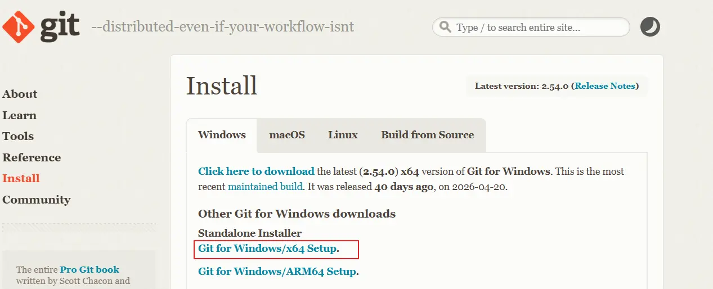
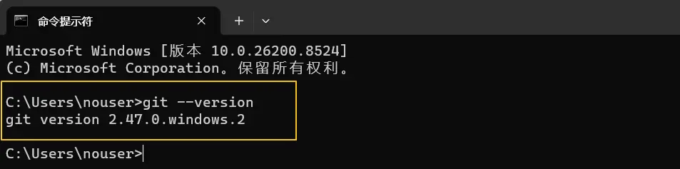
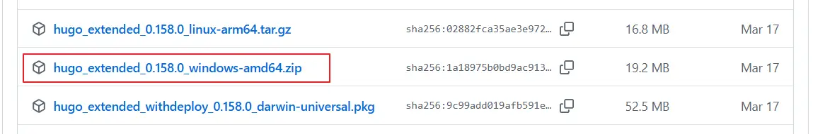
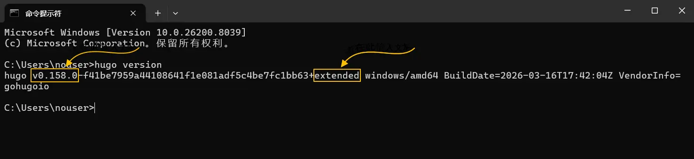
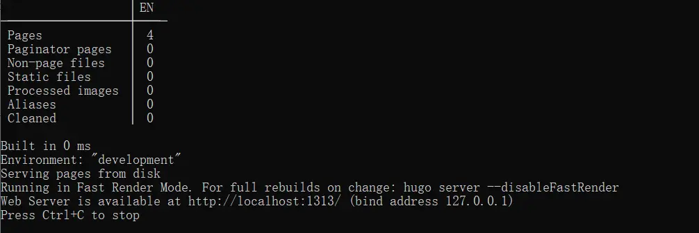
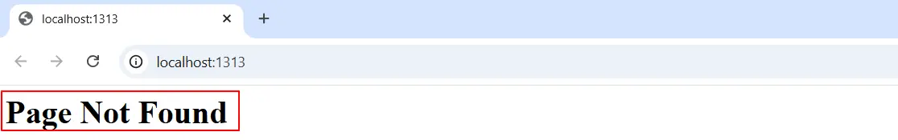
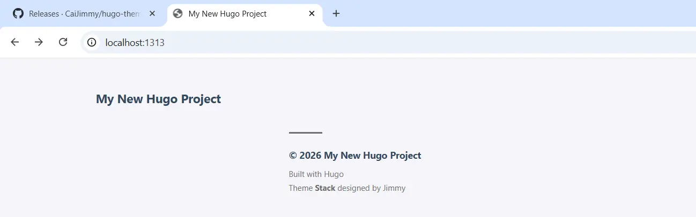
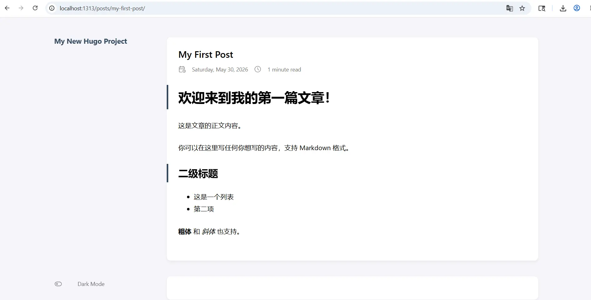
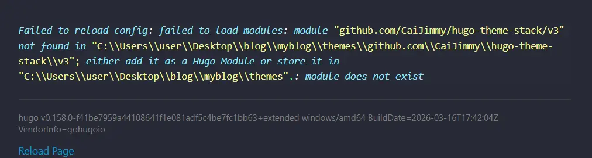
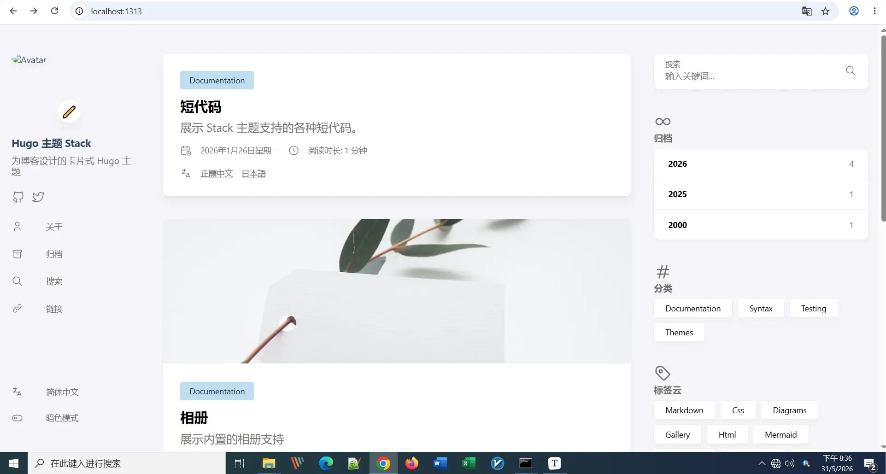

## 做完这篇你能得到什么

打开浏览器，输入 `http://localhost:1313`，看到自己的博客首页。就这一件事。

域名、上线、定制样式后期会逐步分享，这篇只做这一件事。

整个过程需要安装三个工具、运行几条命令、改几行配置。**不需要编程基础，照着做就能完成。**

---



## 第一步：安装 Git

Git 是一个版本管理工具，后面下载Stack模板，推送博客到 GitHub 上都要用到它。

### Windows

打开 [git-scm.com/downloads](https://git-scm.com/install/windows)，点击 **Git for Windows/x64 Setup**。



下载完成后双击安装，安装过程中有几个选项需要注意：

- **Select Components**：保持默认，不用改
- **Choosing the default editor**：建议改选 **Use Visual Studio Code as Git's default editor**（如果你已经装了 VS Code）
- **Adjusting the PATH environment**：选第二项 **Git from the command line and also from 3rd-party software**（默认就是这个）
- 其余步骤全部默认，一路 Next 到底

安装完成后，打开**命令提示符**（按 `Win + R`，输入 `cmd`，回车），输入：

```
git --version
```

看到类似 `git version 2.47.0` 的输出说明安装成功。



### Mac

Mac 通常自带 Git。打开**终端**（在 Spotlight 搜索「终端」），输入：

```
git --version
```

如果弹出安装提示，点击「安装」即可。安装完成后再次运行上面的命令确认。

---

## 第二步：安装 Hugo Extended 版

Hugo 有两个版本：普通版和 Extended 版。Stack 主题用到了 SCSS 编译，**必须安装 Extended 版**，否则后面会报错。**这里我们使用0.158 Extended 版搭建环境，所以建议安装相同版本**。

### Windows

1. 打开 [Hugo Releases 页面](https://github.com/gohugoio/hugo/releases)

2. 找到 v0.158.0 版本（默认看到的是最新版本，往下拉很好找）

3. 在 **Assets** 里找到文件名包含 `extended` 和 `windows-amd64` 的 ZIP 文件，例如：`hugo_extended_0.158.0_windows-amd64.zip`（ [0.158 版本点击下载](https://github.com/gohugoio/hugo/releases/download/v0.158.0/hugo_extended_0.158.0_windows-amd64.zip) ）

   

4. 下载并解压，里面有一个 `hugo.exe` 文件

接下来把 `hugo.exe` 放到一个固定位置，然后添加到系统路径，这样在任何目录都能运行 Hugo 命令。

**推荐做法：**
1. 在 C 盘根目录新建文件夹 `C:\Hugo`（或在其它可用分区新建文件夹）

2. 把 `hugo.exe` 复制进去

3. 打开**系统环境变量**：按 `Win + S` 搜索「编辑系统环境变量」，点击「环境变量」

   **或者** 鼠标右键点  「此电脑」  - 「属性」 - 「高级系统设置」 - 「环境变量」

4. 在「系统变量」里找到 `Path`，双击

5. 点击「新建」，输入 `C:\Hugo`

6. 一路确定，关闭所有窗口

打开一个**新的**命令提示符窗口（已打开的窗口不会读取新的环境变量），输入：

```
hugo version
```

看到输出里包含 `extended` 字样说明安装正确，例如：
```
hugo v0.158.0+extended windows/amd64
```



### Mac

推荐用 Homebrew 安装，最省事：

```
brew install hugo
```

如果还没有 Homebrew，先在终端运行以下命令安装：

```
/bin/bash -c "$(curl -fsSL https://raw.githubusercontent.com/Homebrew/install/HEAD/install.sh)"
```

安装完 Hugo 后确认版本：

```
hugo version
```

---

## 第三步：确认环境正常

两个工具都装好后，在命令提示符（Windows）或终端（Mac）分别运行：

```
git --version
hugo version
```

两条命令都有正常输出，说明环境准备好了。如果任何一条命令提示「不是内部或外部命令」，说明安装没成功，回到对应步骤重新检查。

---

## 第四步：创建 Hugo 站点

选一个你想存放博客文件的位置。建议放在容易找到的地方，比如 `D:\blog` 或 `~/Documents/blog`。

在命令提示符里输入（把路径换成你想要的位置，使用命令创建或资源管理器中直接创建均可）：

```
# Windows 示例，先切换到 D 盘，
d:
mkdir blog
cd blog

# 创建 Hugo 站点，myblog 是文件夹名，可以自己改
hugo new site myblog
cd myblog
```

Mac 示例：

```
mkdir ~/Documents/blog
cd ~/Documents/blog
hugo new site myblog
cd myblog
```

创建成功后，`myblog` 文件夹里会有这些内容：

```
myblog/
├── archetypes/     ← 文章模板，暂时不用管
├── assets/         ← 自定义样式、脚本放这里（后面会用到）
├── content/        ← 你写的所有文章都放这里
├── layouts/        ← 自定义模板放这里（中级阶段会用到）
├── static/         ← 图片等静态文件放这里
├── themes/         ← 主题放这里，下一步就是往这里放 Stack
└── hugo.toml       ← 站点配置文件，核心配置都在这里
```

现在最重要的三个文件夹是：**content**（放文章）、**themes**（放主题）、**config**（放配置，下一步会用到，后会创建）。

运行本地服务启动站点：

```
1、启动Web服务：hugo server -D
2、打开本地网站：http://localhost:1313/
```



首次打开网站时会看到 **Page Not Found** 的提示。

### 为什么会这样？

Hugo 的设计理念是：“**不自带默认主题**”，它必须依赖 themes/ 目录下的主题，或者你在 layouts/ 目录下自己写模板文件。

没有主题 = 没有页面渲染模板 → 内容虽然存在，但**无法被渲染**。下面我们继续～为新站添加主题模板。



添加第一个页面：

```
hugo new posts/my-first-post.md
```


---

## 第五步：安装 Stack 4.0 主题

确保你现在在 `myblog` 文件夹里，运行：

```
git clone https://github.com/CaiJimmy/hugo-theme-stack/ themes/hugo-theme-stack
```

这条命令会把 Stack 主题下载到 `themes/hugo-theme-stack` 文件夹里。网络不好的话可能需要等几分钟，或者开启科学上网工具。

下载完成后，确认文件夹存在：

```
# Windows
dir themes\hugo-theme-stack

# Mac
ls themes/hugo-theme-stack
```

能看到一堆文件和文件夹说明下载成功。

> **ZIP 下载方式（备选）**
> 如果 git clone 网络太慢，可以去 [github.com/CaiJimmy/hugo-theme-stack](https://github.com/CaiJimmy/hugo-theme-stack) 点击绿色的 **Code** 按钮，选 **Download ZIP**，解压后把文件夹重命名为 `hugo-theme-stack`，放到 `themes/` 下面即可。

> **关于 Git Submodule**
> 你可能在其他教程里看到过 `git submodule add` 命令，这是另一种安装方式，适合对 Git 比较熟悉的用户。两种方式功能相同，本教程用 clone 方式，更简单直接。

加载主题：打开新建站点根目录下的 hugo.toml 文件添加刚刚下载的模板

```
baseURL = 'https://example.org/'
locale = 'en-us'
title = 'My New Hugo Project'

theme = 'hugo-theme-stack'   ← 加载模板，模板名称就是文件夹名称「hugo-theme-stack」

```

再次启动本地服务WEB服务：

```
1、启动Web服务：hugo server -D
2、打开本地网站：http://localhost:1313/
```

如果看到了下面这个页面，说明 Stack 模板安装成功了。



之前新建的文档 http://localhost:1313/posts/my-first-post/  也正常显示出来了，并且成功套用了Stack模板的样式。



---

## 第六步：复制 demo 配置

Stack 4.0 主题自带了一个演示站点（**demo** 文件夹），里面包含了完整的配置文件和示例页面。直接复制过来用，比从零开始配置省去大量时间。

### 复制配置文件夹

```
# Windows（在 myblog 目录里运行）
xcopy themes\hugo-theme-stack\demo\config config\ /E /I /Y

# Mac
cp -r themes/hugo-theme-stack/demo/config ./
```

复制完成后，`myblog` 下会出现 `config/_default/` 文件夹，里面有这几个文件：

```
config/_default/
├── hugo.toml       ← 主配置文件：标题、语言、baseURL 等
├── languages.toml  ← 语言设置
├── markup.toml     ← Markdown 渲染设置
├── menu.toml       ← 导航菜单设置
├── params.toml     ← Stack 主题专属参数
└── related.toml    ← 相关文章推荐设置
```

### 复制示例页面

```
# Windows
xcopy themes\hugo-theme-stack\demo\content\page content\page\ /E /I /Y

# Mac
cp -r themes/hugo-theme-stack/demo/content/page ./content/
```

这一步复制过来的是归档、搜索等固定页面，Stack 主题的导航栏依赖这些页面。

### 删除默认配置文件

Hugo 创建站点时自动生成了一个 `hugo.toml` [ 位置：`myblog/hugo.toml` ]，现在已经由 `config/_default/` 目录接管，需要删掉这个文件避免冲突：

```
# Windows
del hugo.toml

# Mac
rm hugo.toml
```

## 第七步：修改基础配置

用文本编辑器打开 `config/_default/hugo.toml`（推荐 VS Code）。

### 第一步：删除 Hugo Module 加载段

找到以下这几行，**整段删掉**：

```toml
[[module.imports]]
    path = "github.com/CaiJimmy/hugo-theme-stack/v3"
```

这段是用 Hugo Module 方式加载主题的配置，但我们用的是 git clone 方式，保留这段会导致运行报错。



### 第二步：新增主题指定

在文件顶部（`title` 那行附近）加上这一行，告诉 Hugo 去 themes 文件夹找主题：

```toml
theme = "hugo-theme-stack"
```

### 第三步：修改以下五项配置

```toml
# 本地预览时用 "/"，部署到 Cloudflare 后再改成真实域名
baseURL = "/"

# 本地化格式（日期、数字显示方式），中文改成 zh
locale = "zh"

# 站点标题，显示在浏览器标签和页面顶部
title = "我的博客"

# 语言设置，中文改成 zh
defaultContentLanguage = "zh"

# 中文博客必须设置为 true，否则阅读时长计算不准确
hasCJKLanguage = true
```

其余配置（`[pagination]`、`[permalinks]`、`[services.disqus]` 等）保持不动，中级阶段再逐项调整。

保存文件。

## 第八步：编辑「关于我」页面

demo 已经自带了 about 页面，第六步复制时已经带过来了，直接用编辑器打开：

```
content/page/about/index.zh.md
```

**第一处：把标题和描述改成你自己的**

```yaml
---
title: 关于
description: 关于本站及其作者的一切。
date: 2026-01-26
lastmod: 2026-01-26
menu:
    main:
        weight: -90
        params:
            icon: user
---
```

`title` 和 `description` 按你的实际情况修改，其余字段保持不动。

**第二处：在 Front Matter 下方写你的自我介绍**

```markdown
你好，我是 [你的名字]。

这里写你想让读者知道的内容，比如你在做什么、这个博客写什么方向、怎么联系你。

几句话就够了，不用写太长。
```

> **关于同目录下的 `index.md`**：这是英文版的关于页面，如果你的博客只做中文，保持不动即可，不会影响中文页面的显示。

### 确认固定页面已到位

前面复制 demo 时已经带过来了归档和搜索页面，确认一下：

```
# Windows
dir content\page

# Mac
ls content/page
```

能看到 `about`、`archives`、`search` 这几个文件夹说明一切正常。

## 第九步：本地预览

启动本地服务器：

```
hugo server -D
```

`-D` 参数表示同时显示草稿文章，方便本地预览。

看到类似这样的输出说明启动成功：

```
Web Server is available at http://localhost:1313/ (bind address 127.0.0.1)
Press Ctrl+C to stop
```

打开浏览器，访问 `http://localhost:1313`，你的博客首页就出现了。

**恭喜，你已经拥有自己的网站了！** 🎉

此时可以尝试拷贝 themes\hugo-theme-stack\demo\content\下 **post** 文件夹到 **myblog\content** 目录下，如果出现错误提示，将content\post\下 **shortcodes** 文件夹删除掉 ( 因为复制过来直接用会报错，需要修改配置参数这里就不细说了，到中期时会说到这个 )

## 刷新页面看到带内容的完整网站



## 常见问题

**Q：运行 `hugo server` 后提示 `Unable to locate config file or config directory`**

A：说明当前不在 myblog 目录里。用 `cd myblog` 切换进去再运行。

**Q：页面能打开但样式乱掉，没有卡片布局**

A：检查 `config/_default/hugo.toml` 里是否有 `theme = "hugo-theme-stack"` 这一行，如果没有手动加上。

**Q：命令提示符里出现很多 WARN 警告，但页面能正常显示**

A：WARN 是警告不是报错，不影响使用，忽略即可。

**Q：Mac 上 git clone 很慢甚至超时**

A：挂上网络代理后再运行，或者改用 ZIP 下载方式（见第五步）。

**Q：`xcopy` 命令提示「找不到文件」**

A：确认你现在在 `myblog` 目录里，并且第五步的 git clone 已经成功完成。

## 下一步

本地博客跑起来了，接下来要把它发布到互联网上，让任何人都能通过域名访问。

- 下一篇：[免费把博客发布到全球——GitHub + Cloudflare Pages 部署完整指南](/hugo-cloudflare-deploy)

涵盖：GitHub 仓库创建、代码推送、Cloudflare Pages 
- 返回系列目录：[Hugo 建站指南](/hugo-guide/)
