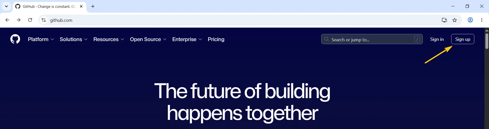
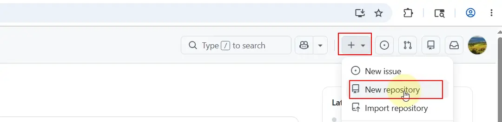
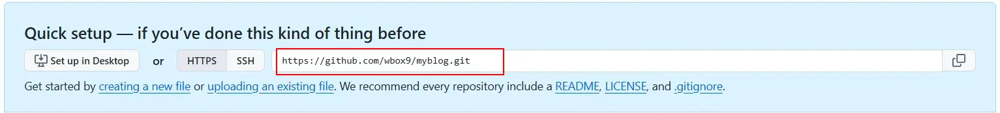
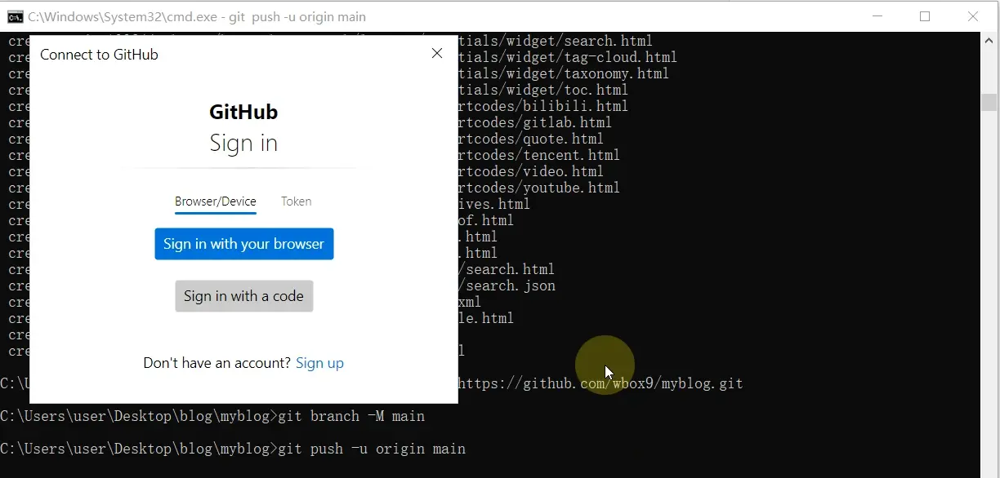
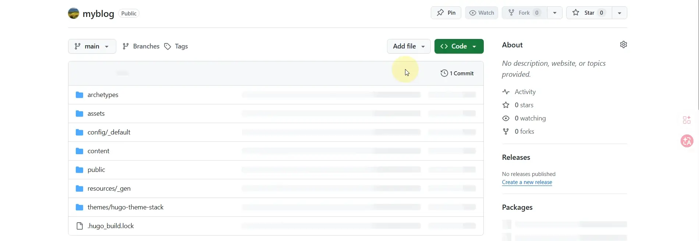
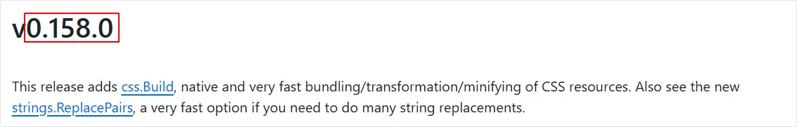
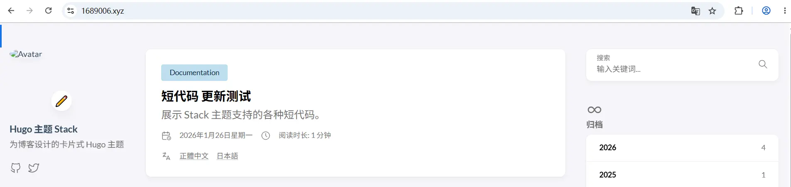

## 做完这篇你能得到什么

一个绑定了自定义域名、任何人都能访问的个人博客。

你在本地改完文章，运行几条命令推送到 GitHub，Cloudflare 自动帮你构建和发布，全程免费，全球访问速度有保障。

**前提：已完成第一篇，本地能正常运行 `hugo server -D`。**

---

## 第一步：注册 GitHub 账号并创建仓库

GitHub 是存放博客代码的地方，Cloudflare Pages 会从这里拉取代码进行构建。

### 注册账号

打开 [github.com](https://github.com)，点击右上角 **Sign up**，填写邮箱、密码、用户名完成注册。已有账号直接登录。（访问前建议开启上网工具）



### 创建仓库

登录后点击右上角的 **+** 号，选择 **New repository**，按以下设置填写：



- **Repository name**：填入你的仓库名，比如 `myblog`
- **Choose visibility**：选 **Public**（Cloudflare Pages 免费版需要公开仓库）
- **Add README**：保持 **Off**，不要开启
- **Add .gitignore**：保持 **No .gitignore**，不要选
- **Add license**：保持 **No license**，不要选

后三项全部保持默认不动，保证创建出来的是一个空仓库。

点击 **Create repository**，仓库创建成功后页面会显示一串命令，先留着，下一步会用到。

---

## 第二步：处理主题的 .git 文件夹

这是推送前**必须处理**的一个问题，跳过这步会导致Git提交时报错。

**问题原因：** 第一篇用 `git clone` 安装 Stack 主题时，主题文件夹里自带了一个 `.git` 文件夹。使用Git命令初始化时会提示仓库已存在。

**解决方法：删除主题里的 `.git` 文件夹。**

打开文件管理器，进入：

```
myblog/themes/hugo-theme-stack/
```

找到里面的 `.git` 文件夹，直接删除。

> **注意**：`.git` 是隐藏文件夹，默认可能看不到。
> - Windows：在文件管理器顶部菜单点「查看」，勾选「隐藏的项目」
> - Mac：按 `Command + Shift + .` 显示隐藏文件

删除后主题文件夹里就没有 `.git` 了，主题文件会作为普通文件正常推送到 GitHub。

---

## 第三步：将本地站点推送到 GitHub

在命令提示符里，确保你在 `myblog` 目录下，依次运行以下命令：

### 初始化本地 Git 仓库

```
git init
```

### 配置 Git 用户信息

第一次使用 Git 需要告诉它你是谁，否则提交时会报错。运行以下两条命令，替换成你自己的邮箱和名字：

```
git config --global user.email "your@email.com"
git config --global user.name "Your Name"
```

> 邮箱建议和 GitHub 注册时使用的邮箱保持一致，只需要配置一次，以后不用重复操作。

### 添加所有文件

```
git add .
```

这条命令把 `myblog` 下的所有文件标记为「待提交」。注意：git add 后面有一个点 “  **.**  ” 不要忘记。

### 提交文件

```
git commit -m "first commit"
```

引号里的内容是这次提交的备注，可以写任何内容。

### 关联远程仓库并推送

依次运行以下三条命令，把地址替换成你自己的仓库地址：

```
git remote add origin https://github.com/你的GitHub用户名/myblog.git
git branch -M main
git push -u origin main
```

> **仓库地址在哪里找？** 
>
> 创建完仓库后，GitHub 页面会显示 **Quick setup** 区域，里面有完整的仓库地址，点右边的复制图标直接复制即可。
>
> 
>
> 如果之前运行过 **git remote add** 再次运行时会出现下面错误提示：

> **`git remote add` 提示 `remote origin already exists`？** 说明之前已经添加过了，把第一条命令换成：
>
> ```
> git remote set-url origin https://github.com/你的GitHub用户名/myblog.git
> ```

初次运行 `git push` 后会弹出 GitHub 登录窗口，点击 **Sign in with your browser**，浏览器会打开授权页面，点击 **Authorize git-ecosystem** 完成授权。授权成功后回到命令提示符，推送会自动继续完成。



推送完成后，打开 GitHub 仓库页面刷新，能看到你的博客文件说明推送成功。



---

## 第四步：注册 Cloudflare 并连接 GitHub

Cloudflare Pages 是免费的静态网站托管服务，每次你推送代码到 GitHub，它会自动重新构建并发布你的博客。

### 注册账号

打开 [cloudflare.com](https://cloudflare.com)，点击右上角 **Sign Up**，填写邮箱和密码完成注册。已有账号直接登录。

### 创建 Pages 项目

登录后在左侧菜单【构建->计算】下找到 **Workers & Pages**，点击进入，然后点击 **Create（创建应用程序）*，选择 **Pages** 标签，选**导入现有 Git 存储库**，点击 **开始使用**。

选择 **GitHub**，点击 **Connect GitHub**，在弹出的窗口里授权 Cloudflare 访问你的 GitHub 账号（选 All repositories，然后点 **Install & Authorize** 按钮 ）。

授权完成后，在仓库列表里找到刚才创建的 `myblog` 仓库，点击选中，然后点击 **Begin setup**。

---

## 第五步：设置构建配置

这是整个部署流程里最容易出错的地方，每一项都要填准确。

在构建配置页面按以下填写：

| 中文界面           | 英文界面                  | 填写内容         |
| ------------------ | ------------------------- | ---------------- |
| 项目名称           | Project name              | myblog           |
| 生产分支           | Production branch         | main             |
| 框架预设           | Framework preset          | Hugo             |
| 构建命令           | Build command             | hugo             |
| 构建输出目录       | Build output directory    | public           |
| 根目录（高级）路径 | Root directory (advanced) | 保持空白，不用填 |

选择 Hugo 框架预设后，构建命令和输出目录会自动填好，确认和上表一致即可。

### 设置 HUGO_VERSION 环境变量

这一项**必须单独设置**，否则 Cloudflare 会用它自带的旧版 Hugo 构建，很可能报错或样式异常。

在同一个页面往下滚，找到**环境变量（高级）**区域，点击 **+ 添加变量**：这里的 **值** 就是实际使用Hugo版本号（0.158.0）



- **变量名称**：`HUGO_VERSION`
- **值**：`0.158.0`

> **为什么必须设置这个？**
> Cloudflare 服务器上预装的 Hugo 版本可能比你本地的旧很多，旧版本不支持 Stack 4.0 的部分新特性，会导致构建失败。指定版本号之后，Cloudflare 会下载并使用和你本地完全一致的 Hugo 版本。

所有配置填写完成后，点击 **Save and Deploy（保存并部署）**。

Cloudflare 开始构建，通常需要 1-3 分钟。页面会实时显示构建日志，看到 **Success** 说明构建成功。

---

## 第六步：绑定自定义域名

构建成功后，Cloudflare 会给你分配一个临时域名，格式类似 `myblog-abc.pages.dev`，已经可以访问了。

接下来把你自己的域名绑定上去。

> **还没有域名？**
> 推荐去 [Spaceship](https://www.spaceship.com) 或 [Namesilo](https://www.namesilo.com) 注册，价格实惠，操作简单。

### 情况一：域名在 Cloudflare 管理

如果你的域名 DNS 已经托管在 Cloudflare，操作最简单：

1. 在Cloudflare **账户主页** 中找到 **构建** / **计算** / **Workers 和 Pages**
2. 点击应用程序名 ( **myblog** ) / 打开 **自定义域名** 选项卡
3. 点击 **设置自定义域名** 按钮
4. 输入你的域名，比如 `yourblog.com`
5. 点击 **Continue（继续）**
6. 在 **确认新 DNS 记录** 页面，点击 **激活域**，Cloudflare 会自动添加 DNS 记录
7. 等待几分钟生效

### 情况二：域名在其他平台管理（Namesilo、Spaceship 等）

需要手动在域名平台添加 DNS 记录，把域名指向 Cloudflare Pages，也就是让Cloudflare托管域名：

**第一步：** 在Cloudflare  **账户主页** / **域** / **添加域名** / **链接域名**，输入你的域名，点击 **继续**，页面会显示 DNS 记录 ，点 **继续前往激活** 看到要更新的服务器信息，类似：

```
A.查找名称服务器部分
B.添加您已分配的各个Cloudflare名称服务器：
elly.ns.cloudflare.com
ernest.ns.cloudflare.com
C.删除你的其他名称服务器：
lanuch2.spaceship.net
launch1.spaceship.net
```

**第二步：** 登录你的域名管理平台，找到 DNS 管理页面，按照上面显示的记录添加 CNAME 记录。

**第三步：** 回到 Cloudflare，点击 **我已更新名称服务器**，等待 DNS 生效。DNS 生效时间通常是几分钟到几小时不等。

### 更新 baseURL

域名绑定成功后，还需要把本地配置里的 `baseURL` 改成真实域名，否则站内链接会出现问题。

打开 `config/_default/hugo.toml`，把这一行：

```toml
baseURL = "/"
```

改成你的真实域名：

```toml
baseURL = "https://yourblog.com/"
```

保存后重新推送到 GitHub：

```
git add .
git commit -m "update baseURL"
git push
```

推送完成后 Cloudflare 会自动重新构建，几分钟后生效。

---

## 第七步：验证部署成功

打开浏览器，访问你的域名，看到博客首页说明一切正常。



---

## 第八步：日常更新博客的流程

部署完成后，以后每次在本地写完文章或修改了任何内容，按以下流程提交到 GitHub，Cloudflare 会自动重新构建并发布。

### 第一步：本地预览确认没问题

在推送之前，先在本地预览一下确认内容正常：

```
hugo server -D
```

打开浏览器访问 `http://localhost:1313`，确认文章显示正常后，按 `Ctrl + C` 停止本地服务器。

### 第二步：提交并推送到 GitHub

依次运行以下三条命令：

```
git add .
git commit -m "更新说明"
git push
```

- `git add .`：把所有改动的文件标记为待提交
- `git commit -m "更新说明"`：提交改动，引号里写这次改了什么，比如"新增文章：Hugo建站教程"、"修复关于页面错别字"
- `git push`：推送到 GitHub

### 第三步：等待 Cloudflare 自动构建

推送成功后，Cloudflare 会自动检测到 GitHub 仓库有更新，开始重新构建。通常 **1-3 分钟**后刷新你的博客页面，就能看到最新内容。

> **如何确认构建状态？**
> 登录 Cloudflare Dashboard，进入 **Workers & Pages**，点击你的项目，在 **Deployments** 标签里可以看到每次构建的状态和日志。构建成功显示 **Success**，失败显示 **Failed** 并附有错误日志。

---

---

**恭喜，你现在拥有一个真正在线的个人博客了！** 🎉

**Q：推送后 Cloudflare 构建失败，日志里提示找不到主题**

A：回到第二步，确认 `themes/hugo-theme-stack/` 里的 `.git` 文件夹已经删除。

**Q：构建成功但页面样式是乱的**

A：确认 `HUGO_VERSION` 环境变量已经设置为 `0.158.0`，并且构建命令是 `hugo` 而不是其他。

**Q：绑定域名后访问提示「SSL 证书错误」**

A：Cloudflare 会自动申请 SSL 证书，但需要一点时间。通常等待 10-30 分钟后刷新页面即可恢复正常。

**Q：推送后一直显示 `main` 分支不存在**

A：说明你本地的默认分支名是 `master`。把 Cloudflare Pages 里的 **Production branch** 也改成 `master`，保持一致即可。

**Q：以后更新了 Hugo 版本怎么办**

A：在 Cloudflare Pages 的项目设置里找到 **Environment variables**，把 `HUGO_VERSION` 的值更新成新版本号即可。

---

## 两篇做完，你拥有了什么

- 一个本地可以随时预览和编辑的 Hugo 博客环境
- 一个托管在 GitHub 的代码仓库，所有文章都有版本记录
- 一个通过 Cloudflare Pages 自动部署的在线博客，`git push` 即发布
- 一个绑定了自定义域名、全球可访问的个人网站，完全免费

---

## 下一步：中级阶段

博客已经上线，但现在还是 Stack 主题的默认样式。中级阶段会教你：

- 配置头像、个人介绍、社交媒体链接
- 添加侧边栏精选文章和自定义小部件
- 为文章添加封面图，让首页更有视觉层次
- 调整主题配色和字体，让博客更有个人风格
- 接入 Google Search Console，了解哪些文章流量最高
---
- **上一篇：[零基础搭建个人博客——Hugo + Stack 4.0 本地环境完整指南](/hugo-local-setup)**
- **下一篇：中级01——让博客更像你的：Stack 主题个性化配置指南**（即将发布）
