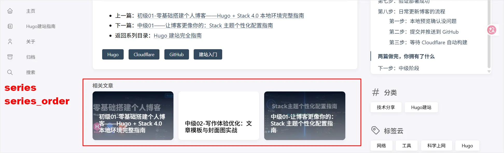



---

## 做完这篇你能得到什么

新建文章时，常用的 Front Matter 字段自动帮你填好，不用每次从零手敲，也不用现场回忆该填哪些字段。封面图放哪、`image` 字段怎么写不用再纠结。如果你也想把默认的 `post` 目录改成更常见的 `posts`，这篇也会说清楚哪些地方要一起改，不然首页文章列表会直接消失。

**前提：已完成中级01，博客的头像、签名、社交链接、导航菜单都配置完了。**

---

## 先搞清楚：Front Matter 是什么，为什么长这样

每篇文章最上面，被 `---` 夹住的那一段——写标题、日期、分类的地方——就是 **Front Matter**。它跟正文内容是分开存放的，Hugo 靠这段信息知道这篇文章叫什么、归到哪个分类、该生成什么样的网址。

这里要提一句容易让人犯迷糊的地方：**Hugo 支持三种 Front Matter 写法**，靠开头结尾的分隔符区分：

| 格式 | 分隔符 | 长什么样 |
|------|--------|----------|
| YAML | `---` | `title: "标题"` |
| TOML | `+++` | `title = "标题"` |
| JSON | `{ }` | `"title": "标题"` |

三种本质上是同一件事的三种写法，效果完全一样。**我们的系列统一用 YAML**（也是 Hugo 默认、社区示例最多的格式），以后看到别的教程用 `+++` 包起来的写法，知道那是 TOML，不用照抄，跟我们的不是同一回事就行。

> **容易搞混的地方：** 配置文件（`hugo.toml`、`params.toml` 这些）本身就是纯 TOML 格式，不需要 `+++` 包裹；但文章顶部的 Front Matter 我们用的是 YAML，需要 `---` 包裹。两者是不同场景下的不同格式，名字像、用法不一样，别混着记。

**Yaml：使用 --- 作为开始和结束的分隔符。**
```yaml
---
title: "文章标题"
date: 2024-05-18T10:00:00+08:00
draft: false
tags: ["Hugo", "前端"]
categories: ["技术博客"]
description: "这是一篇介绍 Hugo Front Matter 的文章"
weight: 10
slug: "hugo-front-matter"

# 自定义参数建议放在 params 下
params:
  author: "张三"
  cover: "/images/cover.jpg"
  series: "Hugo 教程"
---

# 正文从这里开始
```
**Toml：使用 +++ 作为开始和结束的分隔符**
``` toml
+++
title = "文章标题"
date = 2024-05-18T10:00:00+08:00
draft = false
tags = ["Hugo", "前端"]
categories = ["技术博客"]
description = "这是一篇介绍 Hugo Front Matter 的文章"
weight = 10
slug = "hugo-front-matter"

[params]
  author = "张三"
  cover = "/images/cover.jpg"
  series = "Hugo 教程"
+++

# 正文从这里开始
```
**Json：整个 Front Matter 是一个 JSON 对象，{ 必须在第一行，} 单独占一行，后面空一行再写正文。**
```json
{
  "title": "文章标题",
  "date": "2024-05-18T10:00:00+08:00",
  "draft": false,
  "tags": ["Hugo", "前端"],
  "categories": ["技术博客"],
  "description": "这是一篇介绍 Hugo Front Matter 的文章",
  "weight": 10,
  "slug": "hugo-front-matter",
  "params": {
    "author": "张三",
    "cover": "/images/cover.jpg"
  }
}

# 正文从这里开始

```
---

## 第一步：把 Front Matter 标准字段定下来

写了几篇文章下来，每次新建文章前，脑子里要过一遍——这次该填哪些字段？这一步先把字段本身搞清楚，下一步再用 Archetype 让它们自动出现。

**标准字段长什么样：**

```yaml
---
title: ""
date:
lastmod:
draft: false
description: ""
keywords: []
categories:
  - 
tags:
  - 
url: ""
image: ""
series: [""]
series_order:
---
```

大部分字段顾名思义不多解释了，挑几个容易搞混的说一下：

- **draft **，表示这篇文章是否为草稿，true 代表真，false代表假，为真时服务器不生成该页面，用户看不到。所以发布前需设置为假 false。
- **`description`**：是文章摘要介绍，Stack主题中显示在标题的下方，它不仅可以吸引阅读者的目光，也是给搜索引擎和分享卡片看的摘要，虽然它不会直接提高你的排名，但会极大影响用户的**点击率 (CTR)**。
- **`url`**：Hugo中（`url: 与 /p/:slug/`）是定义页面最终访问地址的两种不同方式。也是最常见的两种方式。`/p/:slug/` 通常是在网站的全局配置文件中设置（比如 config.toml 或 hugo.yaml 文件），全局生效。/p/ 是个可自定义的前缀，可以是任意的英文字母，:slug 是一个变量，通常对应文章 Front Matter 里的 **slug** 字段。而 **`url`** 直接在页面的 **`Front Matter`** 中设置，且仅对当前文章生效。如果两项都设置了，url  优先级最高首先被调用。简单来说：**url 是“强制性手动指定”，而 /p/:slug/ 是“自动化规则”**
- **`keywords`**：纯粹给 SEO 用的，跟正文里出不出现这些词没关系，但建议跟标题、描述里的词呼应一下。

**`categories`、`tags`、`series` 这三个看起来都是"分类用的字段"，但作用完全不一样：**

| 字段 | 谁来处理 | 性质 | 一篇文章建议几个 |
|------|----------|------|------------------|
| `categories` | 自动生成分类页 | 大类归属——文章属于哪个主题板块 | 一两个，不用太多 |
| `tags` | 自动生成标签页 | 细碎标记——文章涉及哪些具体工具/概念 | 可以多个 |
| `series` / `series_order` | 非自动，纯人工维护 | 阅读顺序——文章在系列里排第几 | 系列名 + 一个数字 |

打个比方：`categories` 像书店的分区（技术类/小说类/经济类），`tags` 像贴在书脊上的关键词标签（Hugo、入门），`series` 更像是在说"这是某套教程的第一本，第二本“。前两者点开都能看到一个自动生成的同类内容列表页面，后者会以**``相关文章``**的形式显示在文章内容的最下面。



> **`series` / `series_order` 怎么来的：** 这两个字段不是 Hugo 自带的标准字段，也不是 Stack 主题的功能，是我们在这个系列里自己约定的——Hugo 看到它们不会做任何特殊处理，纯粹是写给"未来的自己"看的标记，配合文末的「系列导航」区块手动维护阅读顺序。只有写系列文章时才需要填，独立文章不需要这两个字段。

**这几个字段虽然标准列表里没列，但以后可能用得上：**

| 字段 | 类型 | 作用 |
|------|------|------|
| `weight` | 数字 | 列表排序权重，数字越小越靠前，比靠日期排序更可控 |
| `aliases` | 数组 | 旧网址重定向到新网址，改了 `url` 又不想读者点到 404 时用 |
| `publishDate` | 日期 | 定时发布，设置未来日期，Hugo 构建时还没到点就不会显示 |
| `expiryDate` | 日期 | 过期下线，到这个日期后文章自动不再生成 |

这几个不用现在就加进 archetype，知道有就行，遇到对应场景再手动加。

**Stack 主题专属字段：**

除了 Hugo 标准字段，Stack 4.0 还有几个会用到的自定义字段：

| 字段 | 作用 |
|------|------|
| `image` | 文章封面图路径（第三步单独讲） |
| `comments` | 这篇文章单独开关评论，覆盖全局设置 |
| `license` | 单独覆盖这篇文章的版权声明文字，设为 `false` 直接隐藏 |
| `toc` | 这篇要不要显示文章目录 |
| `readingTime` | 这篇要不要显示预计阅读时长 |

这几个不用每篇都写，只在某篇文章需要「特殊处理」时才加进 Front Matter，平时跟着全局设置走就行。

---

## 第二步：创建带Front Matter的模板文件

**archetypes** 是 Hugo 里用来 "**快速新建文章**" 的模板系统。简单说，就是当你执行 `hugo new` 命令，创建新文章时，archetypes 模板自动帮你生成，带有预设 Front Matter 的 Markdown 文件。

还记得最初我们通过hugo new 命令创建的那个文件吗？打开它会看到 Front Matter 中已经存在了三行代码。其实这就是通过archetypes下的 default 模板实现的。

**在哪改：** **archetypes模板文件**默认放在站点根目录的 `archetypes` 文件夹下，**模板文件名对应文章类型**，文章类型也可理解为文件夹名。比如我们的文章放在 `content/post`目录下，对应的模板文件就是 `archetypes/post.md`。简单来说，**archetypes下的模板名字，就是content 目录下一级文件夹的名字**

这里有个容易踩的坑——Hugo调用模板文件，是按content 目录下，一级文件夹名来匹配的，比如 hugo new 命令后面跟的是posts，Hugo会优先找 `archetypes/posts.md`，找不到才退回去用 `archetypes/default.md`。所以创建archetypes模板时要注意这个对应关系。

**怎么做：**

打开 `myblog/archetypes/` 目录，新建（或修改已有的）`posts.md`：

```yaml
---
title: "{{ replace .File.ContentBaseName "-" " " | title }}"
date: {{ .Date }}
lastmod: {{ .Date }}
draft: true
description: ""
keywords: []
categories:
  - Hugo建站指南
tags:
  - Hugo
series: [""]
series_order: 0
url: ""
image: ""
---

```

说明一下里面的特殊写法：

- `{{ replace .File.ContentBaseName "-" " " | title }}`：自动把文件名（比如 `my-first-post`）转成标题格式（`My First Post`），省得每次手动打标题，但中文标题建议还是手动改一下，自动转换对中文不友好。
- `date: {{ .Date }}`：自动填入新建时间。
- `draft: true`：默认是草稿状态，写完确认没问题了手动改成 `false` 再发布，避免没写完的文章不小心被发出去。

以后新建文章不再手动建文件，改用命令：

```bash
hugo new posts/xxx.md
```

> **验证：** 运行 `hugo new posts/test-archetype.md`，打开 `content/posts/test-archetype.md`，看到`title`、`date`、`lastmod`、`draft` 已经自动填好，`categories`、`tags` 也带出了你常用的默认值，剩下的，只需要按实际情况修改改 `series`、`url`、`image` 和正文内容即可。

> **如果系列文章需要 `series` 和 `series_order`？** 不是每篇都用得上，可以不写进 archetype 里，写系列文章时手动加这两行就够了。

---

## 第三步：Hugo中怎么有效的组织文件

很多朋友给文章配图的时候，都会犹豫——图片到底该放 `assets` 还是 `static`？正文里的图片路径应该怎么写？而且经常会因路径写错，图片显示不出来。其实这是由于，图片散落在不同目录里，路径关系全靠手动维护造成的。

那怎么解决呢？这个方法就是使用**Page Bundle**，它是Hugo 官方推荐的文件组织方式 。

**Page Bundle（也叫页面捆绑包）** ：**就是把一篇文章（.md 文件）和它相关的所有资源文件（如封面图、图片、内嵌图片等）放在同一个文件夹里**。

这样 Hugo 会自动把这个文件夹识别为“一整篇文章”，资源和文章内容紧密绑定，不需要再写复杂的相对路径或纠结 assets / static 的问题。

### 简单结构示例

text

```
content/
└── posts/
    └── my-first-post/          ← 这就是一个 Page Bundle 文件夹
        ├── index.md            ← 文章正文（必须叫这个名字）
        ├── cover.jpg           ← 封面图
        ├── image-1.jpg         ← 文章内使用的图片
        └── image-2.png
```

### 如何使用（最简单步骤）

1. **新建 Page Bundle**

   - 在 content/post/（或其他分类目录）下新建一个**文件夹**（文件夹名建议用英文、短横线混合定义，如 my-first-post）。
   - 在文件夹里新建 index.md 文件，把文章内容写进去。

2. **放图片**

   - 直接把封面图和其他图片**拖进这个文件夹**，和 index.md 放在同一层级。

3. **Front Matter 中引用**

   YAML
   ```yaml
   ---
   title: 我的文章标题
   date: 2026-06-01
   image: "cover.jpg"     # ← 只需要写文件名，不用写路径！
   ---
   ```
4. **在文章正文中引用图片**

   Markdown

   ```markdown
         ← 这里是Stack主题下的写法
   ```
   
   Hugo 会自动在同文件夹里查找对应的图片文件。

### 从单文件转换成 Page Bundle（最常用操作）

如果想将已有的单个文件，转换为Page Bundle 结构，按照下面步骤操作即可。

1. 新建一个文件夹（比如 my-post）。
2. 把原来的 my-post.md 改名为 index.md 放进文件夹。
3. 把封面图也放进同一个文件夹。
4. 更新 Front Matter 中的 image 字段，只保留文件名即可，这样就完成了转换。

**一句话总结**： **Page Bundle = 把文章和它的图片打包成一个文件夹，Hugo 自动认领，同级目录下直接用文件名引用**。简单、省心、不容易出错，是 Hugo 中长期维护内容的推荐做法。

### 优点（为什么推荐）

- **路径简单**：永远不用写 ../../static/img/xxx.jpg 这种容易出错的长路径。
- **迁移方便**：整个文章文件夹复制粘贴就走，图片不会丢。
- **显示稳定**：封面图在首页、归档页、文章页等地方引用更可靠。
- **符合 Hugo 官方推荐**，功能支持最完整。

### 尺寸建议：

准备 1200×630px 左右、16:9 或接近的横向图片，太窄或太方的图在首页卡片里会被裁掉关键内容。文件大小尽量控制在 500KB 以内，太大会拖慢首屏加载。

> **验证：** 保存后刷新首页，对应文章卡片上出现封面图。

---

## 第四步：把文章目录从 post 改成 posts

**这一步可选，但要改就全改**

Stack 4.0 demo 默认用的文章目录名是 `post`（单数），但更常见的习惯是用 `posts`（复数）。这一步不是必须做的，但如果你也想改名字，这里把所有要同步调整的地方一次说清楚——这是真实踩过的坑，只改目录名不改配置，首页文章列表会直接消失。

**为什么会出问题：** Hugo 的好几个配置项都是按"目录名"对应的，改了目录名却不同步改配置，Hugo 就找不到文章了。

**需要同步修改的三个地方：**

**1. 重命名目录本身**

```bash
# Windows
move content\post content\posts

# Mac
mv content/post content/posts
```

**2. 同步修改 `permalinks` 配置**

打开 `config/_default/hugo.toml`：

```toml
[permalinks]
    posts = "/p/:slug/"
    page  = "/:slug/"
```

把原来的 `post = "/p/:slug/"` 改成 `posts = "/p/:slug/"`，键名要和目录名完全一致。

**3. 同步修改 `mainSections`（最容易漏改的一步）**

打开 `config/_default/params.toml`，找到顶层的 `mainSections` 字段：

```toml
mainSections = ["posts"]
```

把原来的 `["post"]` 改成 `["posts"]`。**这一步最容易漏改**——`mainSections` 决定了首页和归档页去哪个目录抓取文章列表，如果这里还是旧的 `post`，Hugo 找不到对应目录，首页和归档页的文章列表会直接显示为空，但不会报错，容易让人摸不着头脑。

**4. 别忘了 archetype 文件名也要对应**

如果第二步设置了 `archetypes/post.md`，目录改名后这个文件也要重命名成 `archetypes/posts.md`，否则新建文章时 Hugo 找不到对应的模板，会退回去用 `archetypes/default.md`。

> **验证：** 改完三处后，运行 `hugo server -D`，刷新首页，确认文章列表正常显示；再运行一次 `hugo new posts/test.md`，确认 archetype 模板也正常生效。

> **不想改目录名的话：** 保持默认的 `post` 完全没问题，这一步只是给想统一成复数习惯的人参考，跳过不影响其他任何步骤。

---

## 常见问题

**Q：改了 `content/post` 为 `content/posts`，首页文章列表却空了**

A：检查 `params.toml` 里的 `mainSections` 是否同步改成了 `["posts"]`。这是最容易漏改的一步，目录名和 `permalinks`、`mainSections`、`archetypes` 文件名要保持完全一致。

**Q：改完目录名后运行 `hugo new posts/xxx.md`，Front Matter 还是没套用模板**

A：检查 `archetypes/` 下的文件名是否也同步改成了 `posts.md`，目录改名后这个文件名要跟着改，不然 Hugo 找不到对应模板。

**Q：封面图在首页/列表页显示破图**

A：用了 Page Bundle 结构，但 `image` 字段里写了完整路径（比如 `img/cover.jpg`），而不是单纯的文件名。Page Bundle 模式下 `image` 字段只写文件名，比如 `image: "cover.jpg"`。

**Q：文章正文里插入的图片显示不出来**

A：图片放进了 Page Bundle 文件夹，但正文 Markdown 里引用路径写错了，比如多写了 `content/post/我的文章/` 这层路径。Page Bundle 内引用同目录图片，直接写文件名就行，比如 ``，不用写完整路径。

---

## 做完这篇，写文章这件事有了什么变化

- 搞清楚 Front Matter 是什么、YAML/TOML/JSON 三种写法的区别，不会再被不同教程的格式搞晕
- 一套固定的 Front Matter 标准字段，不用每次现场回忆
- 新建文章自动带出常用字段，不用每次手敲
- 一套 Page Bundle 封面图存放方式，彻底告别 assets/static 路径混乱
- 如果想把文章目录改成 posts，知道哪三四个地方必须同步改，不会踩"首页列表消失"的坑

---

## 系列导航

- 上一篇：[中级01——让博客更像你的：Stack 主题个性化配置指南](/hugo-stack-config)
- 下一篇：[中级03——主题视觉定制：custom.scss 覆盖样式、主题色、暗色模式](/hugo-stack-custom-style)
- 返回系列目录：[Hugo 建站完全指南](/hugo-guide)

---

## Front Matter

```yaml
---
title: "写作体验优化：Front Matter、文章模板与内容目录改名"
date: 2026-06-12
lastmod: 2026-06-12
draft: false
description: "每次写新文章都要手敲一遍 Front Matter？封面图路径总是搞混？想把文章目录改成 posts 又怕首页列表消失？这篇把这几个真实存在的麻烦一次解决掉。"
keywords: ["Hugo", "Stack主题", "Archetype", "文章模板", "封面图", "Page Bundle", "mainSections"]
categories:
  - Hugo建站指南
tags:
  - Hugo
  - Stack主题
  - 写作效率
series: ["Hugo建站指南"]
series_order: 4
url: "hugo-frontmatter-cover-image"
---
```
