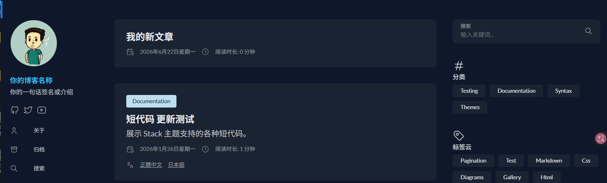
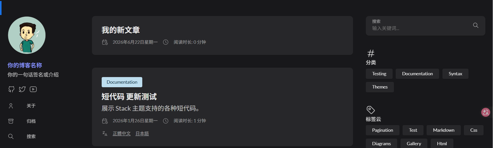
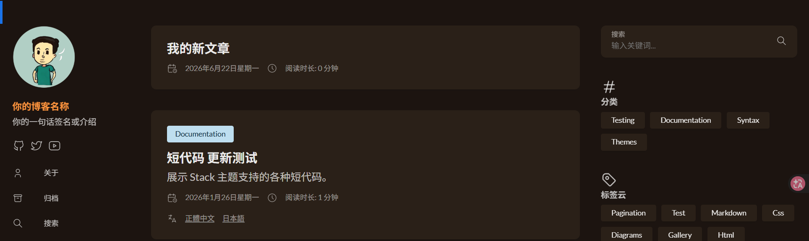

## 做完这篇你能得到什么

你的博客有了自己的主题色，暗色模式下也是你调好的配色，而不是主题默认的样子。最关键的是，这些改动全部写在你自己的文件里，以后主题升级、重新 `git clone`，一点都不会被覆盖掉。

**前提：已完成中级01（头像、签名、社交链接已经配置好）。**

------

## 改样式之前，先搞懂一件事

很多人改主题的第一反应是直接跑去 `themes/hugo-theme-stack/` 文件夹里改源码，改完是好看了，但下次主题更新（或者你重新 `git clone` 一遍主题），改动全部消失，等于白干一场。

Hugo 有个机制：**站点根目录下的文件，优先级永远高于主题目录里同路径的文件**。Stack 主题的开发者也专门留了这个口子——主题自己的 `assets/scss/custom.scss` 文件里其实什么都没写，就一行注释，告诉你"请去你站点自己的 `assets/scss/custom.scss` 里写"。

也就是说，你要做的不是改主题里的文件，而是在 **`myblog/assets/scss/custom.scss`**（注意是站点根目录，不是 `themes` 文件夹里那个同名文件）建一个文件，主题加载样式的时候会自动把这个文件的内容叠加在最后，覆盖掉前面所有默认设置。

------

## 创建自己的专属样式文件

打开你的 `myblog` 文件夹，检查一下有没有这个路径：

```
myblog/assets/scss/custom.scss
```

如果中级01配置头像时已经建过 `assets/scss/` 文件夹，这里只需要新建一个 `custom.scss` 文件；如果还没有，连文件夹一起新建。

文件建好之后先写一行测试一下，确认它真的被加载了：

```scss
:root {
    --body-background: #f0f0f0;
}
```

保存，运行 `hugo server -D` 打开本地预览，如果页面背景变成了浅灰色，说明这个文件已经被正确加载，可以放心往下改了。确认完把这一行删掉或者换成你真正想要的颜色，别让 `#f0f0f0` 不小心留到最后。

------

## 换一个你喜欢的主题色

Stack 主题的颜色（包括圆角、间距）全部用 **CSS 变量** 控制，不是直接写死某个颜色值——好处是一个变量改一次，全站用到这个颜色的地方全部跟着变，不用一个个文件去找。

影响最大的一个变量是 `--accent-color`，控制的是链接颜色、标题左侧的色条、文章目录里当前高亮的项目、锚点图标这些"强调"元素：

```scss
:root {
    --accent-color: #c2410c;
}
```

这里用的是偏暖的赭橙色，换成你喜欢的颜色都行（比如品牌色、头像主色），保存刷新页面，能看到标题旁边的色条、正文里的链接颜色立刻跟着变了。

------

## 三套现成的配色方案，直接选一套抄

如果不想一个变量一个变量自己调，这里准备了三套已经配好、亮色暗色都覆盖好的完整方案，挑一套整段复制进 `custom.scss` 就能用。

**方案一 · 科技蓝**（强调色 `#2b6cb0`，暗色模式下换成 `#38bdf8`，整体偏冷调，技术感比较强）

```scss
:root {
    --accent-color: #2b6cb0;
    --body-background: #f7f9fb;
    --card-background: #ffffff;
    --code-background-color: #eef2f7;
    --code-text-color: #2b6cb0;

    &[data-scheme="dark"] {
        --accent-color: #38bdf8;
        --body-background: #0f172a;
        --card-background: #1a2332;
        --code-background-color: #1e293b;
        --code-text-color: #fbbf24;
    }
}
```

**方案二 · 极简黑灰**（强调色 `#4338ca`，暗色模式下换成 `#818cf8`，灰阶为主，视觉干扰最少）

```scss
:root {
    --accent-color: #4338ca;
    --body-background: #fafaf9;
    --card-background: #ffffff;
    --code-background-color: #f4f4f5;
    --code-text-color: #57534e;

    &[data-scheme="dark"] {
        --accent-color: #818cf8;
        --body-background: #18181b;
        --card-background: #27272a;
        --code-background-color: #3f3f46;
        --code-text-color: #fda4af;
    }
}
```

**方案三 · 暖色文艺**（强调色 `#c2410c`，暗色模式下换成 `#fb923c`，整体偏暖调，阅读感更柔和——接下来的步骤就用这套带你过一遍）

```scss
:root {
    --accent-color: #c2410c;
    --body-background: #faf6f1;
    --card-background: #ffffff;
    --code-background-color: #fef3e7;
    --code-text-color: #9a3412;

    &[data-scheme="dark"] {
        --accent-color: #fb923c;
        --body-background: #1c1410;
        --card-background: #2a2018;
        --code-background-color: #3a2c1f;
        --code-text-color: #fcd34d;
    }
}
```

三套选哪套都行，挑一套整段复制粘贴替换掉 `custom.scss` 里的内容就生效。下面的步骤统一用方案三走一遍流程，方便理解每个变量具体改了什么；如果你选的是方案一或方案二，把代码里的色值对应换一下，思路完全一样。

> 想知道改之前的默认配色长什么样？在写 custom.scss 之前打开本地预览，按 F12 打开开发者工具，选中页面上的标题或链接，在样式面板里找 `--accent-color` 这一行，后面跟着的就是 Stack 主题当前版本真实生效的默认色值——主题不同小版本之间这个值可能会有细微调整，本地查一下最准。

------

## 暗色模式要单独配色，这一步最容易漏

如果你试过把背景色改成白色，会发现亮色模式确实变白了，但切到暗色模式，背景还是主题默认的深色——这是正常的，**`:root` 里写的颜色，暗色模式不会自动跟着换**，需要单独再写一段。

写法是在 `:root` 里嵌套一个 `&[data-scheme="dark"]`，专门管暗色模式下的颜色。接着用前面方案三的代码，带你逐行看一下具体在改什么：

```scss
:root {
    // 亮色模式——暖色文艺风格
    --accent-color: #c2410c;
    --body-background: #faf6f1;
    --card-background: #ffffff;
    --code-background-color: #fef3e7;
    --code-text-color: #9a3412;

    // 暗色模式专属
    &[data-scheme="dark"] {
        --accent-color: #fb923c;
        --body-background: #1c1410;
        --card-background: #2a2018;
        --code-background-color: #3a2c1f;
        --code-text-color: #fcd34d;
    }
}
```

两套颜色互不影响，亮色模式只看上面那部分，暗色模式只看 `&[data-scheme="dark"]` 里面的。如果某个变量你在暗色模式里没单独写，会沿用 `:root` 里的默认值（也就是亮色模式那套）——这也是为什么之前改了背景色，切到暗色还是老样子。

------

## `colorScheme` 开关是另一码事，别和颜色搞混

`themes/hugo-theme-stack/config/_default/params.toml ` 里有一段配置 `[colorScheme]`：

```toml
[colorScheme]
    toggle  = true
    default = "auto"
```

这两行跟你刚才改的颜色没关系，它们管的是：

- `toggle`：页面上要不要显示那个深色/浅色切换按钮
- `default`：没有手动切换的情况下，默认用哪种模式（`auto` 跟随系统设置，`light` 强制亮色，`dark` 强制暗色）

亮色和暗色具体长什么样，还是要靠前面 `custom.scss` 里的两段颜色来决定。这两个东西经常被新手搞混——"为什么我改了配色按钮还显示不对"——其实是两件独立的事：一个管"有没有切换、默认显示哪种"，一个管"切换后具体是什么颜色"。

------

## 常用的几个变量，先记这些就够

不用一次性记住所有变量，日常改版式用得最多的就这几个：

| 变量名 | 作用 |
|---|---|
| `--accent-color` | 强调色：链接、标题色条、目录高亮 |
| `--body-background` | 页面整体背景色 |
| `--card-background` | 卡片背景色（文章卡片、侧边栏小部件） |
| `--card-border-radius` | 卡片圆角，数值越大越圆润 |
| `--code-background-color` / `--code-text-color` | 行内代码的背景色和文字色 |
| `--article-font-size` | 正文字号 |
| `--tag-border-radius` | 标签、行内代码等小圆角元素 |

这几个改一遍，博客的"个人风格"基本就出来了。

如果你想更系统地改（表格、引用块、提示框、阴影深度这些细节都想自定义），我整理了一份更完整的变量参考表，放在文章同目录下，点击就能打开：

📄**[Stack 4.0 主题 CSS 变量完整参考表](/hugo-stack-css-variables/)**

------

## 改完怎么确认是真的生效了

每次改完 `custom.scss`，按这个顺序检查：

1. 确认文件路径是 `myblog/assets/scss/custom.scss`，不是 `themes/hugo-theme-stack/assets/scss/custom.scss`（改错文件夹是最常见的翻车原因）
2. 重新运行一次 `hugo server -D`（有些改动光靠 Hugo 自动刷新不一定能完全生效，重启一次最保险）
3. 浏览器按 `Ctrl + Shift + R`（Mac 是 `Cmd + Shift + R`）强制刷新，跳过缓存
4. 如果某个地方颜色还是没变，按 `F12` 打开开发者工具，鼠标点一下那个元素，在右侧样式面板看它实际用的是哪个变量名——有时候同一个区域用的变量比你以为的更细分

------

## 常见问题

**Q：改了 custom.scss，页面一点变化都没有**

A：先检查文件位置有没有放错文件夹（建在 `themes` 目录下是最常见的原因），再检查有没有重启 `hugo server`，最后试试强制刷新浏览器缓存。

**Q：亮色模式改好了，暗色模式还是默认的颜色**

A：暗色模式的颜色要单独写在 `&[data-scheme="dark"]` 里，不会跟着 `:root` 自动变，回去检查有没有漏写这一段。

**Q：改了 `--accent-color`，但某个地方的颜色还是没变**

A：说明那个位置用的不是这个变量，是另一个更细分的变量（比如代码块用的是 `--code-text-color`，跟强调色是两个变量）。用浏览器开发者工具点一下那个元素，确认实际用的变量名。

**Q：改了 `[colorScheme]` 的 `default`，但配色没变**

A：`[colorScheme]` 只管默认显示哪种模式、有没有切换按钮，不管具体颜色。颜色还是要去 `custom.scss` 里改。

**Q：想恢复主题默认样式怎么办**

A：把 `custom.scss` 里自己写的内容删掉（或者直接清空整个文件）就能恢复，主题本身的文件完全没被动过，不会留下任何后遗症。

------

## 这篇做完，你拥有了什么

- 一个不碰主题源码、主题升级也不会丢的自定义样式入口
- 自己的主题强调色，亮色暗色两套配色都设置好了
- 一份随时可以回来查的完整 CSS 变量参考表

------

## 下一步：流量与变现基础

博客现在看着顺眼多了，接下来该让更多人看到它了。中级04 会讲怎么接入 Google Analytics、Search Console，让你知道流量从哪来、读者在看哪些文章。

- 上一篇：[写作体验优化——Front Matter、文章模板、封面图规范](/hugo-frontmatter-cover-image/)
- 下一篇：流量与变现基础——Google Analytics、Search Console、AdSense（即将发布）
- 返回系列目录：[Hugo 建站指南](/hugo-guide/)

------

## Front Matter

```yaml
---
title: "主题视觉定制——custom.scss 覆盖样式、主题色、暗色模式"
date: 2026-06-23
lastmod: 2026-06-23
draft: false
description: "用 custom.scss 安全地改 Stack 主题的颜色、圆角和暗色模式配色，不碰主题源码，以后主题升级也不会把改动冲掉。"
keywords: ["Hugo", "Stack主题", "custom.scss", "暗色模式", "主题色", "建站"]
categories:
  - Hugo建站
tags:
  - Hugo
  - Stack主题
  - custom.scss
  - 暗色模式
url: "hugo-stack-custom-style"
series: ["Hugo建站指南"]
series_order: 5
---
```

