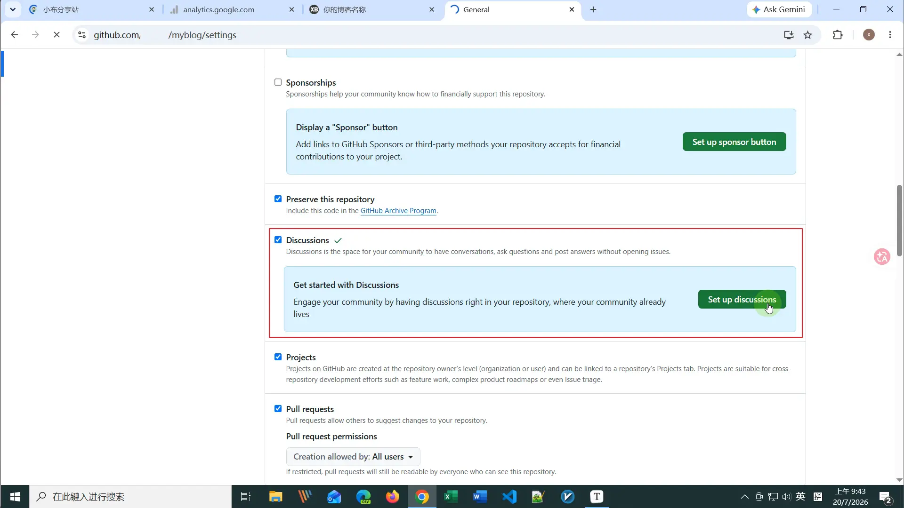
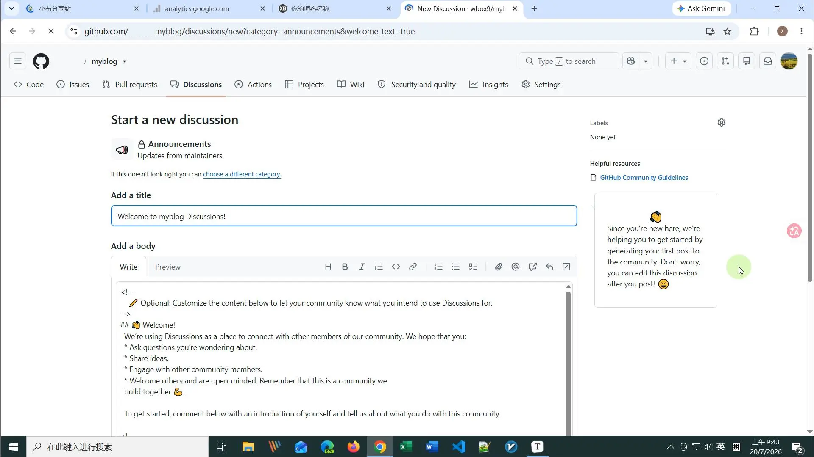
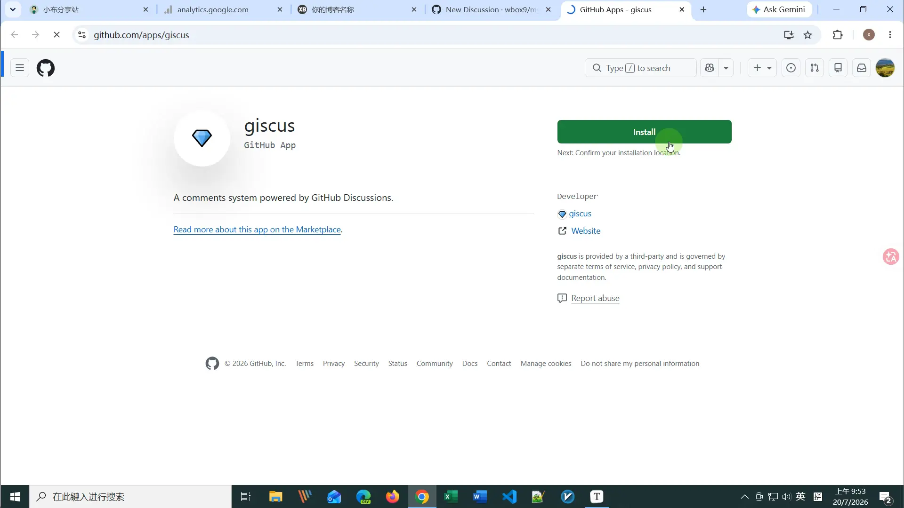
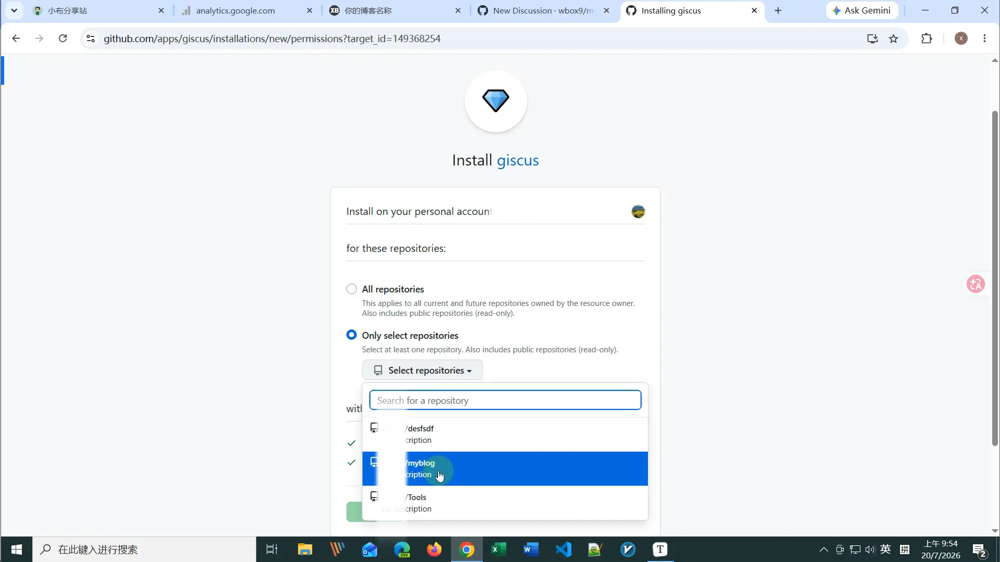
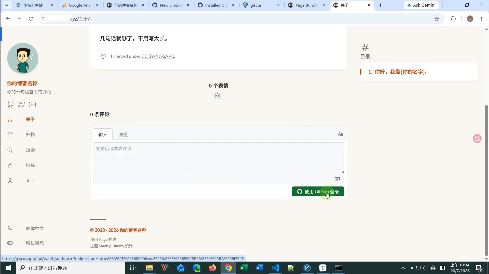

## 做完这篇你能得到什么

文章下面会出现一个评论区，读者用你之前注册的那个 GitHub 账号（对，就是部署博客时用的那个）直接登录就能留言、点赞、回复——不用你额外花一分钱，也不用再多搭一个后端服务。

------

## 先想清楚：现阶段要不要上评论区

说句实话，刚起步的博客流量不大，上线评论区之后大概率是冷清的——这是正常现象，不是你哪里做错了。我自己当年也纠结过这事，后来想明白了：评论区这东西不是靠它一开始就有人用才值得装，而是等真有读者想说点什么的时候，正好有个地方能接住。装上不费事，不装也不影响别的功能，纯粹是"有更好"的事，不用有心理压力。

如果你确定要上，那接下来要解决的第一个问题就是：Stack 这么多评论系统，到底选哪个。

------

## Stack 到底能接哪些评论系统

我直接把 Stack 主题最新的源码拉下来翻了一遍（不是抄网上教程），确认目前一共支持 **14 种**，比很多教程里写的还多两个。按"要不要自己搭后端"分两组看会更清楚：

**纯前端，不用搭后端：** Giscus、Utterances、Beaudar（这三个都基于 GitHub）、Disqus、DisqusJS、Gitalk、Vssue、Cusdis、Remark42、Cactus、Comentario

**需要自己搭一个后端服务：** Waline、Twikoo、Artalk

后面这三个功能更全——支持读者不登录、填个昵称邮箱就能评论，还带后台管理。但代价是要多接一个数据库或者云函数服务，对刚学会 `git push` 的阶段来说，等于又开一条新的维护线。

你可能注意到 Stack 的**默认**评论系统是 **Disqus**，但这篇没有推荐它。原因很直接：Disqus 服务器在境外，国内直接访问加载极慢甚至完全打不开，读者打开文章等半天评论区还在转圈，体验很差；另外免费版会在评论区下方插广告，对博客整体观感影响不小，付费版去广告又是额外成本。Stack 把 Disqus 设为默认，是"全球通用的保底选项"，不是最优选项——就像很多软件默认搜索引擎是必应，不代表必应最好用。

挑几个最常被拿来比较的列一下：

| 方案 | 要不要后端 | 读者评论门槛 | 配置复杂度 | 国内访问 |
|------|-----------|-------------|-----------|---------|
| Giscus | 不需要 | 要登录 GitHub | 低，填5个参数就行 | ✅ 正常 |
| Disqus | 不需要 | 要登录 Disqus | 低，但有广告 | ❌ 基本打不开 |
| Waline | 需要 | 填昵称邮箱即可 | 中，先部署后端 | ✅ 正常 |
| Twikoo | 需要 | 填昵称邮箱即可 | 中，国内云部署方便 | ✅ 正常 |
| Artalk | 需要（自己的VPS） | 填昵称邮箱即可 | 中高 | ✅ 正常 |

------

## 我们为什么选 Giscus

关键就一句话：**你已经有 GitHub 账号了。**

部署那篇（[GitHub + Cloudflare Pages 部署完整指南](/hugo-cloudflare-deploy/)）已经让你注册过 GitHub、建过仓库了，这个门槛早就迈过去了。Giscus 就是把 GitHub 仓库的 Discussions 功能拿来当评论数据库用，读者用 GitHub 账号登录就能留言——对你来说不用再多接一个数据库、不用再多记一个后台密码，纯前端、零成本、零维护，跟整个系列"照做就行，别折腾"的调性最贴。

Waline、Twikoo 这些方案功能确实更全，匿名也能评论，但代价是要多搭一个后端。如果你手上正好有 VPS（比如"VPS 白嫖实战"系列里那台甲骨文 ARM 免费机），Artalk 是个值得考虑的自建方向——这个以后可以另开一篇专门讲，这里先不展开。

------

## 第一步：给仓库开启 Discussions 功能

不用新建仓库，就用你部署博客那个 `myblog` 仓库就行。

打开 GitHub 上的 `myblog` 仓库页面，点击 **Settings**，往下滚找到 **Features** 区域，勾选 **Discussions**，然后点击出现的 **Set up discussions** 按钮完成初始化。



> **注意：** "Set up discussions" 点进去会跳到一个"发第一条讨论"的引导页面，这是 GitHub 的新手欢迎流程，**不需要填任何内容**，直接关掉这个页面就行。它和下一步安装 giscus app 是两件完全独立的事。

进入 Discussions 后，推荐使用默认的 **Announcements** 分类——这种类型普通访客无法自己发起新讨论，只有 giscus bot 自动创建的讨论才会出现在里面，评论区更干净。



------

## 第二步：安装 giscus app

打开 [github.com/apps/giscus](https://github.com/apps/giscus)，点击 **Install**。



在仓库授权页面，选 **Only select repositories**，从下拉里找到 `myblog`，点 **Install** 确认。

> 不要用默认的 All repositories——没必要把所有仓库都授权给 giscus，只给博客那个仓库就够了。




安装完成后页面顶部会提示 "giscus was installed on the @你的用户名 account"，说明装好了。

------

## 第三步：在 giscus 官网生成配置参数

打开 [giscus.app/zh-CN](https://giscus.app/zh-CN)，按以下设置操作：

**仓库：** 填入 `你的用户名/myblog`，出现绿色的勾说明检测通过

**页面 ↔ discussion 映射关系：** 选 **Discussion 的标题包含页面的 pathname**（默认就是这个，不用动）

> 不要选"title"——标题以后可能会改，但 `url` 字段是固定的，用 pathname 匹配更稳，不会因为改标题导致评论找不到历史记录。

**Discussion 分类：** 选 **Announcements**（giscus 官网也推荐用这个类型）

**特性：**
- 启用主帖子上的反应（reaction）：保持勾选，评论区顶部会有 emoji 点赞
- 将评论框放在评论上方：建议勾上，读者不用滑到最底下才能留言
- 懒加载评论：建议勾上，页面打开更快

页面下方会自动生成一段 `<script>` 代码，从里面找到这两个值记下来：

- `data-repo-id` 的值（格式类似 `R_kgDOxxxxxx`）
- `data-category-id` 的值（格式类似 `DIC_kwDOxxxxxx`）

------

## 第四步：把参数填进 Stack 配置

打开 `config/_default/params.toml`，找到 `[comments]` 这一段，**注意要同时把 `provider` 从默认的 `disqus` 改成 `giscus`**，否则即使加了 giscus 参数，博客还是会加载 Disqus：

```toml
[comments]
    enabled  = true
    provider = "giscus"

    [comments.giscus]
        repo             = "你的用户名/myblog"
        repoID           = "上一步拿到的 data-repo-id"
        category         = "Announcements"
        categoryID       = "上一步拿到的 data-category-id"
        mapping          = "pathname"
        lightTheme       = "light"
        darkTheme        = "dark_dimmed"
        reactionsEnabled = 1
        emitMetadata     = 0
        inputPosition    = "top"
        lang             = "zh-CN"
        strict           = 0
        loading          = "lazy"
```

几个字段说明一下：

- `repoID` 和 `categoryID` 注意大小写，是大写的 `ID` 结尾，不是 `repoId`——网上不少教程字段名写得不一致，照抄容易出错，这个我专门去主题源码里确认过的
- `lang` 填 `zh-CN`，评论区界面文字才会显示中文
- `lightTheme` / `darkTheme` 都填好之后，评论区会自动跟着博客的深色/浅色模式切换
- `inputPosition` 填 `"top"`，评论输入框放在评论列表上面，读者不用滑到最底下才能留言

保存后推送到 GitHub：

```
git add .
git commit -m "接入 Giscus 评论系统"
git push
```

------

## 跑起来看看评论区在不在

推送完等 Cloudflare 自动构建（1-3 分钟），打开任意一篇文章往下滚，看到 GitHub 风格的登录入口和评论框说明配置成功了。

打开 `http://你的域名/` 里的任意文章，滚到底部确认评论区出现即可。

注意：用户要想留言需点击【使用 Github 登录】按钮登录Github账户



------

## 怎么关闭评论区

**全站关闭：** 打开 `config/_default/params.toml`，把 `enabled` 改成 `false`：

```toml
[comments]
    enabled  = false
```

保存推送即生效，需要重新开启改回 `true` 就行。

**单篇文章关闭：** 在**那篇文章自己的** `.md` 文件 Front Matter 里加一行：

```yaml
comments: false
```

> **注意文件位置：** 这行必须加在具体文章的 `.md` 文件里（比如 `content/post/my-article.md`），不能加在 `_index.md` 里——`_index.md` 是分支页面，加在里面会级联影响整个目录下所有文章，导致全站评论都被关掉。

单篇关闭的优先级比全局配置高，其他文章不受影响。反过来——如果全站关了评论但想单独给某篇文章开，改成 `comments: true` 即可。

------

## 常见报错与解决

**Q：推送后博客显示的还是 Disqus（转圈加载不出来），不是 Giscus**

A：检查 `params.toml` 里 `provider` 字段有没有改成 `"giscus"`。demo 默认是 `provider = "disqus"`，只加了 `[comments.giscus]` 的参数但没改 `provider`，还是会加载 Disqus。

**Q：评论区显示 "discussion not found" 或一直转圈**

A：大概率是 `categoryID` 没填对，或者 giscus app 安装时选错了仓库。回到 giscus.app 重新检测一遍仓库状态，把 `data-repo-id` 和 `data-category-id` 重新复制核对。

**Q：提示 "repository not found"**

A：检查 `repo` 字段格式是不是 `用户名/仓库名`，少了用户名前缀或者仓库名打错都会报这个错。

**Q：本地能看到评论区，但线上看不到**

A：先确认 Cloudflare 构建是否成功（Dashboard → Workers & Pages → myblog → Deployments）。构建成功的话，大概率是浏览器缓存，强制刷新（`Ctrl + Shift + R`）试试。

**Q：评论区样式跟博客主题不搭**

A：去 giscus.app 挑别的主题样式名填进 `lightTheme` / `darkTheme`，比如 `transparent_dark`、`noborder_light`，主题名称列表在官网生成代码那一步能看到。

------

## 这篇之后，还有什么

评论区接好之后，博客已经具备了"被搜到、被统计、能互动"这三件基本功能。中级阶段最后剩下的两块——多语言配置和站内搜索体验优化，会放到下一篇专门讲。

**系列导航：**
- 上一篇：[SEO 进阶——让 Google 和社交平台真正"看懂"你的博客](/hugo-seo-advanced/)
- 返回系列目录：[Hugo建站指南总目录](/hugo-guide/)
