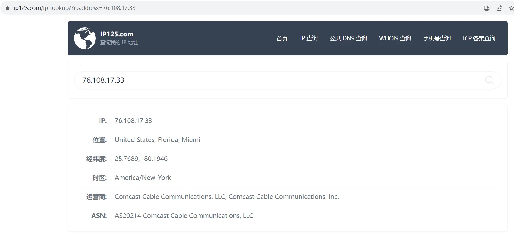
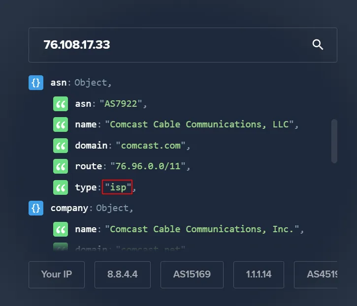
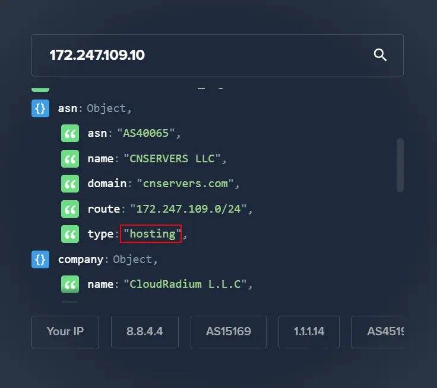
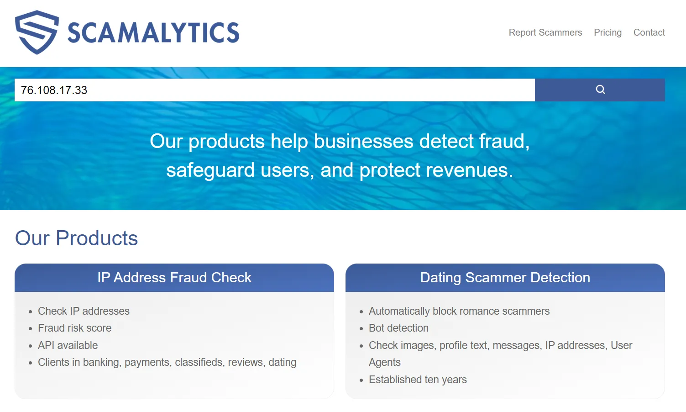
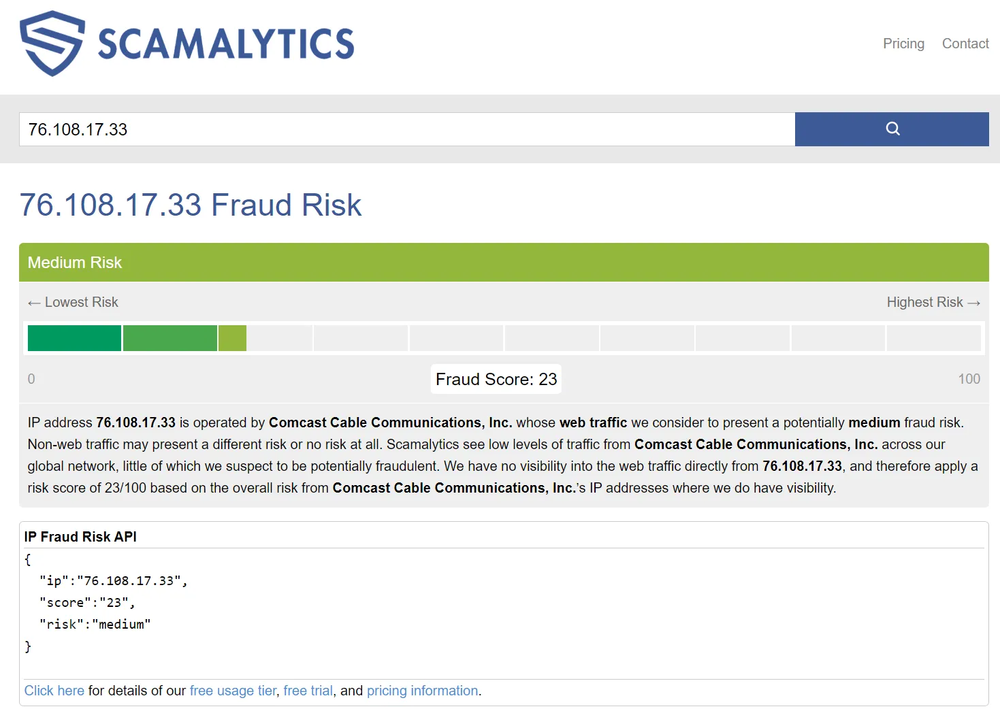
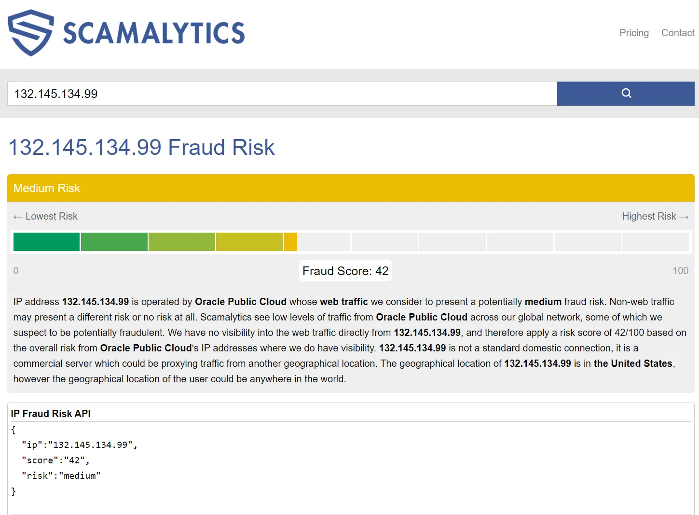



[ 【 **Youtube上观看** 】 ](https://youtube.com/watch?v=-3KqtWvXha8)

<aside>
😀 在网络使用过程中，您是不是遇到过访问被拒绝、被风控，被提示欺诈、而且经常听到，要用原生ip、避免IP被污染等等。今天小布通过一个视频，带您了解什么是原生ip、住宅ip、机房ip、商务ip，以及如何判断ip纯净度

</aside>

[https://youtu.be/-3KqtWvXha8](https://youtu.be/-3KqtWvXha8)

## 1、住宅IP：

住宅IP也被称为家庭宽带IP（**家宽IP**），是由网络运营商为家庭用户分配的IP，不管是国内还是国外，由网络运营商提供的这种家庭上网IP通常都是住宅IP，我们在家使用的联通、电信、移动三大运营商分配的IP都属于住宅IP。平时常说的**原生IP**其实指的就是住宅IP。

住宅IP的最大优势就是干净。因为目标网站通常会认为这种IP是真实的用户在使用，不是机器人，具有很高的真实性，所以在上网的过程中通常不会出现验证提示。注册对IP要求比较高的应用时也不会被风控或提示欺诈。住宅IP只要未被污染过，使用上基本没有什么限制。

## 2、机房IP：

**机房IP**是指由云服务厂商或数据中心提供的ip。我们所知的亚马逊云，谷歌云，甲骨文云，腾讯云、阿里云，以及购买独立主机、虚拟主机、VPS所提供的ip都属于机房ip。机场、自建的节点或VPN使用的也都是机房ip。平时使用时感受不到太多的区别。但在网络环境要求高的情况下，这种IP存在一定的限制。**商务IP**是企业应用场景下的一种叫法，也就是企业从运营商处购买的ip，其实也是机房ip。

## 3、识别是住宅IP还是机房IP

过程中我们用到两个工具:

一个是本机IP查询工具：ip125.com

另一个是ip类型查询工具：ipinfo.io。

这两个都是在线检测工具。如果想检测本机机器正在使用的网络ip情况，使用ip125.com这个工具。这类工具在网络上可以搜到多，可根据自己喜好选择使用。如果想检测ip类型，使用ipinfo.io这个工具，它可以清晰的显示ip类型。同时我们特意准备了三个不同类型的ip地址作为演示素材。

* US：76.108.17.33
* US：172.247.109.10
* JP：132.145.134.99

### 3.1、本机IP查询：

【官网】[https://ip125.com/](https://ip125.com/)

### 3.2、IP类型查询工具

【官网】:[https://ipinfo.io](https://ipinfo.io)

**US：76.108.17.33（isp 住宅IP），type:“isp”代表这个地址是住宅IP**

**US：172.247.109.10（hosting 机房IP）type:“hosting”代表这个地址是机房IP**

**JP：132.145.134.99 （business 商务IP）type:“business”代表这个地址是商务IP**

## 4、如何识别IP地址的纯净度

### 4.1、介绍

所谓的IP纯净度，可以简单的理解为IP地址被污染的程度。

纯净IP是实现注册某些特殊业务的前提，比如注册ChatGPT、Google、Facebook、运营跨境电商，解锁流媒体、注册免费VPS、虚拟电话卡、国外支付平台等这些对网络环境要求较高的应用场景。

Scamalytics是IP纯净度检测网站，主要看Fraud Score的值，分数从0到100，数值越低IP越干净，分数越高风险越高，越不干净。不干净的原因可能是之前有黑客利用这个ip进行过钓鱼欺诈等非法活动，或者同一个IP多次被不同的人注册了同一个应用，被网站识别为恶意注册等。如果数值低于10表示这个ip非常干净，通常30分以下都属于比较干净的IP。如果数值超过了40或者50，注册部分支付网站有由可能通不过，数值虽然偏高，但还是可以使用。如果达到了70以上就不建议使用了。当然这个检测值也不是绝对的，而且不同的检测网站有不同的检测标准，这个工具检测的结果也仅供参考使用。

### 4.2、Scamalytics IP纯净度检测

【官网】[https://scamalytics.com/](https://scamalytics.com/) 



[ 【 **Youtube上观看** 】 ](https://youtube.com/watch?v=3KqtWvXha8)