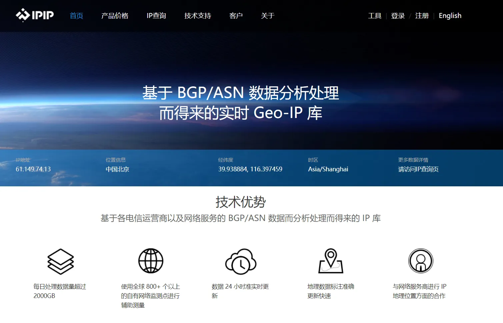
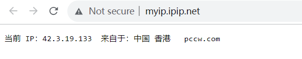
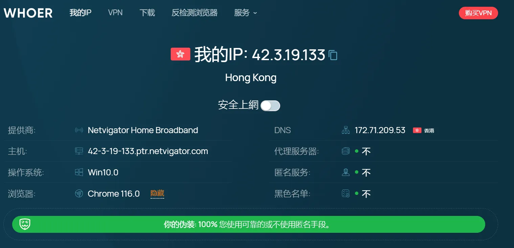
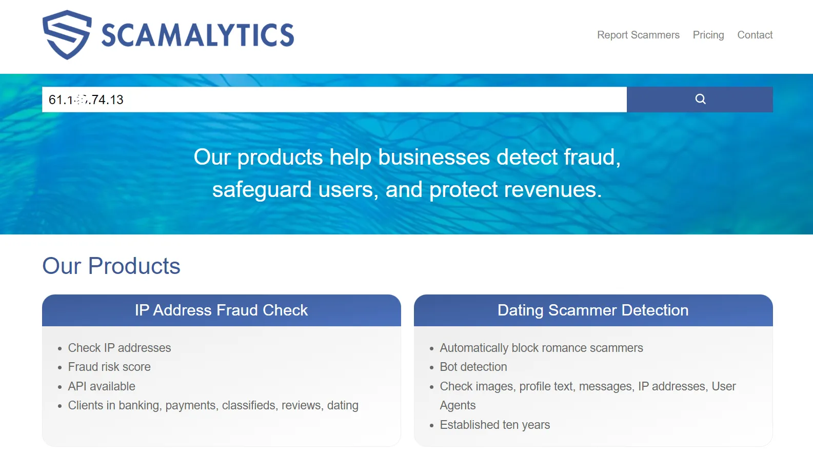
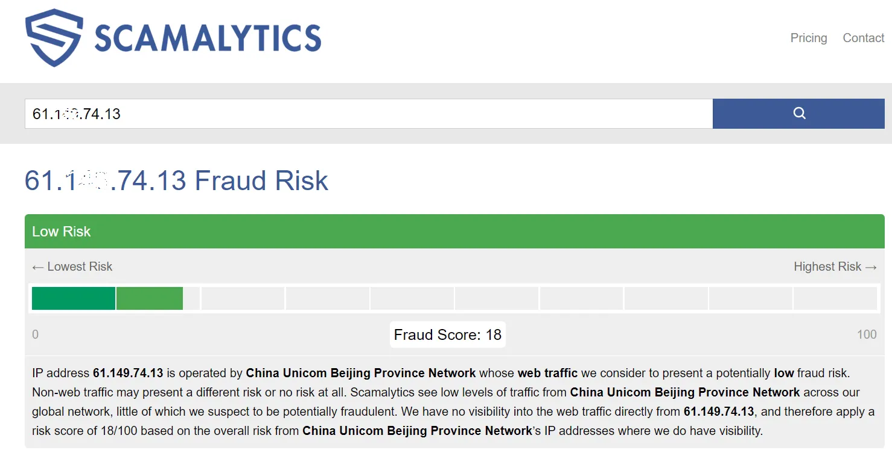
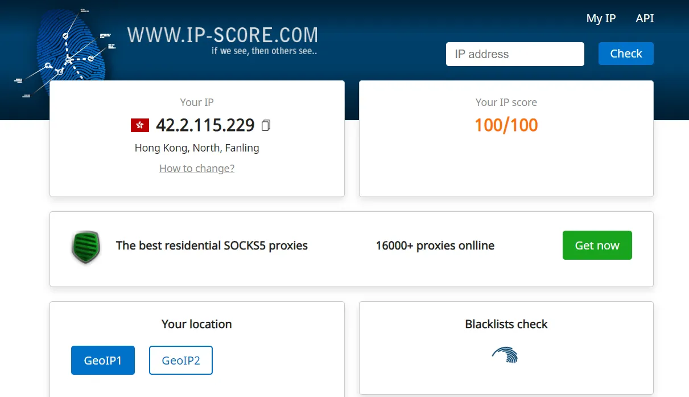
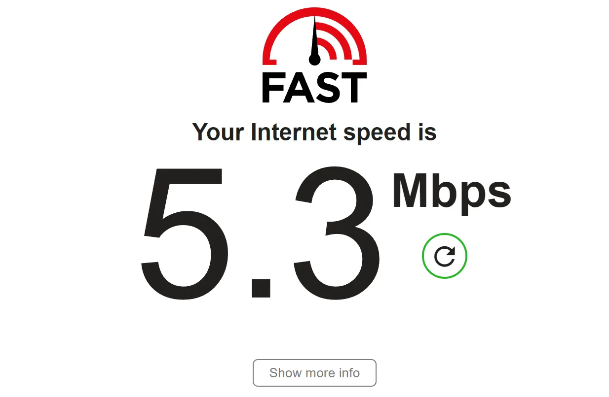
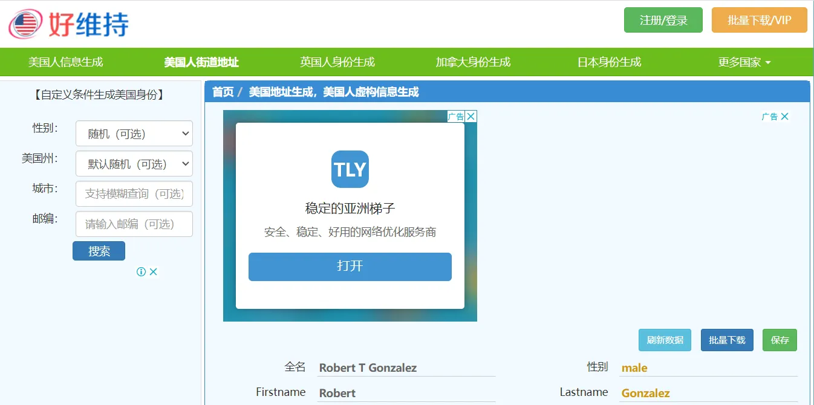
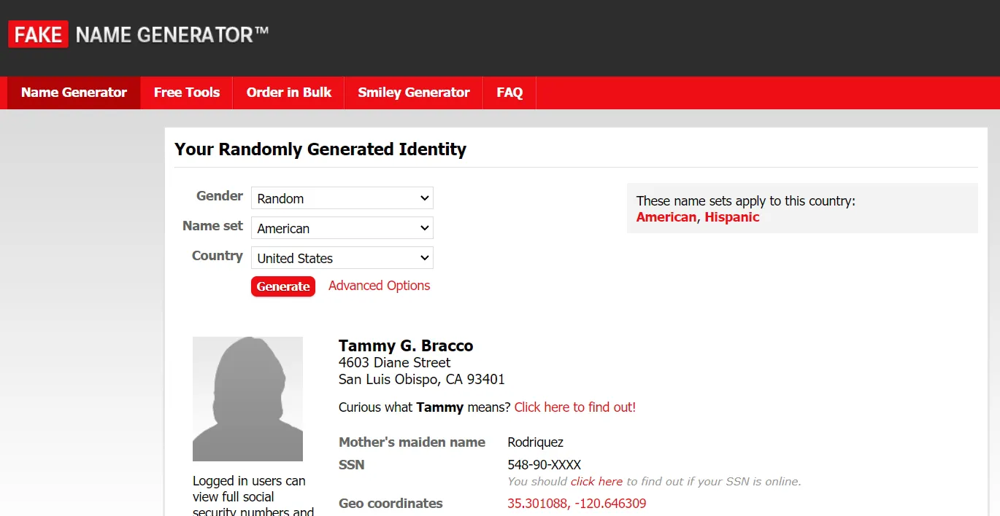

# 网络工具

## 1、网络综合检测：

[https://www.ipip.net/](https://www.ipip.net/)

## 2、验证是否为美国IP1：

[http://myip.ipip.net/](http://myip.ipip.net/)

## 3、验证是否为美国IP2：

[https://whoer.net/zh](https://whoer.net/zh)

## 4、IP质量检测1：

[https://scamalytics.com/](https://scamalytics.com/)

## 5、IP质量检测2：

[https://ip-score.com/](https://ip-score.com/)

## 6、站长工具：

[https://ping.chinaz.com/](https://ping.chinaz.com/)

## 7、测速工具：

[https://fast.com/](https://fast.com/)

## 8、美国地址生成器：

[https://haoweichi.com/](https://haoweichi.com/)

## 9、国外地址生成：

[https://www.fakenamegenerator.com/](https://www.fakenamegenerator.com/)

