> 甲骨文云自有登录验证器，需要单独安装到手机端，验证时需要到手机端点击确认登录。这种方式如果遇到手机损坏，更换手机或卸载了验证器应用APP，要想登录只能联络客服重制，因此这里我们将甲骨文登录验证器，更换为成常用的谷歌验证器。
> 



[ 【 **Youtube上观看** 】 ](https://youtube.com/watch?v=6ADP2jX6OxU)

## 1、登录甲骨文云后台

**甲骨文后台：**[https://cloud.oracle.com/](https://cloud.oracle.com/)

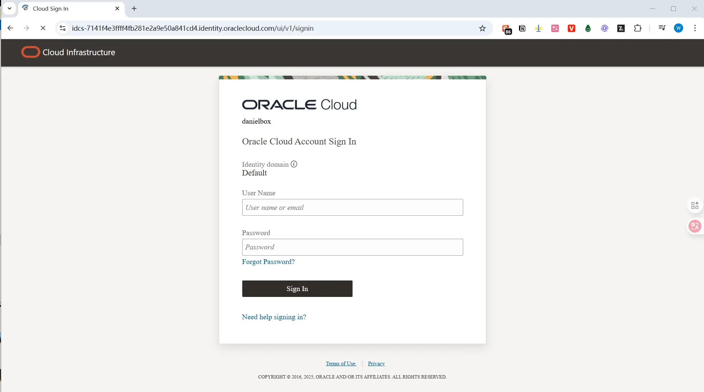

## 2、更换甲骨文验证器

### 2.1、新增【移动应用程序】~新验证器

**开启路径**：

点击【右上方头像】→【邮箱】→【安全】→【两步验证】→【操作】→【添加移动应用程序】

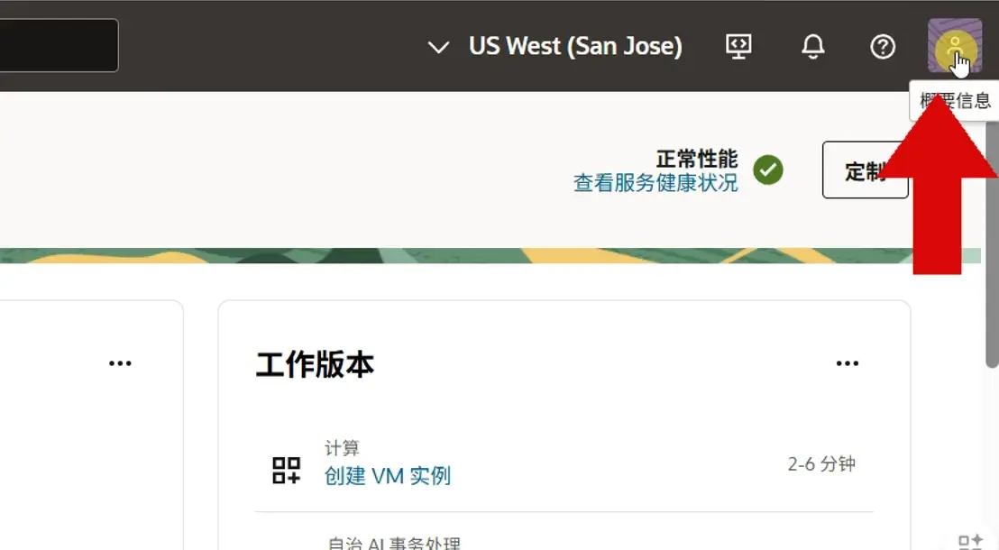

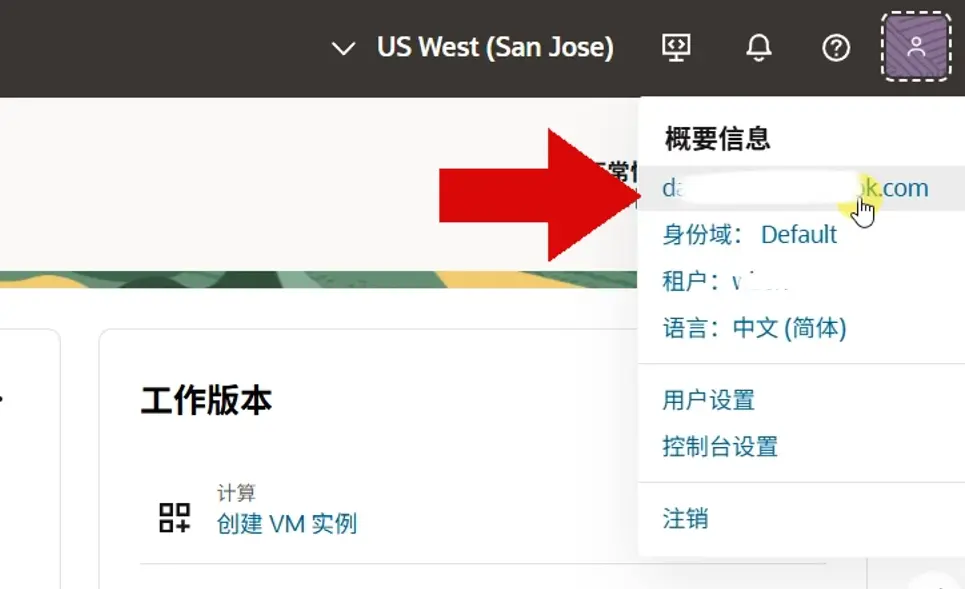

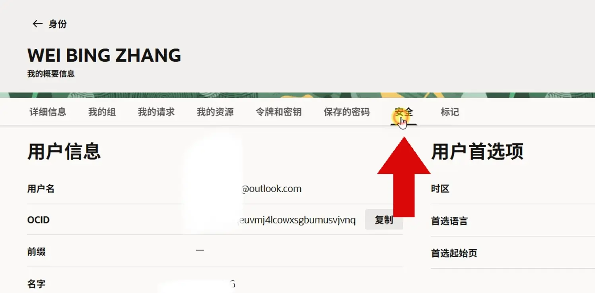

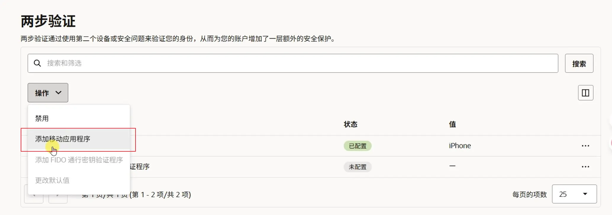

### 2.2、生成谷歌验证器绑定二维码

2.1.1、找到【脱机模式或使用其他验证程序】的开关按钮

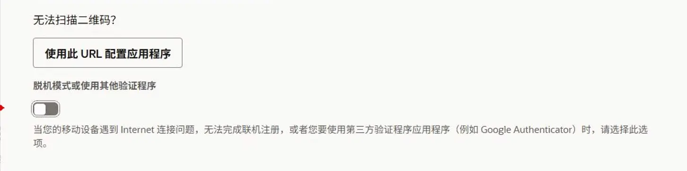

2.1.2、按钮置为开启状态

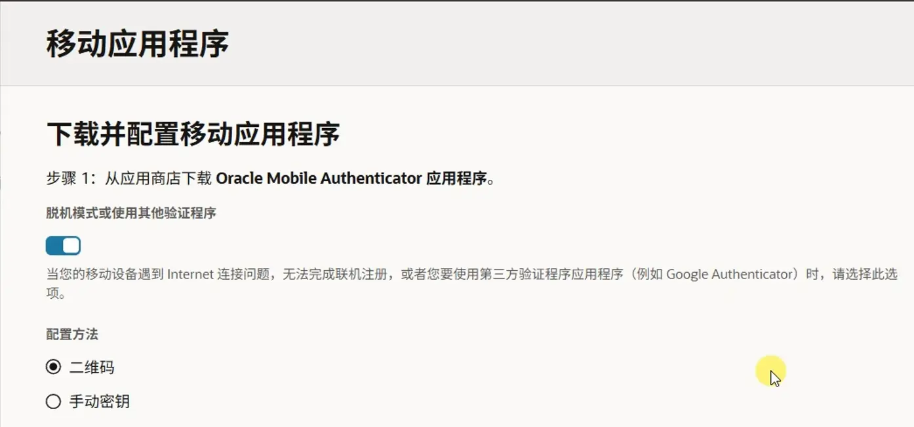

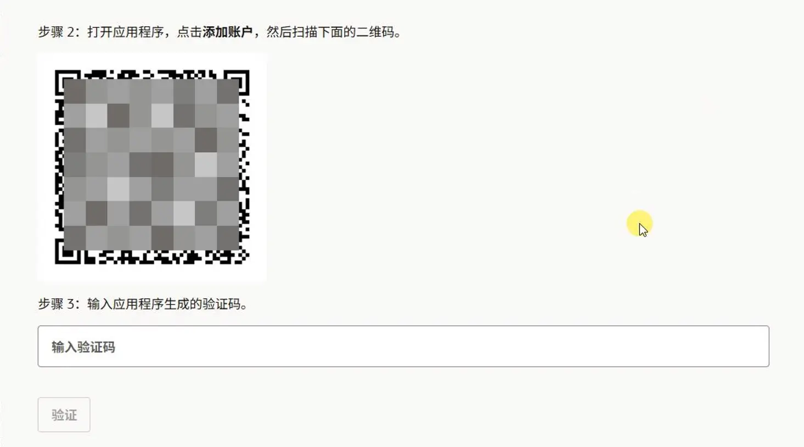

2.2.3、打开手机端【谷歌验证器】，点加号添加验证账户，然后扫描上面步骤2提供的二维码

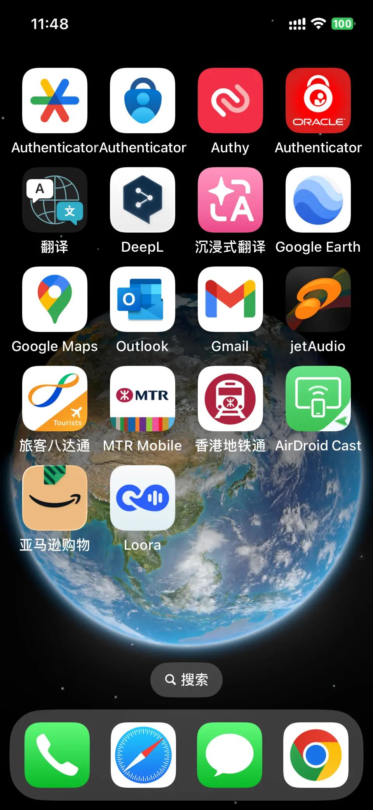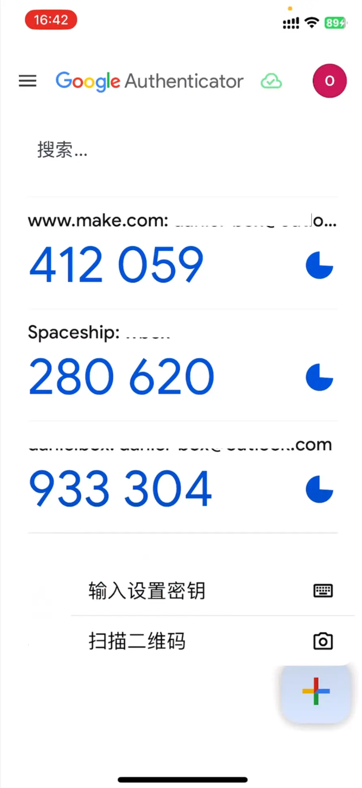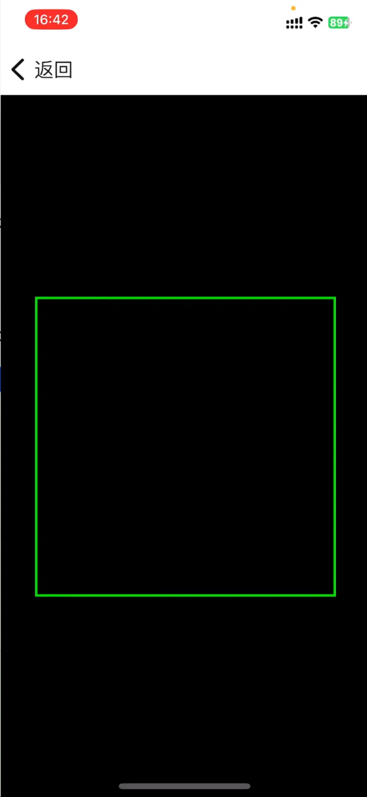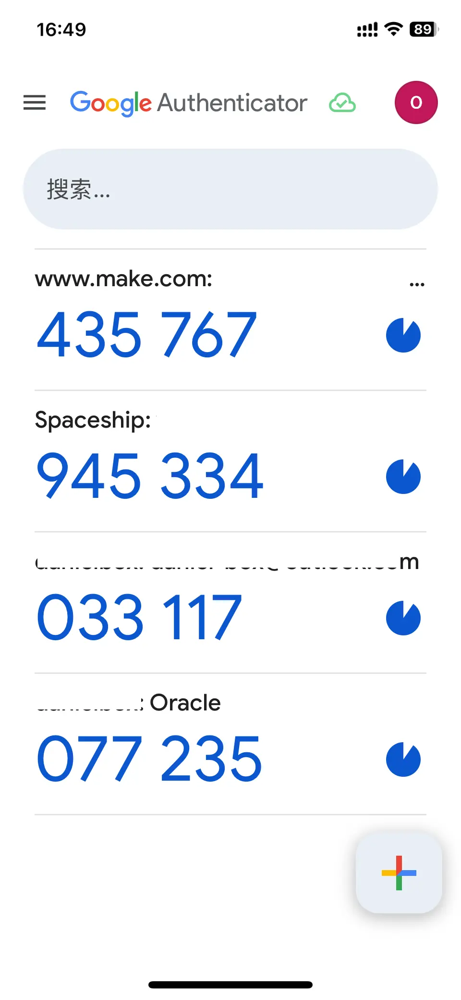

2.2.4、将【谷歌验证器】新账户显示的六位状态码，输入到【步骤3】的输入框中，然后点【验证】完成甲骨文账户与谷歌验证器的绑定。

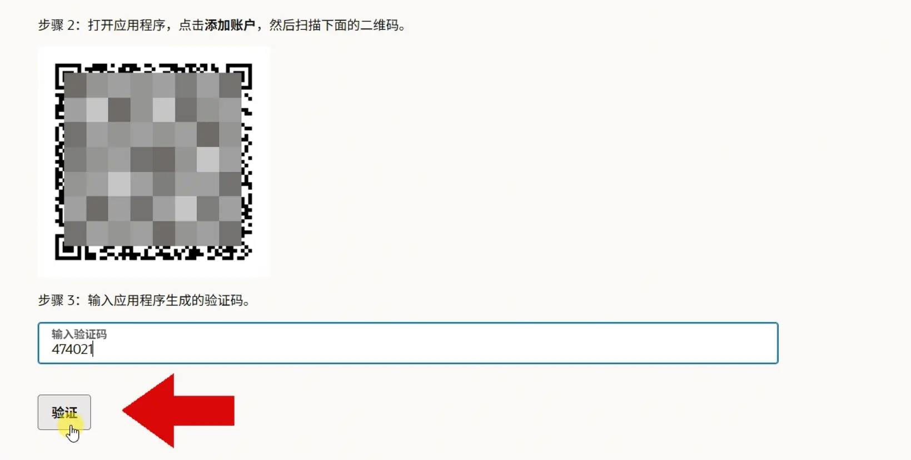

2.2.5、绑定完成后返回两步验证页面，会看到新绑定的【移动应用程序】

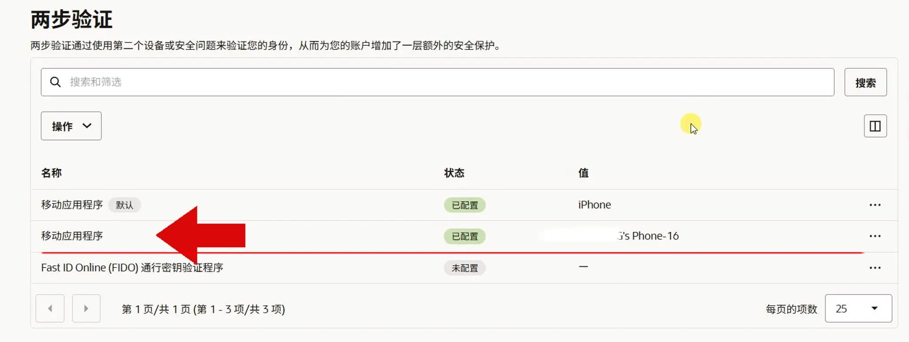

## 3、更换默认验证器

甲骨文登录验证默认绑定的是甲骨文自有的登录验证器，添加新的谷歌验证器后，最好将谷歌验证器设置成默认的登录验证设备。不然登录时甲骨文会优先使用自有的验证器。

**3.1、更改默认值**

**路径：**【两步验证】→【操作】→【更改默认值】

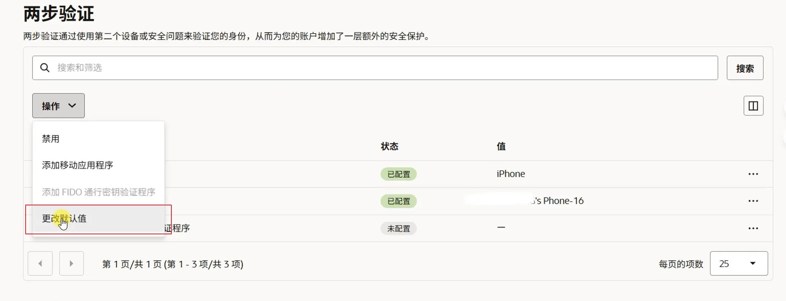

**3.2、选择新添加的【移动应用程序】→【更新】**

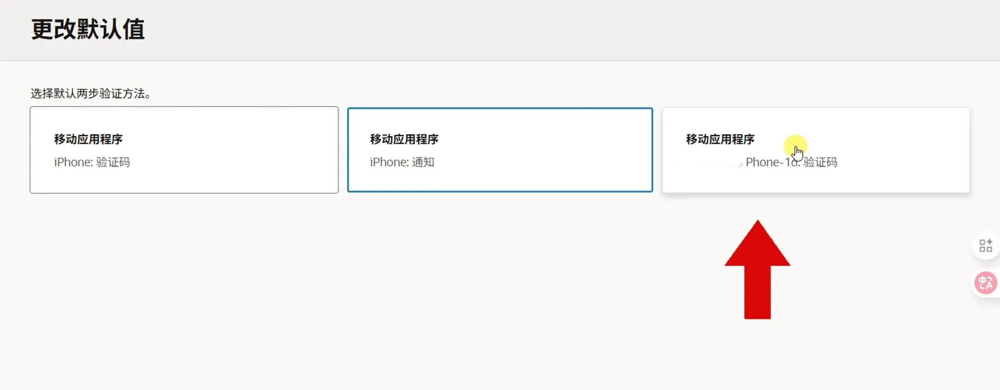

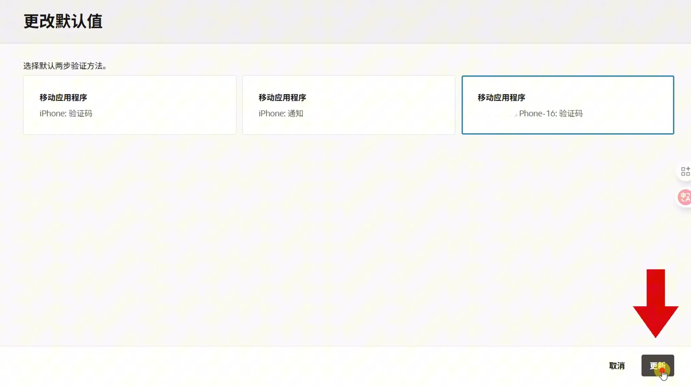

3.3、更新完成后，在两步验证列表中会看到【移动应用程序】被设置成了【默认】状态。

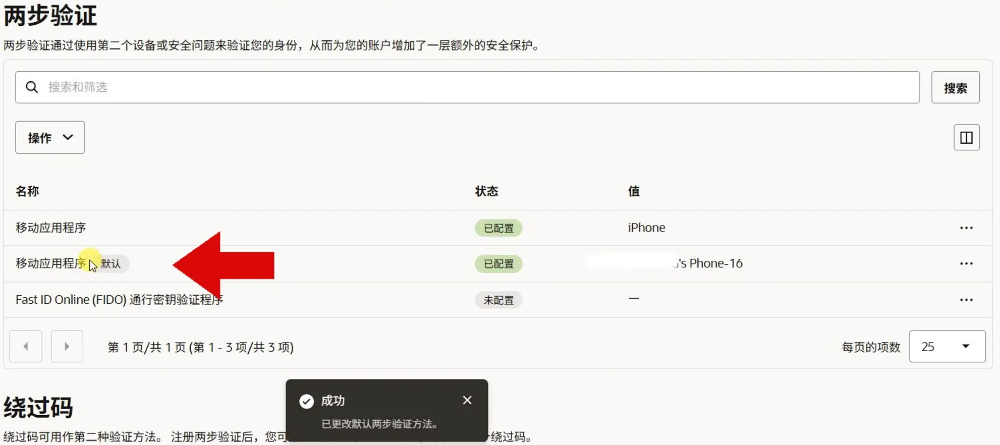

## 4、测试

重新登录时，甲骨文登录验证会使用设置好的谷歌验证器，输入谷歌验证器的六位动态码登即可成功录，甲骨文云后台。

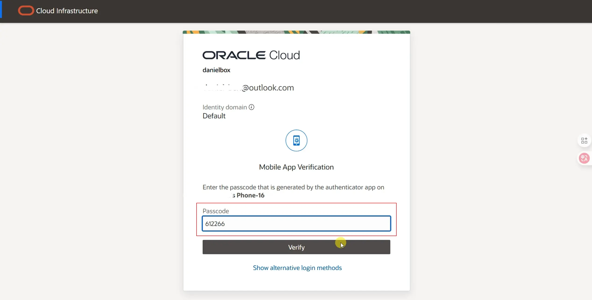

## 5、绕过码

绕过码是甲骨文云提供的另外一种登录放，这个方式可以跳过验证器，只需要输入一串在后台【绕过码】处生成的数字串即可。最多可创建5个绕过码，每个码只可使用一次，用过的废码可删除重新生成，建议有甲骨文账户的用户，都开启这个【绕过码】功能，这是无法使用验证器登录时，能挽成功登录户的最简洁的办法。

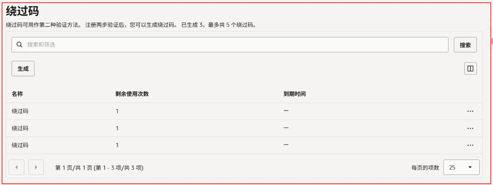

---

## **[ 实用工具 ]**

**1、自用VPN工具（PrivadoVPN）**： 
[https://s.ospace.top/PrivadoVPN](https://s.ospace.top/PrivadoVPN) 
零日志，瑞士隐私法保护，支持中文界面，**免费用户10G/月免费流量**，支持Talkatone注册和登录，
**支持** Windows，Android，macOS，ios，FireTV，AndroidTV，tvOS，Chrome**多种客户端**。
**付费用户：支持无限流量，无限设备**，67城市的服务器，最多 10 个设备同时连接，以及Socks5代理，广告拦截器，防病毒扫描等更多功能。
12+3个月：1**.33美金**/月，24+3个月：**1.11美金**/月，1个月计划：10.99美金/月。

**2、自用机场订阅Mitce**： 
[https://s.ospace.top/3tps6w](https://s.ospace.top/3tps6w)  **9折优惠码：**（**S4E6U9**） 
100GB/0.60美金/月、500GB/1.2美金/月、1000GB/2美金/月，不计量套餐/3美金，四款套餐可选，
包含住宅IP链路，支持多种客户端订阅，注册、养号、上网好帮手。

**3、Eskimo流量卡：** 
[https://s.ospace.top/mw9qyz](https://s.ospace.top/mw9qyz) 邀请码：**BD995**  
注册得**500MB**两年有效期的**免费全球数据流量**。
Eskimo是流量卡**不含号码**，支持**100多个国家**/地区漫游，从第一次激活使用流量开始计时，**长达2年有效期**，并且购买的流量**可转送其它Eskimo账户**。
购买中国区域流量或全球流量，在中国使用走**新加坡链路**，是新加坡**原生住宅IP**，非常适合申请国外应用及保号。

**4、ReadteaGO流量卡:**  
ReadteaGO链接: [https://esim.redteago.com/?c=i5oq82b3](https://esim.redteago.com/?c=i5oq82b3) 
ReadteaGO优惠码（5% 折扣）：**RTGF8F49L**

**5、域名注册Namesilo：**[https://www.namesilo.com](https://www.namesilo.com/?rid=f5e9423mw) ****（**oupons优惠码**：**092368xb** ） 
6、**SMS-Activate优惠链接**：[https://s.ospace.top/9tzyrx](https://s.ospace.top/9tzyrx) 
7、**Elevenlabs AI生成语音**：[https://try.elevenlabs.io/6xlgbhoqxkc8](https://try.elevenlabs.io/6xlgbhoqxkc8)