<aside>
😀 在国内网络环境下，谷歌Pixel8a手机连接wifi网络时，会出现网络受限的的提示。这是由于，自Android 5.0起，谷歌引入了Captive Portal机制， 初次连接WiFi时需访问谷歌服务器，来验证网络是否可用。由于众所周知的原因，国内的用户目前无法正常访问谷歌服，于是就导致了连接WIFI时出现网络受限提示。这里我们分享一个相对简单的方法，只要三步就能修正这个问题，就是将受限连接替换为可访问连接。无需ROOT权限，不破坏Pixel原生系统环境，不影响Pixel8a自带的免费VPN的使用。下面我们以windows为例进行设置，macOS和Linux下的设置原理类似。

</aside>



[ 【 **Youtube上观看** 】 ](https://youtube.com/watch?v=IpDW1AheKyo)

整个过程分为三部分：**第一部分：配置ADB运行环境**，**第二部分：开启手机USB调试**，**第三部分：修改手机相关配置**

## 第一部分：配置ADB运行环境

修改过程中会用到一个Android开发工具**ADB**，adb （ Android Debug Bridge ）是一个命令行工具，属于 Google 官方的 Android 开发工具之一，在这里我们用它来修改Pixel手机的配置参数

### 1、安装ADB

**ADB下载连接（微软官网）：**
[https://developer.android.google.cn/tools/adb?hl=zh-](https://developer.android.google.cn/tools/adb?hl=zh-cn)

微软官方提供了windows，Mac，Linux三个版本，您可以根据自己使用的系统下载不同的版本，这里我们下载windows版本。下载文件是一个ZIP的压缩包，包含了ADB这个安卓工具。

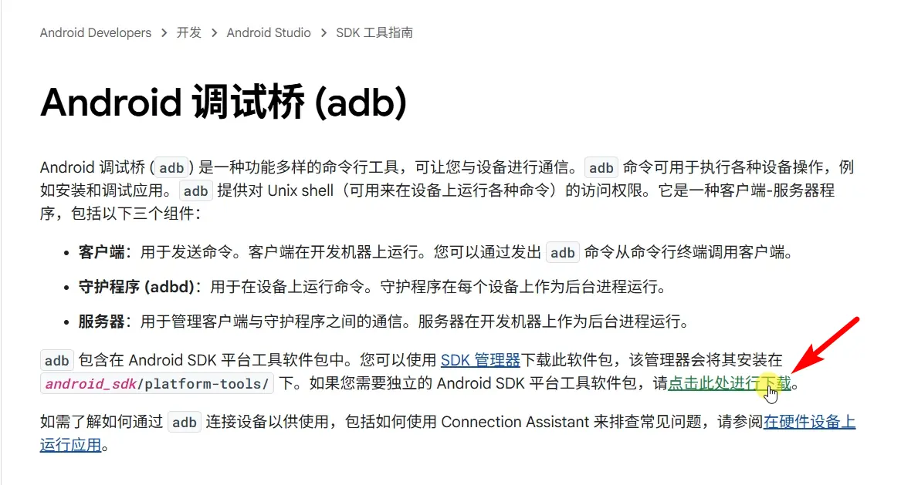

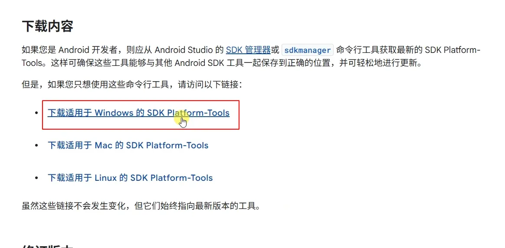

下载完工具包后，解压工具包并放到根目录下，这里可以是D盘，E盘或其他本地盘中。

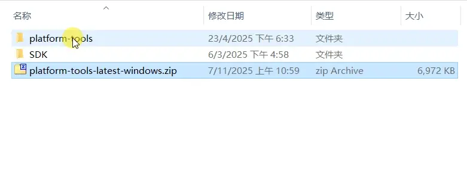

解压完成后复制完整路径，下一步配置ADB运行环境时会用到这个路径。

### 2、配置ADB运行环境：

> 这一步是将ADB工具添加到系统变量，这样无论在什么位置都可以正常运行ADB命令。
右键点击【此电脑】-》【属性】-》【高级系统设置】-》【环境变量】-》【系统变量】-》找到【Path】变量名，双击打开-》【新建】-》粘贴工具包完整路-》【确定】
> 

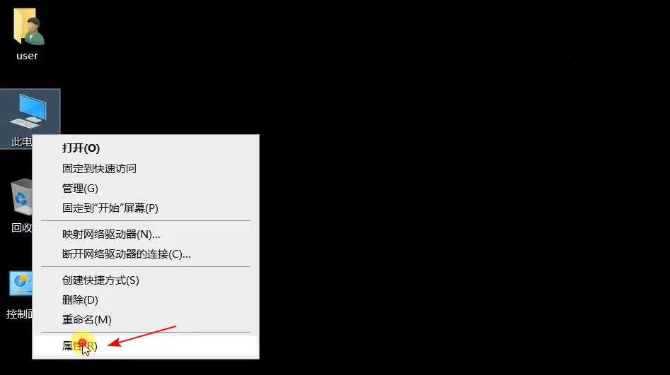

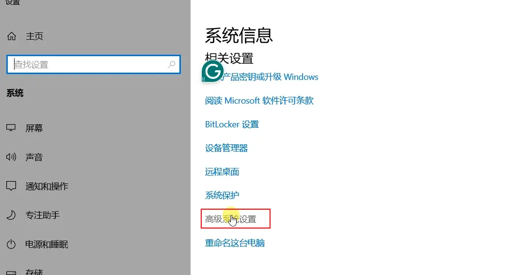

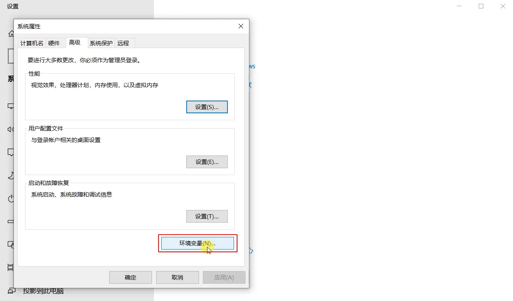

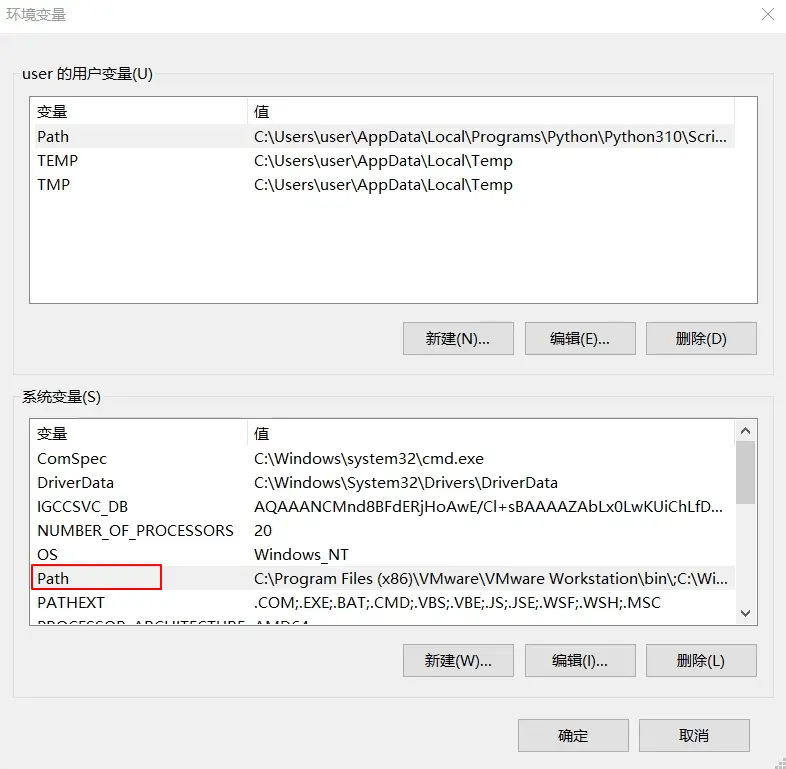

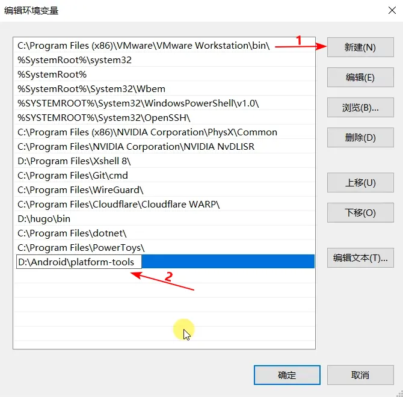

**验证adb状态是否正常：**

命令行窗口输入：adb 回车

如果看到下面信息，说明adb环境变量设置成功，以后无论在哪里打开命令行窗口，都能正常运行adb命令。

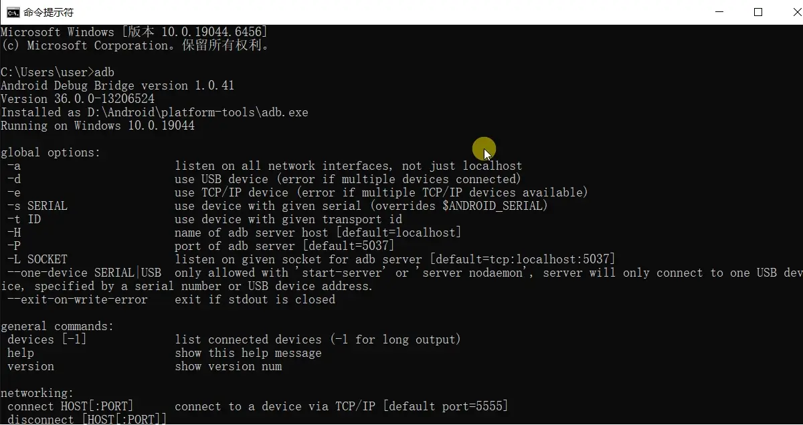

## 第二部分：开启USB调试

### 1、解锁USB调试

新手机默认状态下，开发者选项处于隐藏状态，需要手动开启后才能使用。

点击【设置】，点击【关于本机】，找到最下方的“版本号”或“构建号（Build号），连续点击7次。点击过程中会看到提示，告知再点几次就能启用开发者选项。

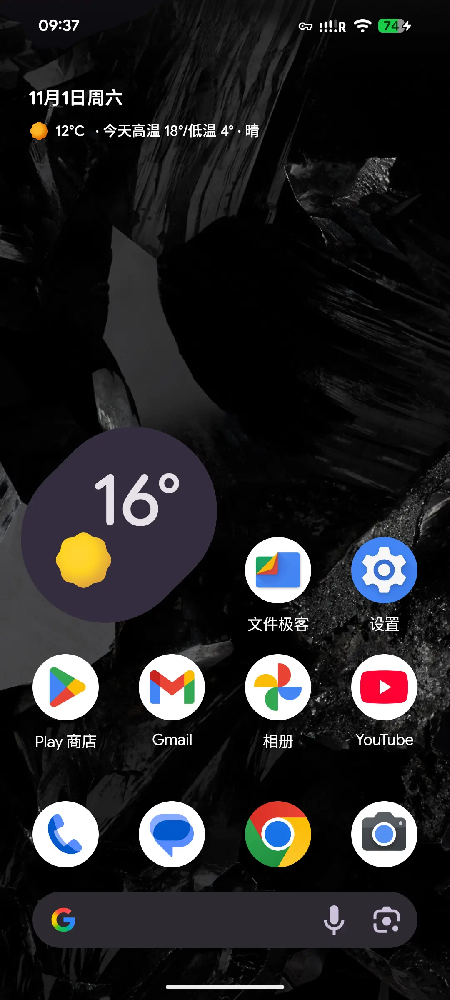
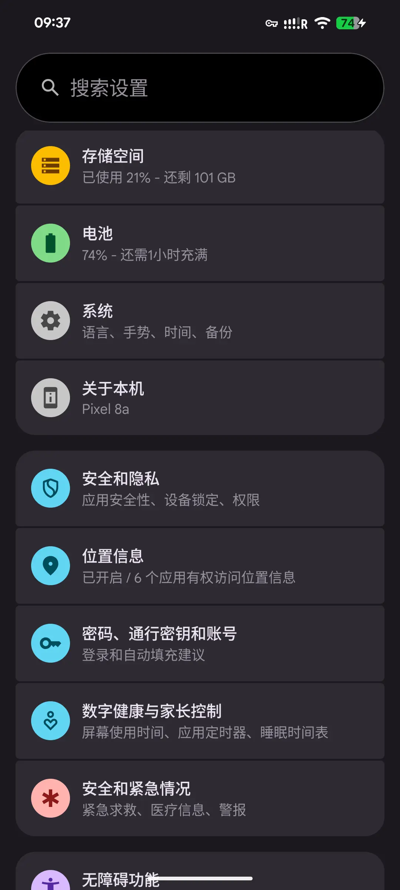
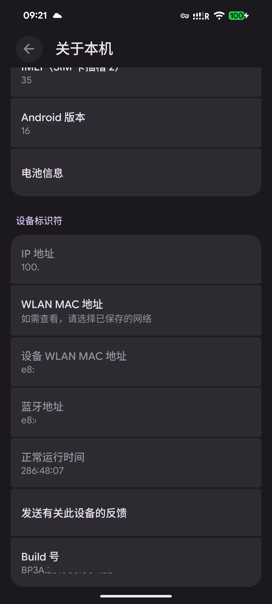

### 2、开启USB调试功能

解锁完成后返回【**设置**】菜单，进入【**系统**】菜单，菜单列表中会看到“**开发者选项”**这个选项。
进入**“开发者选项”**，这里能看到许多高级选项开关，找到开启【**USB调试**】开关按钮，然后开启它。

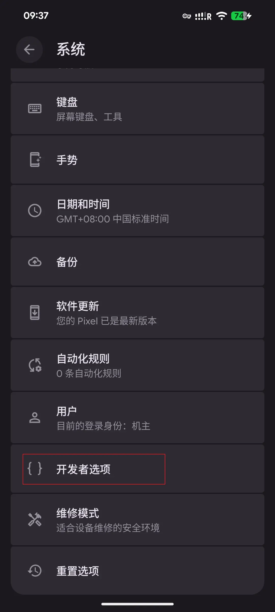
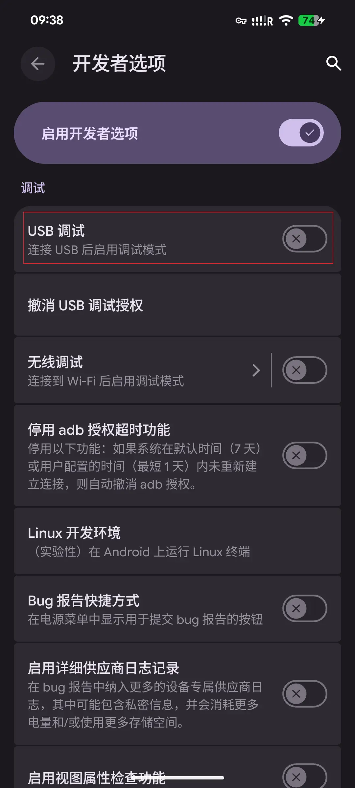
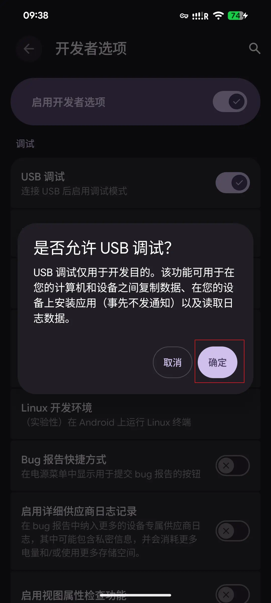

## 第三部分：修改配置

### 第一步：连接Pixel手机

**1、安卓手机连入电脑**

使用USB线将pixel8手机连接到电脑。

**2、检测连接状态**

打开命令提示符窗口，输入：**adb devices** 回车

如果看到有 **xxx device**字样的信息，说明手机已经正常连接到本地系统。

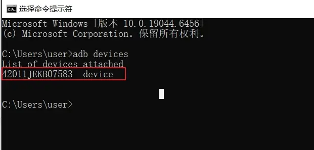

### 第二步：删除原有服务器地址

> 在命令行窗口中分别输入下面命令：删除原有的服务器访问连接
> 

* adb shell settings delete global captive_portal_https_url
* adb shell settings delete global captive_portal_http_url

### 第三步：添加新服务器的地址

> 删除原有连接后，再分别输入下面命令：添加新的服务器访问连接。
[http://captive.v2ex.co/generate_204](http://captive.v2ex.co/generate_204) 这个地址是V2EX 提供的 Android Captive Portal Server 地址。这里可以使用自己或其他可用的服务器地址。
> 

* adb shell settings put global captive_portal_http_url http://captive.v2ex.co/generate_204
* adb shell settings put global captive_portal_https_url https://captive.v2ex.co/generate_204

### 第四步：激活配置

修改完成后，先打开飞行模式，等待5秒钟后再关闭飞行模式，激活新修改的配置后，然后再进行WiFi连接设置。

**Pixel手机开启飞行模式**：【**设置**】->【**网络和互联网**】->【**飞行模式**】

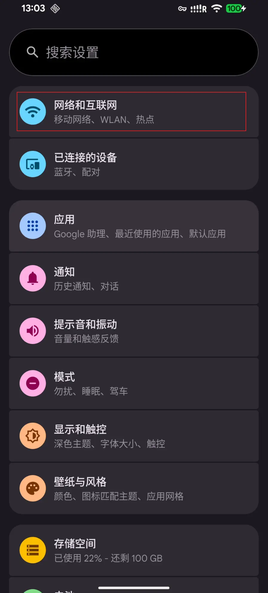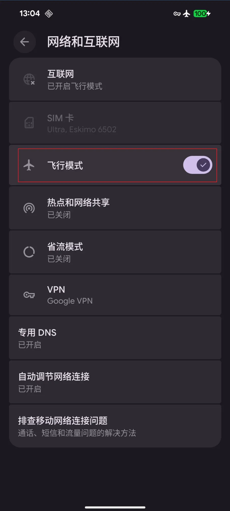

---

## [ 实用工具 ]

**1、自用VPN工具（PrivadoVPN）**： 
[https://s.ospace.top/PrivadoVPN](https://s.ospace.top/PrivadoVPN) 
零日志，受瑞士隐私法保护，支持中文界面，每月10G免费流量，支持Talkatone注册和登录，
支持：Windows，Android，macOS，ios，FireTV，AndroidTV，tvOS，Chrome等多种客户端。
付费用户：支持无限流量，无限设备，67城市的服务器，最多 10 个设备同时连接，以及Socks5代理，广告拦截器，防病毒扫描等更多功能。
12+3个月：1.33美金/月，24+3个月：1.11美金/月，1个月计划：10.99美金/月。

**2、自用机场订阅Mitce**： 
[https://s.ospace.top/3tps6w](https://s.ospace.top/3tps6w) **9折优惠码：**（**S4E6U9**） 
100GB/0.60美金/月、500GB/1.2美金/月、1000GB/2美金/月，不计量套餐/3美金，四款套餐可选，
包含住宅IP链路，支持多种客户端订阅，注册、养号、上网好帮手。

**3、Eskimo流量卡：**  
[https://s.ospace.top/mw9qyz](https://s.ospace.top/mw9qyz) **邀请码：BD995**  
注册得500MB两年有效期的免费全球数据流量。
Eskimo是流量卡不含号码，支持100多个国家/地区漫游，从第一次激活使用流量开始计时，长达2年有效期，并且非免费赠送流量可转送到其它Eskimo账户。
购买中国区域流量或全球流量，在中国使用走的是新加坡网络链路，获取的是新加坡的原生住宅IP，非常适合申请国外应用及保号。

**4、ReadteaGO流量卡:** 
ReadteaGO链接: [https://esim.redteago.com/?c=i5oq82b3](https://esim.redteago.com/?c=i5oq82b3) 
ReadteaGO优惠码（5% 折扣）：**RTGF8F49L**

**5、域名注册Namesilo：**[https://www.namesilo.com](https://www.namesilo.com/?rid=f5e9423mw) ****（**oupons优惠码**：**092368xb** ） 
**6、SMS-Activate优惠链接**：[https://s.ospace.top/9tzyrx](https://s.ospace.top/9tzyrx) 
**7、Elevenlabs AI生成语音**：[https://try.elevenlabs.io/6xlgbhoqxkc8](https://try.elevenlabs.io/6xlgbhoqxkc8) 