

[ 【 **Youtube上观看** 】 ](https://youtube.com/watch?v=ns4mdPk4xTM)

<aside>
😀 **SMS-Activate**是一款来自俄罗斯的全球手机接码平台，提供全球多个国家的临时虚拟手机号码，用于接收验证短信。国内可以直接访问，并且支持中文界面。国外常用的**Google、Youtube、Gmail、Facebook、Telegram、Twitter、Whatsapp、Instagram**等平台注册都可使用这个平台接收验证码。

</aside>

注册过程并不复杂，只需按照下面步操作即可。

## 注册步骤：

### 1、登录官网【[官网](https://sms-activate.org/?ref=7713526)】

使用本链接打开后，先点击右上角将语言改为中文。

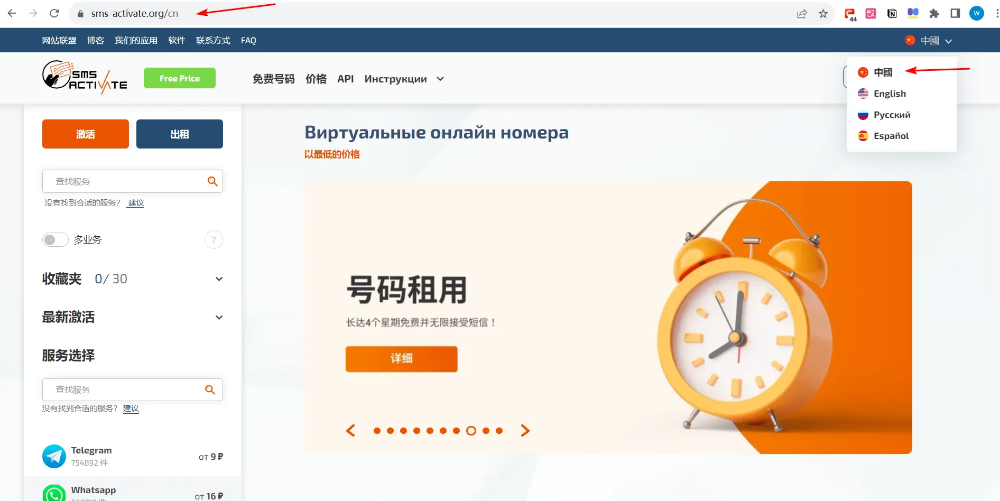

### 2、打开注册页面

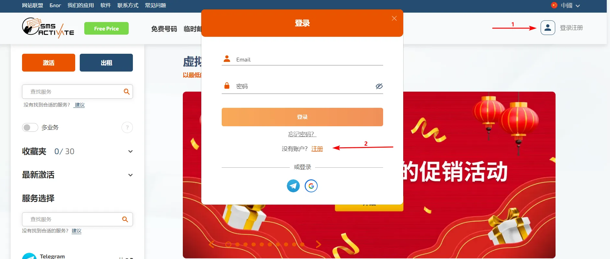

### 3、填写注册邮箱及密码

可以是任意可正常使用的邮箱，因为注册过程中需要邮件验证注册账号。

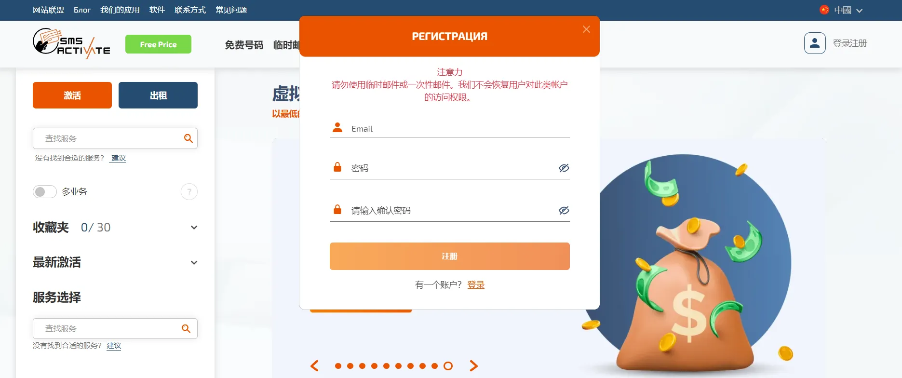

### 4、邮箱验证

登录邮箱打开验证邮件。点击【确认】进行验证，如果[sms-activate](https://sms-activate.org/?ref=7713526)发送的邮件未显示在收件箱，看看是否被当成了垃圾邮件，小布注册时的验证邮件就被当作了垃圾收件。

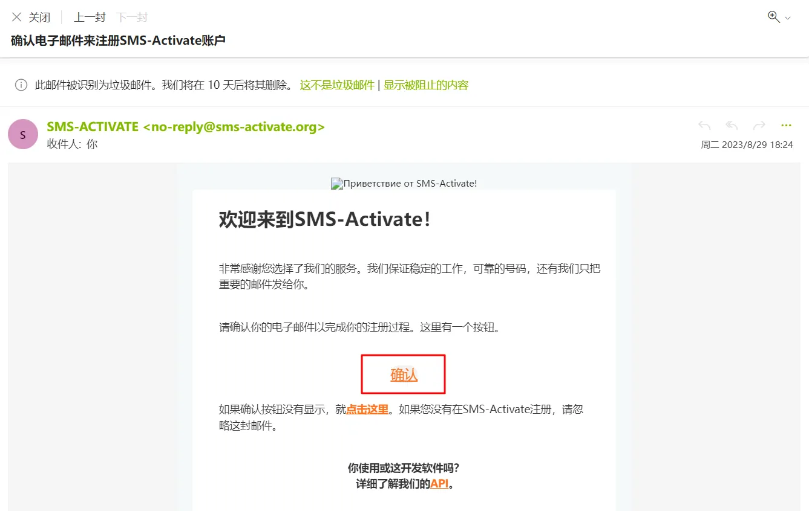

### 5、账户充值

接码按次计费，因为是俄罗斯的，平台以卢布结算，充值时以美元支付（1美元大致兑换96卢布，以实时汇率为准），支持支付宝、Visa等方式。

**5.1、**点击右上角的加号**（+）**打开充值页面。

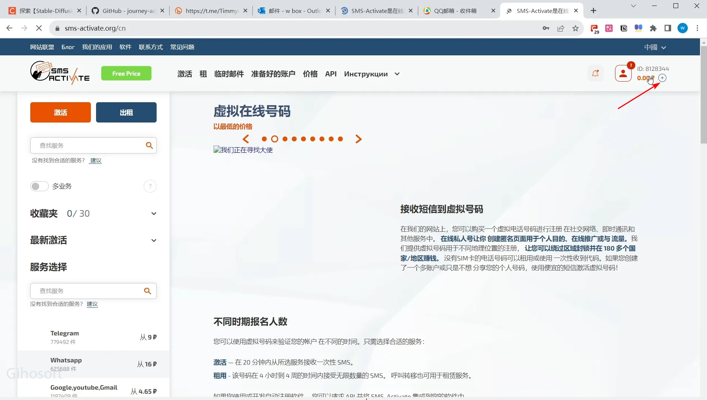

**5.2、往下拉选择**【支付宝】

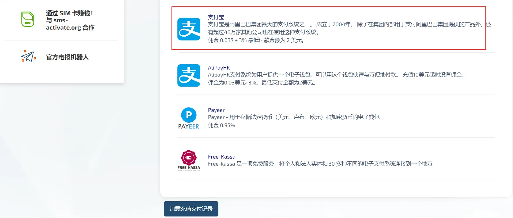

**5.3、**输入充值金额并支付（如果不经常使用，按照最低2美元充值即可。有手续费所以总金额会高于2美元，充值成功后，系统会将2美元转换为卢布）

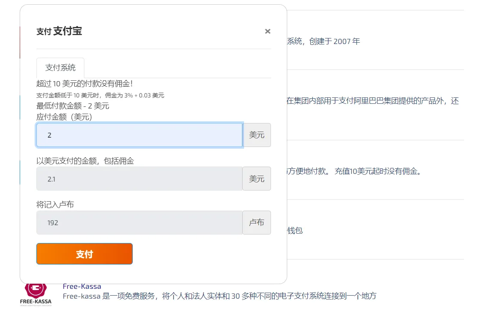

**5.4、**扫码支付，支付宝会自动进行汇率转换，不用做其他操作。

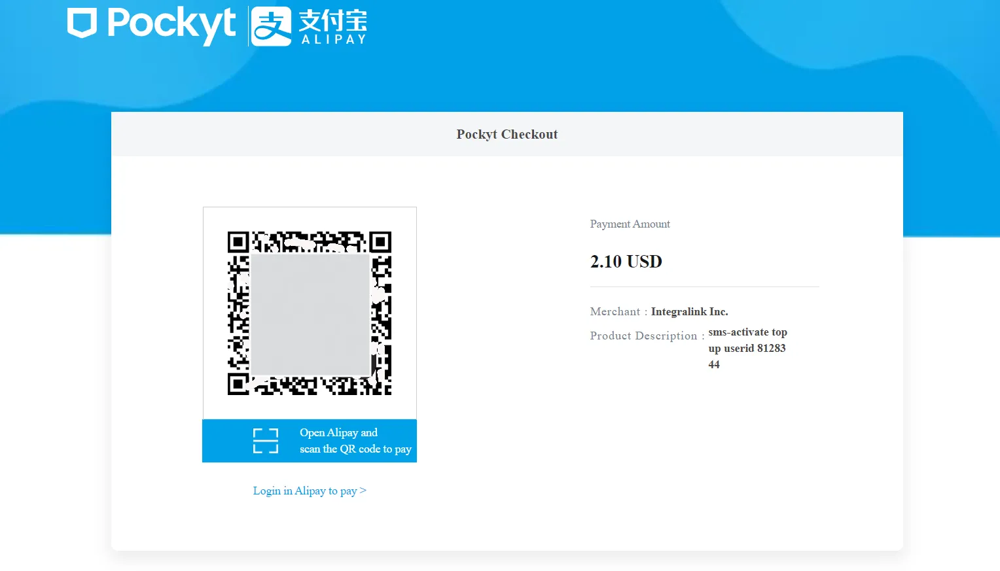

**5.5、**支付成功后，可在右上角看到充值的金额（此时已经转换为卢布，）

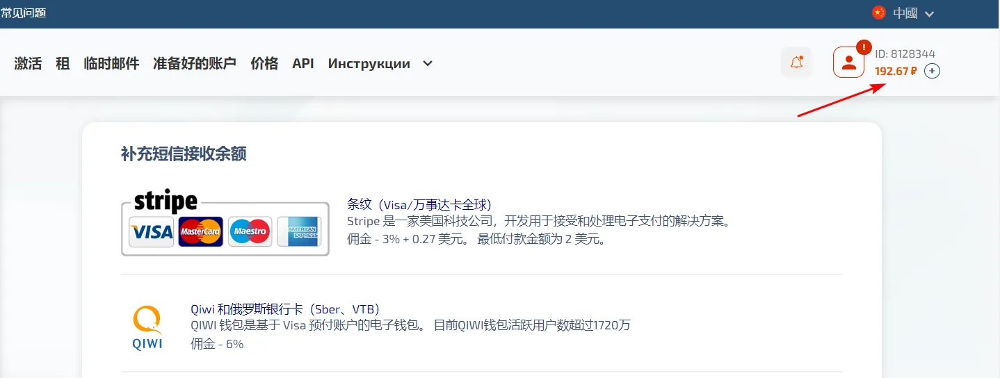

### 6、购买短信服务

**6.1、选择服务**

在网页左侧，查找要注册的平台（或输入输入要注册的平台名称）

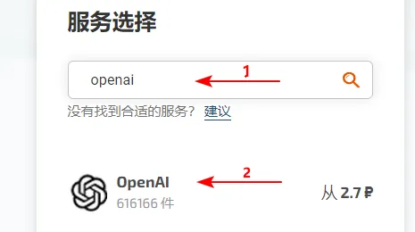

**6.2、选择国家**

点击【OpenAI】图标后，显示的是到可购买的国家，数字后面的字符代表卢布。

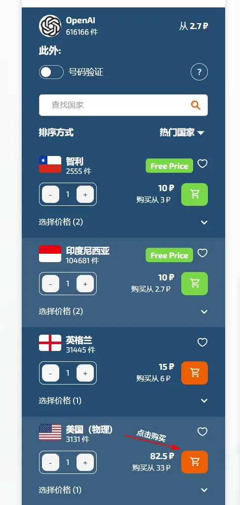

**6.3、购买号码**

点击价格后面【购物车】图标即购买，购买成功后会自动转到短信接收页面，页面中会显示购买的接码电话。**20分钟**表示这个电话号码20分钟后会过期。**等待短信**表示还未收到验证码，收到短信会显示验证码。如果不能收到验证码，2分钟后可删除这个电话即可（不会扣费）。重新购买新号码继续验证即可。注册OpenAI账户时填写的验证电话就是这里显示的电话。

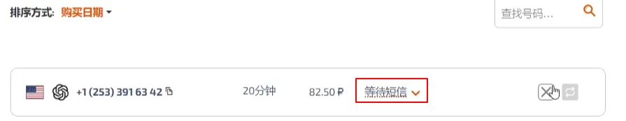

### 7、接收验证码

**7.1、输入验证手机并发送验证码**

回到OpenAi注册页面填写手机号码开始验证，因为输入框默认有国家代码，粘贴进来的手机号，需要去掉前面的国别代码（这里选择

的是美国代码是+1，如果是中国代码是+86）。

输入时+1不用填，括号不用填，只填写+1后面的数字部分。（如下图）

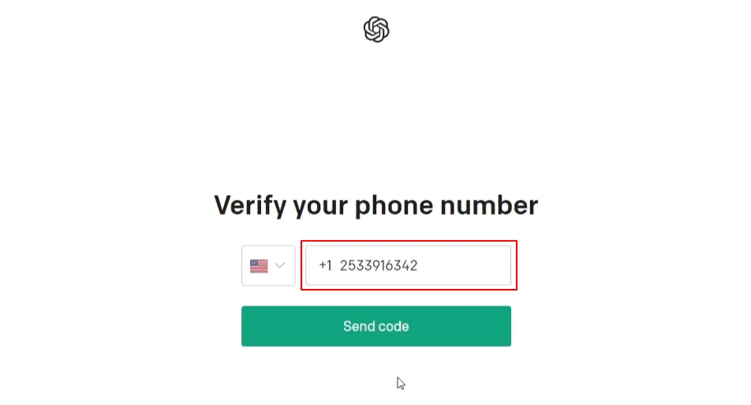

**7.2、接码并验证**

回到接码平台，复制验证码，将验证码填写到OpenAi的验证框中确定即可。其他应用注册时，获取验证码的方式类似。参考上面上面步骤6，购买短信服务准备接码即可。

另外：听到有朋友说，现在这个平台收不到OpenAI的验证码。小布近期特地做了下测试，发现这个平台是可以正常接码的（测试时间：2023年8月28日）。不过测试也不是一次成功，过程中更换过号码归属地。不能正常接码，估计有两方面的原因，一是[科学上网](#)的IP要干净，不能是被OpenAI平台认定的污染的网络资源（[网络环境检测](https://www.smallstep.one/article/yuansheng-ip)），这应该是最主要的原因。二是注册过程中，科学上网的IP位置最好与接码手机地理位置相同（比如：使用美国IP科学上网，那么接码手机所在区域最好也选美国），只要不是被OpenAi屏蔽的国家，通常都能通过。

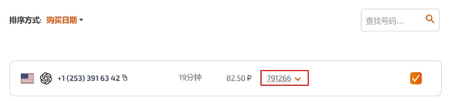

填写验证码开始验证

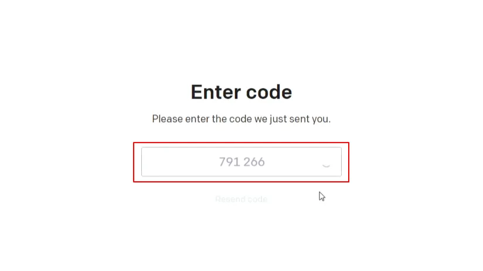

验证成功后自动转入OpenAi起始页面

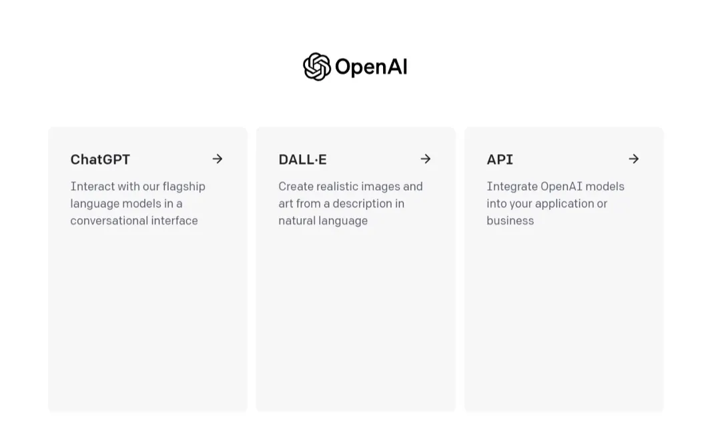

注册【 [SMS-Activate](https://sms-activate.org/?ref=7713526)】账号
