<aside>
😀 这期视频分享的是一款可在国内成功注册Talkatone的工具，不用外置esim卡，不用esim流量卡，不用订阅机场链接，只需这一个工具就能成功注册登录Talkatone。

</aside>



[ 【 **Youtube上观看** 】 ](https://youtube.com/watch?v=NTBZLh4PQ5Q)

## **工具链接**

* **PrivadoVPN官网：**[https://s.ospace.top/PrivadoVPN](https://s.ospace.top/PrivadoVPN)
* **PrivadoVPN官网后台：**[https://app.privadovpn.com](https://app.privadovpn.com/)
* **PrivadoVPN软件下载：**[https://privadovpn.com/software/?device=windows](https://privadovpn.com/software/?device=windows)
* **PrivadoVPN安装帮助：**[https://support.privadovpn.com/kb/section/46/](https://support.privadovpn.com/kb/section/46/)
* **PrivadpVPN TCP与UDP说明：**[https://support.privadovpn.com/kb/article/821-what-is-the-difference-between-udp-tcp/](https://support.privadovpn.com/kb/article/821-what-is-the-difference-between-udp-tcp/)
* **Talkatone 官网：**[https://www.talkatone.com/](https://www.talkatone.com/)
* **Talkatone(Android)：**[https://play.google.com/store/apps/details?id=com.talkatone.android&hl=en](https://play.google.com/store/apps/details?id=com.talkatone.android&hl=en)
* T**alkatone(iOS)：**[https://itunes.apple.com/us/app/talkatone-free-group-sms-texting/id397648381?mt=8](https://itunes.apple.com/us/app/talkatone-free-group-sms-texting/id397648381?mt=8)

之前分享Talkatone的注册方法中，网络环境是所有步骤中最难的部分，为了解决这个网络难题，用到esim卡，机场链接，国内可用的esim流量等多个工具，步骤多多且繁琐。今天我们分享一个实测可行且简单有效方法，只用一个工具就能完成Talkatone的注册和登录和养号。

这工具就是PrivadoVPN，它是一家总部在瑞士的网络服务商，受瑞士隐私法保护，零日志、256位加密、不挑设备，可在Windows、macOS、Android、iOS多种客户端安装，关键是注册后可永久免费使用，每月还有10G的不限速免费数据，付费版还支持美国，加拿大，新加坡，韩国，日本等，多地域的SOCKS5代理设置，且支持P2P-种子下载等应用场景。

## 1、软件获取

第一步开启科学上网，目前Privado官网处于被屏蔽状态，国内用户下载前需先开启科学上网，如果您目前还未完成网络环境搭建，可翻翻之前的视频，小布分享过多种网络环境的搭建方法，小伙伴可需根据自己情况选择任何一种。之前被大面积屏蔽的网络工具Cloudflare WARP，最近测试时发现，只要更新到最新版本可恢复正常使用，感兴趣的小伙伴可以试一下。

### **Cloudflare 团队账户：**

[https://www.youtube.com/watch?v=qyufPce-00s](https://www.youtube.com/watch?v=qyufPce-00s)

[ 文字版 ]：[https://www.smallstep.one/article/cloudflare-1](https://www.smallstep.one/article/cloudflare-1)

> 其它网络环境搭建方法：
1、[免费VPS+Reality+Vision流量控制，打造自己的专属机场](https://www.smallstep.one/article/aws-vps)
2、[通过Workers部署自己的机场订阅节点](https://www.smallstep.one/article/workers-deployment)
> 

### 下载客户端

> PrivadoVPN官网：[https://s.ospace.top/PrivadoVPN](https://s.ospace.top/PrivadoVPN)
> 

打开Privado官网，点下图左侧的黄色按钮下载客户端，安装时按照提示直至完成即可。

安装帮助：[https://support.privadovpn.com/kb/section/46](https://support.privadovpn.com/kb/section/46)

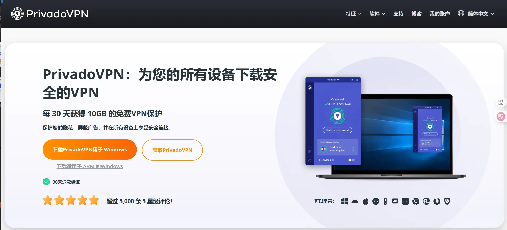

## 2、注册账号与登录

> 国内网络环境下，注册或登录账号前先开启科学上网
> 

### 2.1、账号注册

点击【Sign Up】按钮开始注册，填入邮箱信息，选【Get Free VPN】按钮开始免费VPN注册。

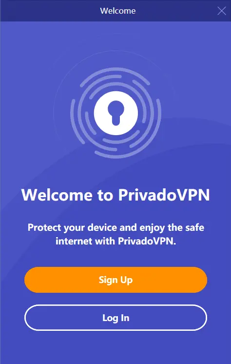
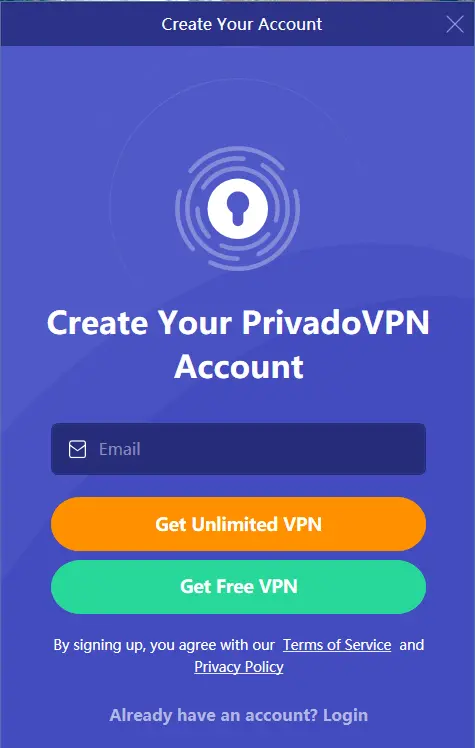

PrivadoVPN会发送一封验证邮件，如下图所示。

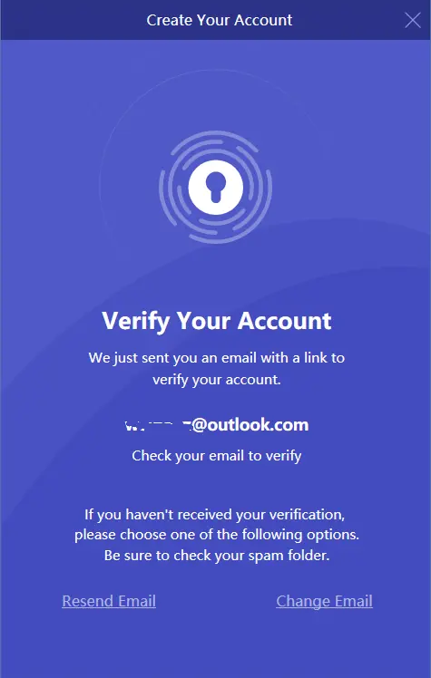

### 2.2、邮件验证：

注册成功后会先后收到两封邮件，先收到的是一封是验证邮件，验证成功后会收到一封包含登录链及用户名和密码的邮件。

**打开验证邮件，点击验证按钮开始验证**

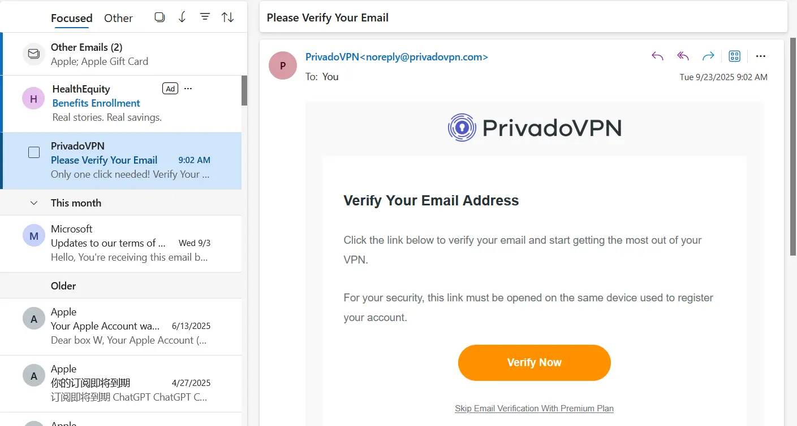

**确认用户信息**

点击上一步的验证按钮后，Privado会自跳转到用户登录信息页面，这些信息除邮箱是注册时自己填写外，用户名和密码是Privado自动为我们生成的。点 【**Login Now】** 按钮后，会看到页面顶部弹出的选项卡，然后点选项卡中的 【**Open Link】** 按钮

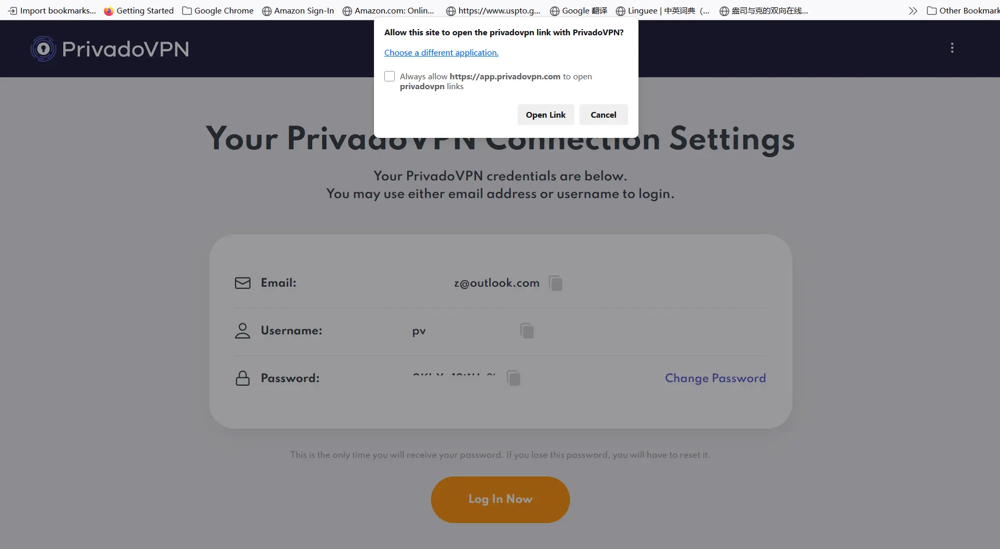

**登录PrivadoVNP客户端**

点选上一步项卡中的 【**Open Link】** 按钮后跳转到这里的客户端登录界面。界面中已经自动填写好了登录信息，这里的用户名是Privado自动为我们设置的名称。点击 【Log In】 按钮登录。如果登录时显示登录错误，如：下图上方的红色提示：The username or password provided is incorrent. **将登录名称改为我们注册时使用的邮箱**，再点击【Log In】 登录即可。

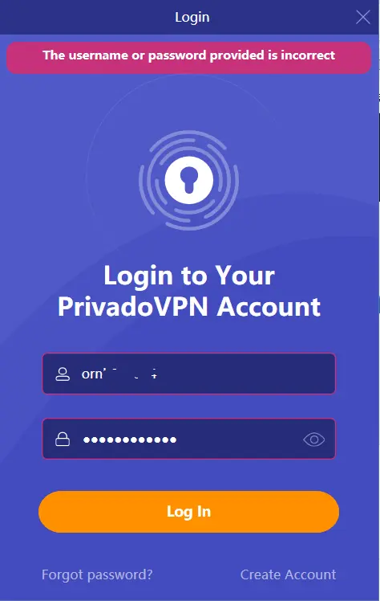
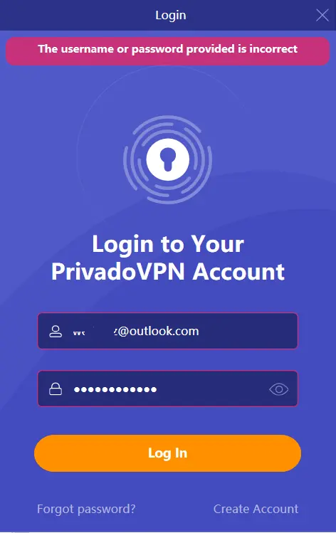

看到下面的信息说明登录成功

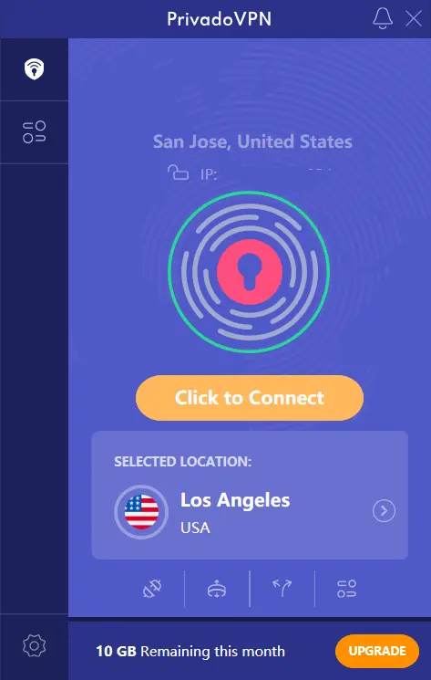

点击Application（应用）选项，在右侧选项卡中，点击Application Language 右侧的语言。

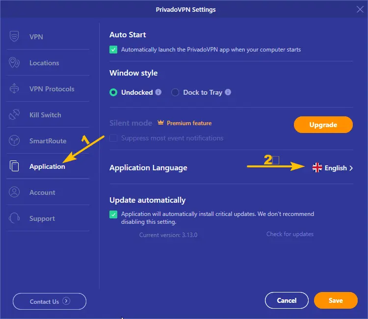

选简体中文，点Save保存。

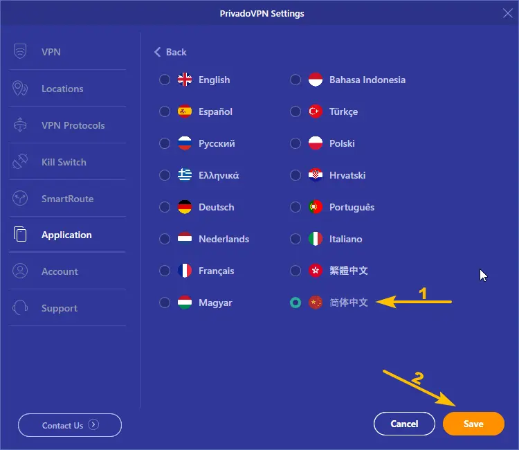

返回到主界面后语言自动会转换成简体中文 。

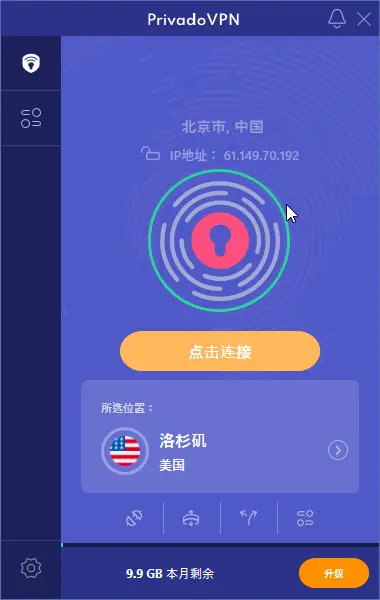

### 2.3、账户信息邮件：

PrivadoVPN完成邮件验证这一步之后，我们会收到第二封邮件，这封邮件中包含了，客户端下载链接，用户名及用户密码修改链接。

这里注意Privado客户端中未提供密码修改功能，修改密码需登录官网后台。初次注册如果想修改初始密码，可点击这封邮件中的密码修改链接进行修改。或者登录官网后台进行修改。

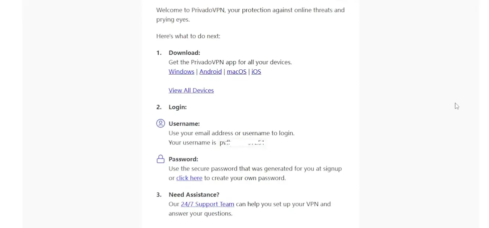

### 2.4、PrivadoVPN官网后台

后台链接：[https://app.privadovpn.com](https://app.privadovpn.com/)

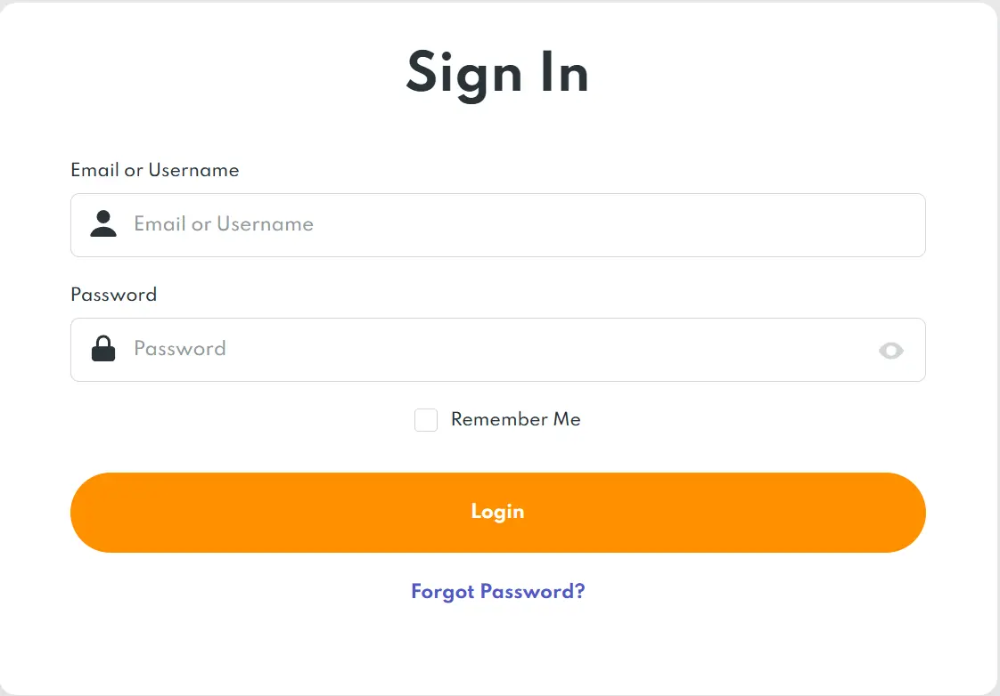

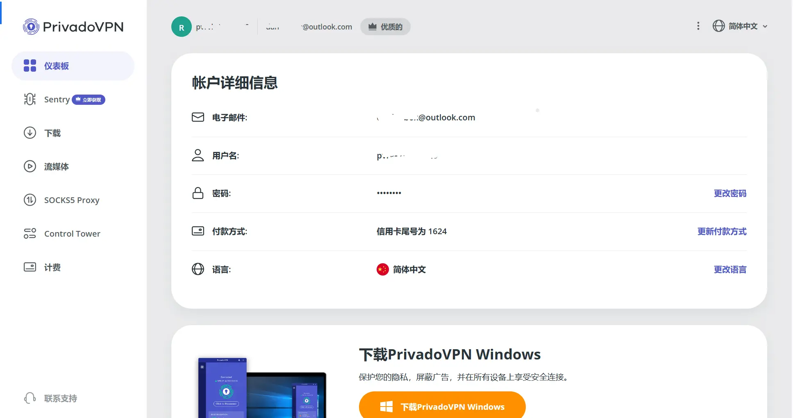

## 3、设置及使用

如果您是第一次登录，看到的是英文界面，如下图。打开PrivadoVPN后，如果是免费版本，可以看到最下端有10GB Remaining this month 提示，是说这个月还剩余有10GB的流量未使用。以后使用过程中这里会显示实际的剩余流量，这个10GB流量每月都会初始化不会累加。

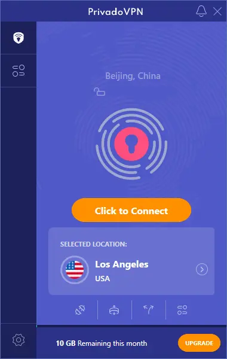

### 3.1、设置中文界面

点击界面左下方的齿轮图标

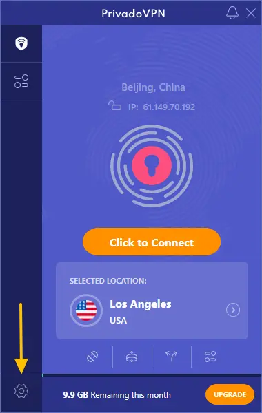

### 3.2、选择服务器节点

点击【所选位置】打开服务器列表，Privado默认按照延时由低到高显示可用的服务器资源。

**免费用户：**PrivadoVPN提供了包括，墨西哥、美国、加拿大、德国、巴西、英国、荷兰、阿根廷、印度、法国这个10个国家的13个服务器位置资源。

**付费用户：**PrivadoVPN提供更多的服务器资源（67个区域上百个服务器位置资源）

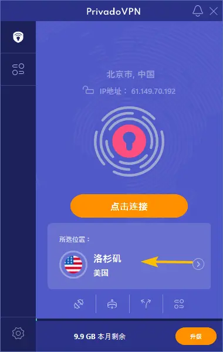
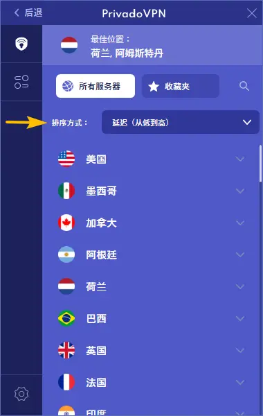

选中任意一个区域Privado会自动建立连接。

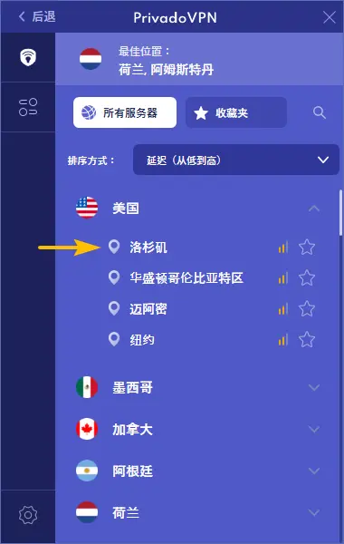
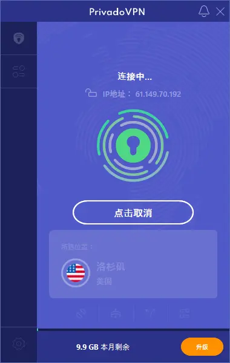

### 3.3、网络协议选择和设置

点齿轮图标

点【VPN 协议】看到协议设置页面，PrivadoVPN默认自动是勾选的，使用的是IKEv2协议。

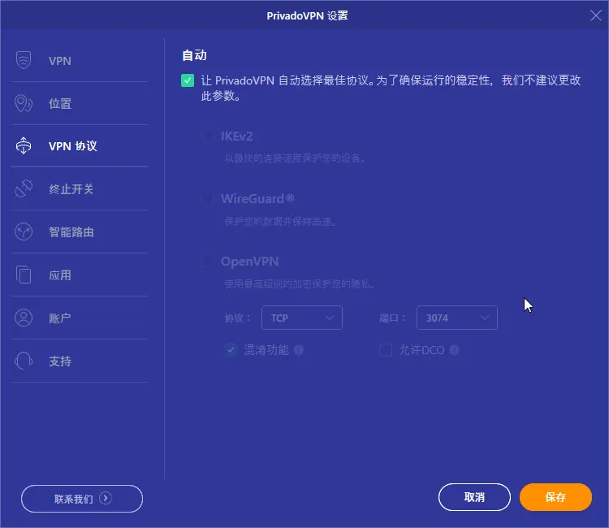

去掉勾选看到有三种协议可以选择，这三种协议均为业界通用协议。

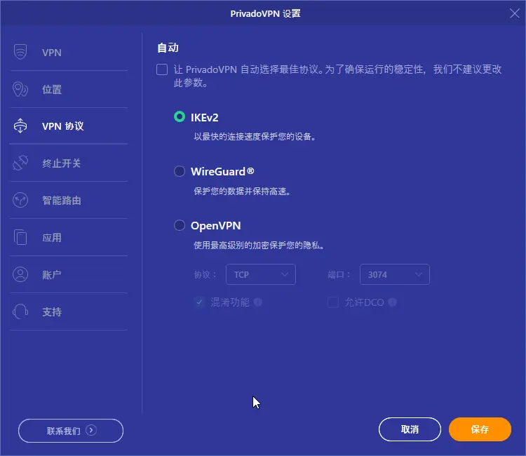

**IKEv2：**强调稳定性和移动性，适合频繁切换网络的用户。

**WireGuard：**注重速度和简洁性，是PrivadoVPN中平衡速度与安全的最佳选择。

**OpenVPN：**以灵活性和安全性著称，几乎支持所有操作系统，被视为可靠的通用协议，但速度可能不如其他两者，尤其在高负载时。

三种协议中小伙伴可根据自己本地情况自由选择，就是那个能顺利上网用哪个，那个好使用哪个。

测试过程中使用IKEv2，WireGuard两种协议时，经常有连不上的情况，如果您也有类似的问题，建议使用第三种OpenVPN协议，协议选TCP协议或UDP协议都可以，需要更高的可靠性选TCP，需要更快的速度选UDP。

> 更多说明：[https://support.privadovpn.com/kb/article/821-what-is-the-difference-between-udp-tcp/）](https://support.privadovpn.com/kb/article/821-what-is-the-difference-between-udp-tcp/%EF%BC%89%EF%BC%8C%E5%86%8D%E5%8B%BE%E9%80%89%E6%B7%B7%E6%B7%86%E5%8A%9F%E8%83%BD%E8%BF%9B%E4%B8%80%E6%AD%A5%E5%A2%9E%E5%BC%BA%E4%BA%86%E7%BD%91%E7%BB%9C%E5%AE%89%E5%85%A8%E6%80%A7%EF%BC%8C%E9%80%9A%E5%B8%B8%E8%BF%99%E6%A0%B7%E8%AE%BE%E7%BD%AE%E9%83%BD%E5%8F%AF%E6%AD%A3%E5%B8%B8%E4%B8%8A%E7%BD%91%E3%80%82)
> 

建议：勾选混淆功能进一步增强了网络安全性，通常这样设置都可正常上网。

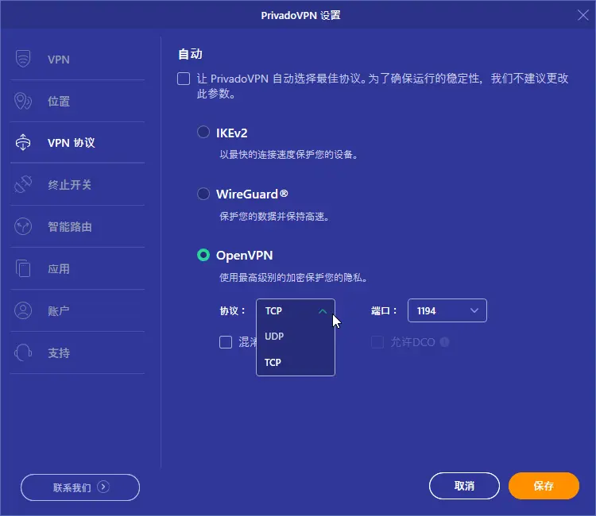

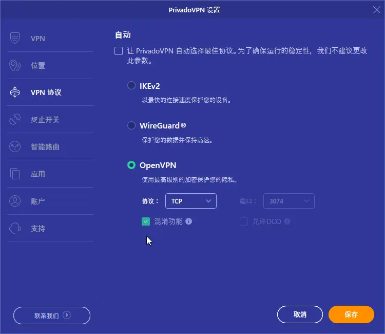

### 3.4、开启Socks5代理

> Socks5代理属于付费版中的功能，并且设置Socks5不在客户端中，需登录PrivadoVPN[管理后台](https://app.privadovpn.com)
> 

登录后我们能看到这个界面

点左侧SOCKS5 Proxy可以看到设置好的代理信息

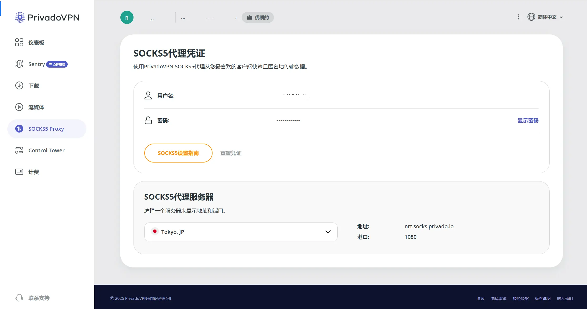

使用socks5代理时，会用到这里的用户名和密码信息，比如为X-UI添加socks5代理时。

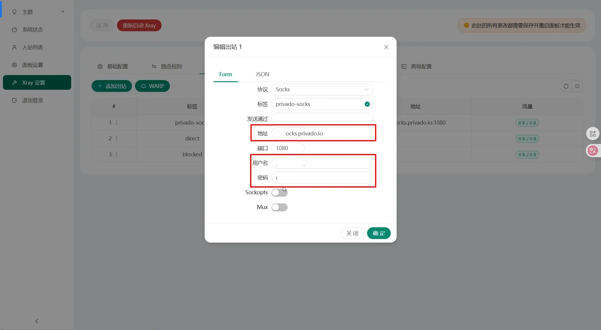

PrivadoVPN提供了七十多个不同国家可用的代理服务器，可根据需要自行选择。

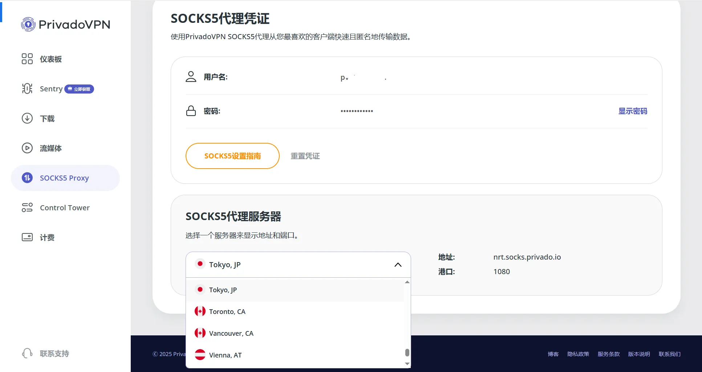

> Socks5包含的国家（美国，加拿大，新西兰，英国，法国，德国，澳大利亚，日本，韩国，新加坡，瑞士，瑞典，香港，台湾，泰国，印度，巴西，荷兰，希腊，墨西哥，意大利，菲律宾，塞尔维亚，布拉迪斯拉发，比利时，罗马尼亚，维也纳，匈牙利，阿根廷，丹麦，芬兰，土耳其，以色列，南非，马来西亚，乌克兰，葡萄牙，西班牙，斯洛文尼亚，挪威，捷克，冰岛，拉脱维亚，爱沙尼亚，波兰）
> 

## 4、选择PrivadoVPN理由

代理工具有许多，之所以选择它，最主要的原因：

一、Privado一个工具就能实现正常注册使用Talkatone，无需考虑网络约束步骤少，简单方便快捷。

二、Privado是一款可长期免费使用的网络工具，每月都有10GB的高速免费数据，而且作为免费版本有更多的服务器节点可选

三、付费版本每月1.11美金还不到8元人民币，相较其他知名付费网络工具价格亲民许多

四、看重了它的Socks5代理功能，可设置选择的国家多达七十几个，设置好后方便添加到X-

<aside>
💡

总的来说，PrivadoVPN 是一个注重隐私、适合流媒体和预算有限用户的 VPN，尤其是其免费计划在同类产品中表现出色。虽在我本地测试使用非常流畅，但众所周知的网络原因，并不能一定保证所有地区都适用，只是作为一种更简洁的替代方法分享给大家，希望能解决小伙伴注册及登录难题。如果您本地无法正常使用这个方法，可看看下面这期视频，其中分享了另外注册登录养号的方法。

</aside>

[https://www.youtube.com/watch?v=1mO5KKC2JzE&t=2s](https://www.youtube.com/watch?v=1mO5KKC2JzE&t=2s)

[ 文字版 ] ： [一美元的美国永久电话卡Talkatone，国内用户注册安装和使用](https://www.smallstep.one/article/talkatone)

# **[实用工具]**

**1、自用VPN工具**（PrivadoVPN）：[https://s.ospace.top/PrivadoVPN](https://s.ospace.top/PrivadoVPN)
零日志，受瑞士隐私法保护，支持中文界面，每月10G免费流量，支持Talkatone注册和登录，
支持：Windows，Android，macOS，ios，FireTV，AndroidTV，tvOS，Chrome等多种客户端。
付费用户：支持无限流量，无限设备，67城市的服务器，最多 10 个设备同时连接，以及Socks5代理，广告拦截器，防病毒扫描等更多功能。
12+3个月：1.33美金/月，24+3个月：1.11美金/月，1个月计划：10.99美金/月。

**2、自用机场订阅Mitce**：[https://s.ospace.top/3tps6w](https://s.ospace.top/3tps6w)
100GB/0.60美金/月、500GB/1.2美金/月、1000GB/2美金/月，不计量套餐/3美金，四款套餐可选，
包含住宅IP链路，支持多种客户端订阅，注册、养号、上网好帮手。
9折优惠码：（**S4E6U9**）

**3、Eskimo流量卡**：
[https://s.ospace.top/mw9qyz](https://s.ospace.top/mw9qyz)
邀请码：**BD995** 得500MB两年有效期的免费全球数据流量。
Eskimo是流量卡不含号码，支持100多个国家/地区漫游，从第一次激活使用流量开始计时，长达2年有效期，并且非免费赠送流量可转送到其它Eskimo账户。
购买中国区域流量或全球流量，在中国使用走的是新加坡网络链路，获取的是新加坡的原生住宅IP，非常适合申请国外应用及保号。

**4、ReadteaGO流量卡**:
ReadteaGO链接: [https://esim.redteago.com/?c=i5oq82b3](https://esim.redteago.com/?c=i5oq82b3)
ReadteaGO优惠码（**5% 折扣**）：RTGF8F49L

**5、域名注册Namesilo**：[https://www.namesilo.com/](https://www.namesilo.com/) （Coupons优惠码：**092368xb**）

**6、SMS-Activate**优惠链接：[https://s.ospace.top/9tzyrx](https://s.ospace.top/9tzyrx)

**7、Elevenlabs AI生成语音**：[https://try.elevenlabs.io/6xlgbhoqxkc8](https://try.elevenlabs.io/6xlgbhoqxkc8)