

[ 【 **Youtube上观看** 】 ](https://youtube.com/watch?v=1mO5KKC2JzE)

## 前期准备

国内注册Talkatone之前需要先解决两个网络问题，一是网络访问的区域要符合Talkatone的要求，二是IP属性要符合住在IP的要求，后面我们会说到怎么解决这两个问题。

> **区域要求：**美国、加拿大、墨西哥、澳大利亚、新西兰、南非、德国、英国、法国、意大利、瑞典、瑞士、西班牙、日本、韩国、新加坡
**IP属性要求：**住宅IP
> 

## 应用下载和工具

**[ Talkatone 官网：]**[https://www.talkatone.com/](https://www.talkatone.com/)

**[ Android 版本：]**[https://play.google.com/store/apps/details?id=com.talkatone.android&hl=en](https://play.google.com/store/apps/details?id=com.talkatone.android&hl=en)

**[ iOS 版本：]**[https://itunes.apple.com/us/app/talkatone-free-group-sms-texting/id397648381?mt=8](https://itunes.apple.com/us/app/talkatone-free-group-sms-texting/id397648381?mt=8)

**[ 可拨打的国家或地区：]**[http://www.talkatone.com/intl-subscription.html](http://www.talkatone.com/intl-subscription.html)

**[ 通话费率：]**[http://www.talkatone.com/intl-calling-rates.html](http://www.talkatone.com/intl-calling-rates.html)

**[ 实体账号检测网站：]**[https://freecarrierlookup.com/](https://freecarrierlookup.com/)

## 简介

Talkatone是一款主要面对美国和加拿大地区用户的电话应用，可免费获得一个美区电话号码，可免费拨打美国加拿移动电话和固定电话，通过购买信用点数还可以拨打任意国家的电话，开启全球短信免费接收功能。在美区Talkatone属于实体号码，能注册chatGpt、Telegram、gmail，tiktok，paypal等虚拟号码无法注册的应用。

## 功能特点

1、能免费拨打美国和加拿大地区的移动电话和固定电话

2、可免费收发美国加拿大地区短信

3、一次性支付0.99美元就可永久开启全球短信接收功能，包含的60积分还可用于拨打全球电话

4、支持蜂窝数据或WiFi数据接打电话收发短信，没有漫游费用

5、在美国地区被识别为实体号码，能注册虚拟号码无法注册的应用

## 国内注册注意事项

国内网友注册时至少需要满足下面两个条件

### 1、Talk atone注册区域要求要符合

注册Talkatone时，网络环境须在允许的区域

Talkatone目前只对（美国、加拿大、墨西哥、澳大利亚、新西兰、南非、德国、英国、法国、意大利、瑞典、瑞士、西班牙、日本、韩国、新加坡）这些地区开放使用，因此注册过程中的网络环境要切换到上述区域

### 2、网络IP属性要符合

注册时网络环境要在Talkatone运行的区域外，网络访问IP也要在同一个区域，并且最好是[住宅IP](https://www.smallstep.one/article/yuansheng-ip)，比如：使用的是新加坡电信的网络，那IP地址也得是新加坡电信的IP，而且是[住宅IP](https://www.smallstep.one/article/yuansheng-ip)。这里要求是住宅IP主要是为的保证能成功注册，如果觉得自己的网络环境很好，也可尝试在自己的网络环境中进行注册。如果没有合适的网络环境可参考下面分享的网络环境。

**什么是住宅IP：type类型是isp的就是住宅IP**

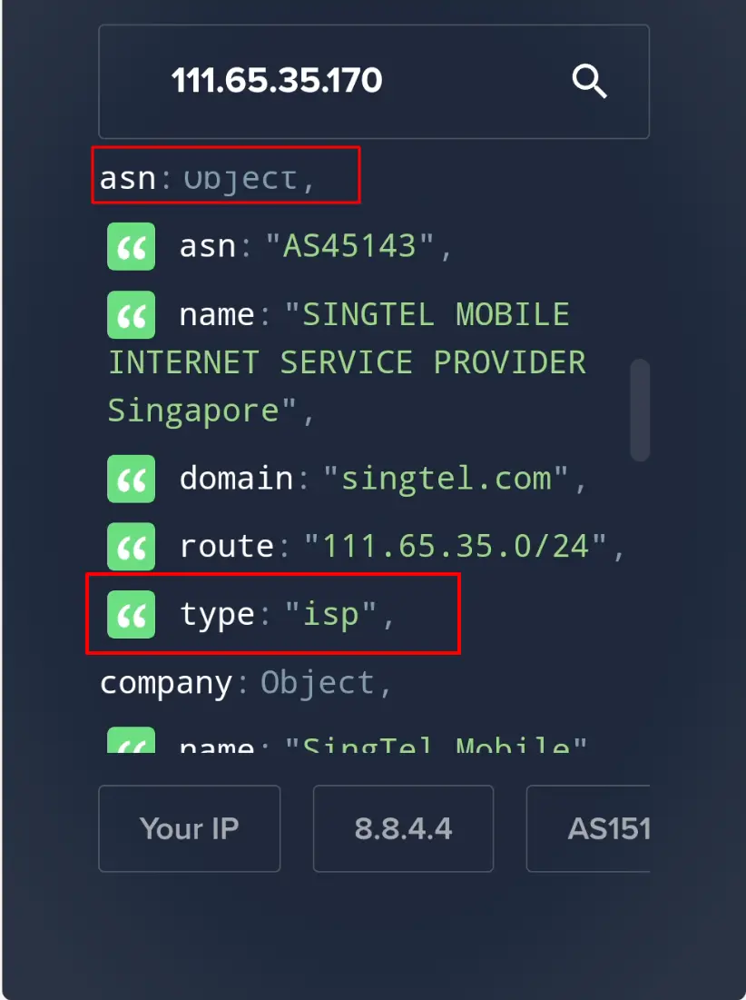
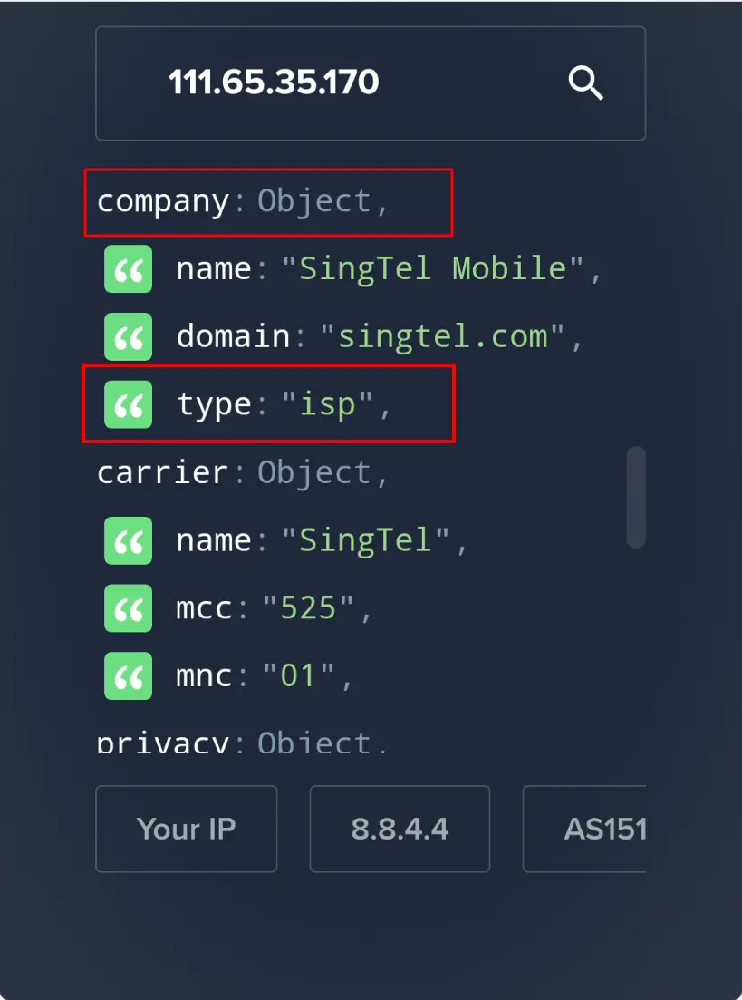

### 3、适合注册的网络环境

注册Talkatone时对网络的要求比较严格，如果身在Talkatone允许的地区，没啥要求直接使用当地网络直接注册就好，如果是在国内注册，需使用工具满足所在区域和住宅IP这两项要求后，才能正常注册。这里分享两种方式，作为抛砖引玉提供一个解题思路。一是使用手机蜂窝数据去注册，二是使用带有住宅IP的机场流量去注册。两种方式各有各的优势和缺点，小伙伴可自行斟酌选择。或使用自己熟悉的网络环境。

#### 3.1、使用蜂窝数据

蜂窝数据指的是手机号码自带的数据，或者是运营商推出的纯流量数据。比如：[Eskimo](https://www.smallstep.one/article/eskimo) ****流量卡或其他流量卡，分享Eskimo是因为它是新加坡电信针对旅游及商务人士推出的，可多国漫游的纯流量卡，可直接写入支持eSIM的手机或第三方的eSIM卡中（比如曾经分享的让国行手机秒变eSIM手机的【[**ESTK](https://www.smallstep.one/article/estk-card-setup.html)】**卡），有两年的超长有效期，兼具满足地区和住宅IP两项属性，能完全满足Talkatone的注册要求。使用Eskimo的难度在于它是eSIM，需要支持eSIM的手机或拥有第三方支持写入eSIM的外置eSIM卡才可以使用，像上面提到的estk卡。

> **Eskimo流量卡：[https://s.ospace.top/mw9qyz](https://s.ospace.top/mw9qyz)**
邀请码：**BD995** 输入邀请码可**得500MB**两年有效期的**免费全球数据流量**。
购买中国区域流量或全球流量，在中国使用的是新加坡网络链路，获取的是新加坡的原生住宅IP，非常适合注册Talkatone，登录及保号。
> 

#### 3.2、使用带住宅IP的机场订阅链接

机场有很多，但我们通常使用的机场，VPN，哪怕是自建机场，绝大部分也都属于机房IP，拥有住宅IP的机场少之又少，就算有也贵的离谱，自建机场中虽然可通过购买住宅ip的方式解决，但也有设置上的难度，并且还要满足区域的要求，可以说是难上加难。如果您是新手不熟悉网络环境搭建，建议使用蜂窝数据注册Talkatone这种方法，与自建网络环境相比会简单许多，与购买拥有住宅IP的机场来说便宜很多。

**什么是机房IP：type是hosting或business的都属于机房IP**

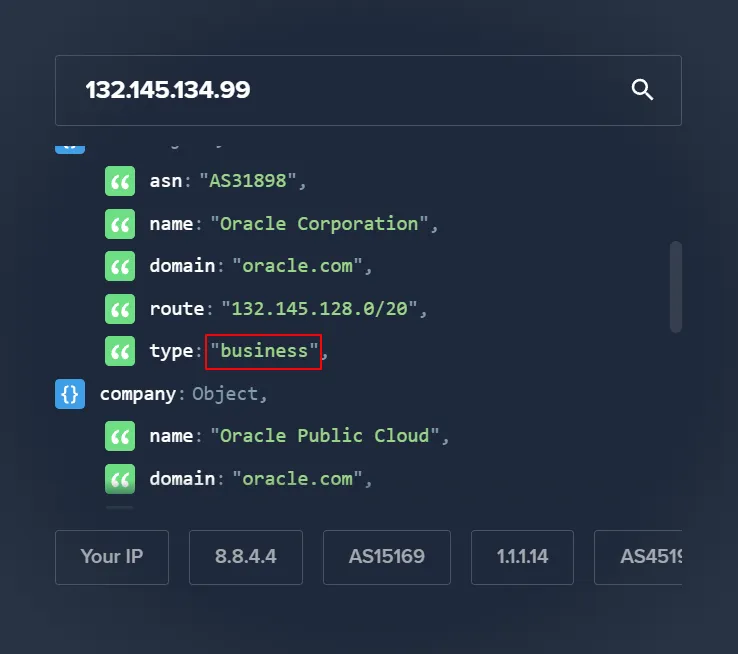

由于目前还未遇到能满足条件且更具性价比的机场，这里就不推荐了，小伙伴可自行搜索，也欢迎小伙伴积极反馈。但这里会分享一款拥有住宅IP可用于登录保号的的机场Mitce，他家能提供香港区域的住宅IP订阅链接具有双ISP属性，注意啦，虽然是拥有双ISP的住宅IP，但由于是属于香港地区的，因此这个住宅IP链路并不适合注册Talkatone，**只适用于登录Talkatone和养号**。

> **Mitce：[https://s.ospace.top/3tps6w](https://s.ospace.top/3tps6w)**
100GB/$0.60/月、500GB/$1.2/月、1000GB/$2/月，不计量套餐/$3，四款套餐可选
包含HK住宅IP链路，支持多种客户端订阅
9折优惠码：**S4E6U9**
> 

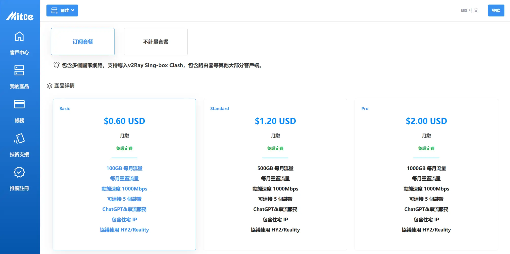

## 软件获取

Talkatone官方只提供了手机端的应用程序，目前还不支持在电脑端安装使用，而且这款应用在国内的应用市场上无法找到。苹果手机需要到美区App Store 下载，安卓手机需到Google Play下载。

注册提醒：从目前测试注册的结果来看，在苹果手机上注册Talkatone更容易成功，包括国航iPhone。安卓上注册成功率很小，至少我这里是这样。[ [**Android 版本](https://www.notion.so/f9984c755c3c426c89958a8baa129bf0?pvs=21) ]  [** [**iOS 版本](https://www.notion.so/Talkatone-141cffff9976803bb6bfd28882328b06?pvs=21) ]**

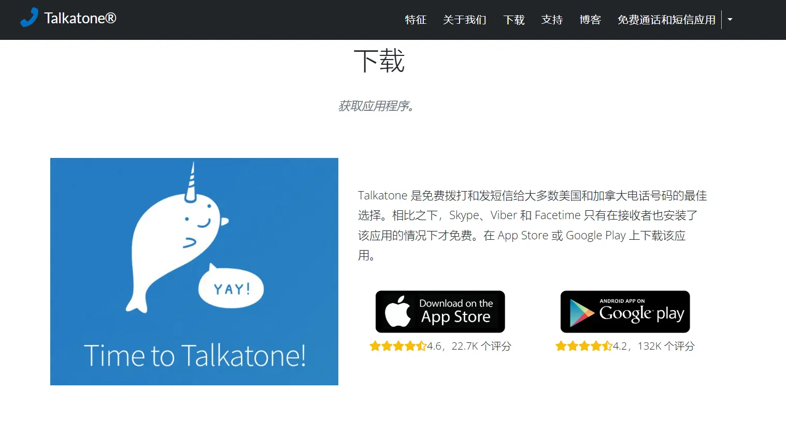

## 注册Talkatone

注册之前一定要先解决区域和住宅IP这两个网络问题，网络问题解决了，注册Talkatone是很简单的，只要确认大于16周岁，验证邮箱，填写姓名年龄这些信息，并选择自己心仪的号码即可完成注册了，如果网络问题没解决，基本上是看不到后面注册内容的。

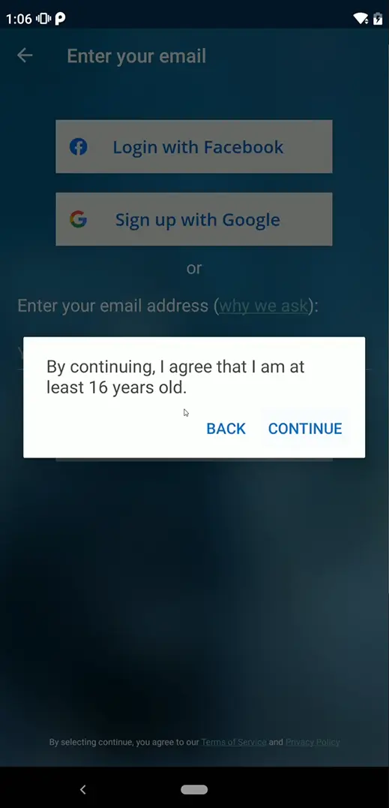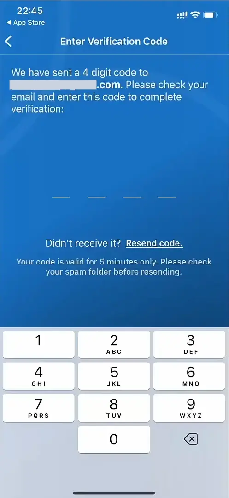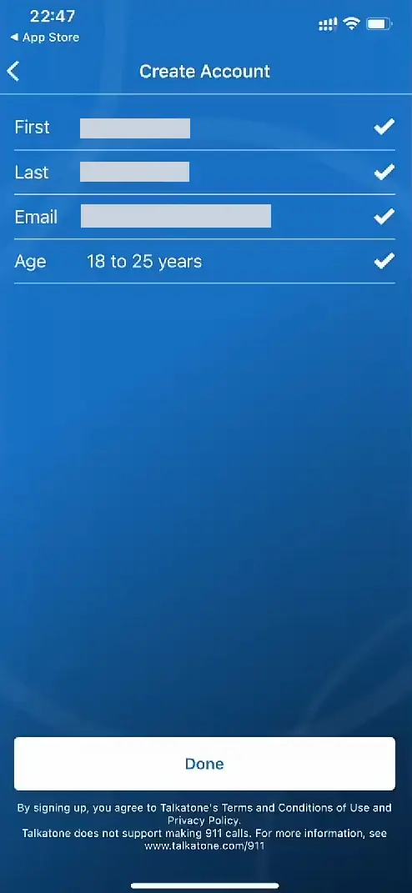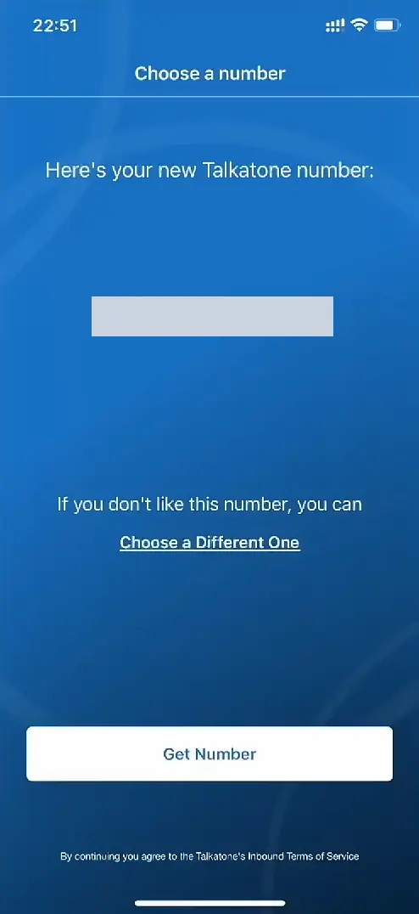

## 使用和保号

### 1、可免费更换一次号码

注册成功后，Talkatone会免费分配一个美国地区的手机号码，如果对这个号码不满意，可通过点击火苗图标或Get a New Number按钮免费更换一次电话号码。

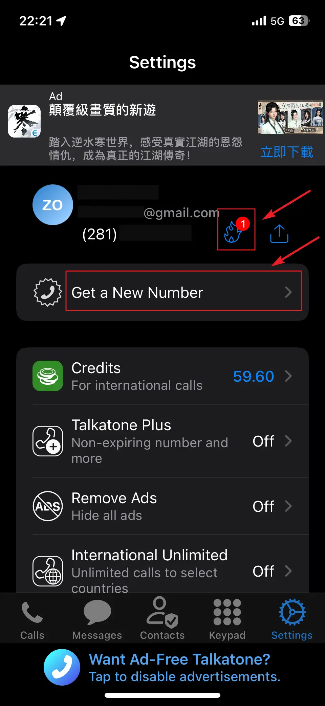
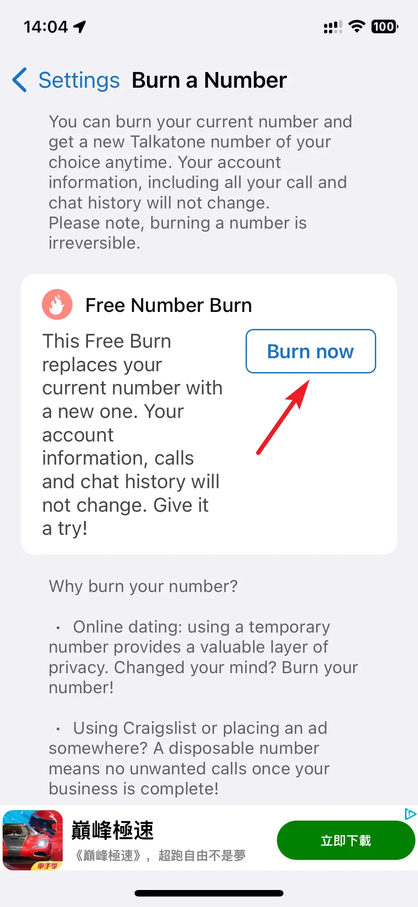

### 2、开通全球短信接收功

初次完成注册后，需购买信用积分开通全球短信接收功能，如果只是为了接收短信，只须支付一次0.99美金购买60个积分即可。开通后免费接收全球短信，美国地区及加拿大地区之间的用户打电话发短信免费，如果需要给美国或加拿大以外地区手机打电话发短信，会产生费用并从积分中扣除。

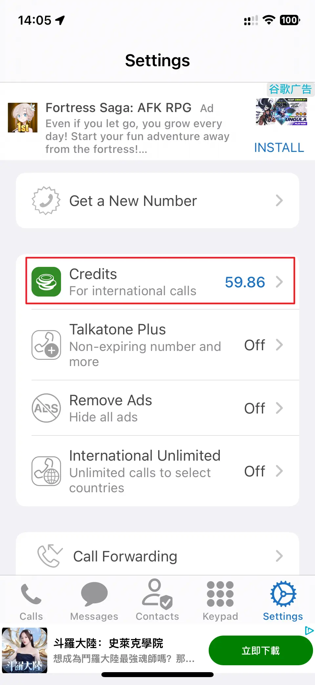
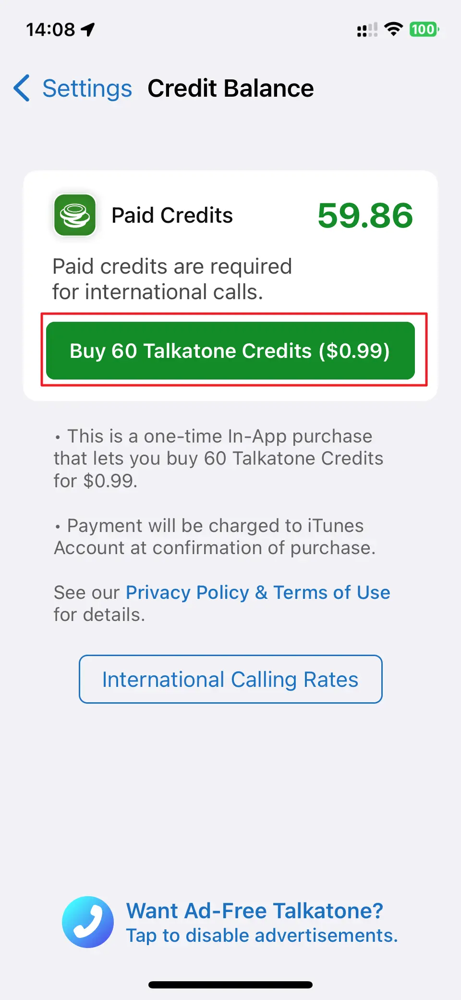

具体费用可通过点击International Calling Rates按钮查看。

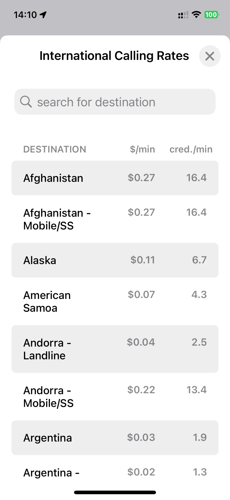
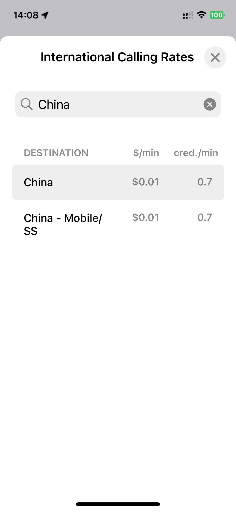

### 3、登录Talkatone

成功注册后，如果在国内使用一定会遇到无法正常登录的问题。测试中发现注册和使用Talkatone对网络的要求不同，注册时要满足区域及住宅IP两个条件，而使用时只要满足住宅IP这条就行，如果使用的是机房IP基本上是无法正常登录的。

**可正常登录的两种方法：**

**一是使用手机号码自带的蜂窝数据登录**，当然这里不包括国内的手机流量，比如离我们最近的港澳的手机流量，比如港区的my3卡，澳门的CTM Sim卡，或者之前提到Eskimo流量卡，它们都是拥有住宅IP属性的流量。

**二是使用拥有住宅IP属性的机场流量登录**。像前面提到的mitce订阅的香港住宅IP链接。

### 4、如何养号

注册完成后，Talkatone每月都会检测用户使用状态，果您30天内没有使用 Talkatone打电话或发短信，Talkatone会从帐户中扣除30个积分，我们购买的60个积分只能维持两个月，看到有许多博主说只扣20积分，查阅帮助文档时官方显示的是30。如果账号30天内没有使用并且少于30积分，申请的号码将被停用并收回，但是也大家不用担心，回收之前Talkatone会发送到一封通知邮件。因此**要想保留号码，需要30天内打一个电话或发一封短信**，电话可以打给另一个Talkatone号码，也可以打amazon等平台美区的客服电话，要么保证账户内积分大于30，要么3.99美金开启Talkatone Plus订阅。

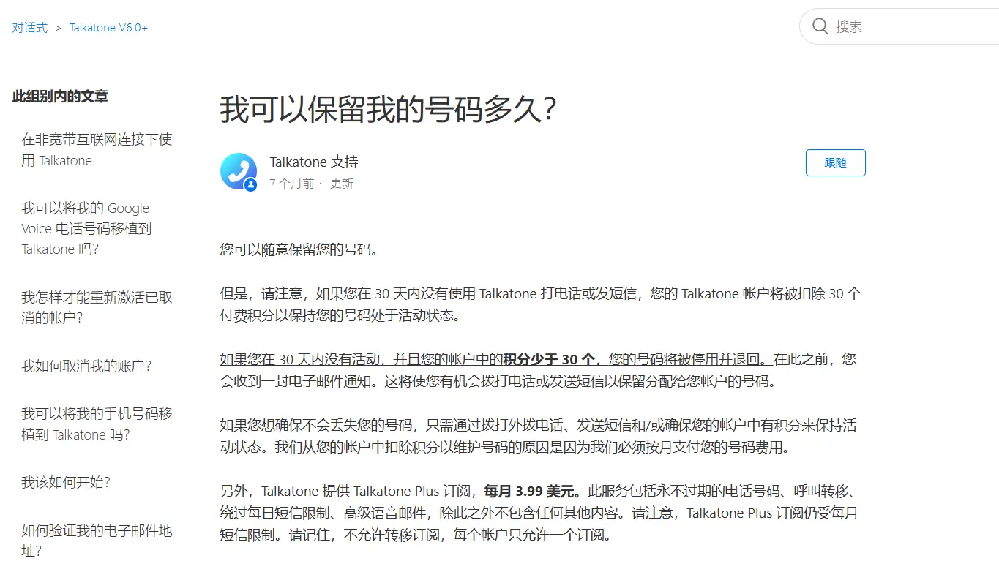

## [ 实用工具 ]

**1、自用VPN工具（PrivadoVPN）**： 
[https://s.ospace.top/PrivadoVPN](https://s.ospace.top/PrivadoVPN) 
零日志，受瑞士隐私法保护，支持中文界面，每月10G免费流量，支持Talkatone注册和登录，
支持：Windows，Android，macOS，ios，FireTV，AndroidTV，tvOS，Chrome等多种客户端。
付费用户：支持无限流量，无限设备，67城市的服务器，最多 10 个设备同时连接，以及Socks5代理，广告拦截器，防病毒扫描等更多功能。
12+3个月：1.33美金/月，24+3个月：1.11美金/月，1个月计划：10.99美金/月。

**2、自用机场订阅Mitce**： 
[https://s.ospace.top/3tps6w](https://s.ospace.top/3tps6w) **9折优惠码：**（**S4E6U9**） 
100GB/0.60美金/月、500GB/1.2美金/月、1000GB/2美金/月，不计量套餐/3美金，四款套餐可选，
包含住宅IP链路，支持多种客户端订阅，注册、养号、上网好帮手。

**3、Eskimo流量卡：**  
[https://s.ospace.top/mw9qyz](https://s.ospace.top/mw9qyz) **邀请码：BD995**  
注册得500MB两年有效期的免费全球数据流量。
Eskimo是流量卡不含号码，支持100多个国家/地区漫游，从第一次激活使用流量开始计时，长达2年有效期，并且非免费赠送流量可转送到其它Eskimo账户。
购买中国区域流量或全球流量，在中国使用走的是新加坡网络链路，获取的是新加坡的原生住宅IP，非常适合申请国外应用及保号。

**4、ReadteaGO流量卡:** 
ReadteaGO链接: [https://esim.redteago.com/?c=i5oq82b3](https://esim.redteago.com/?c=i5oq82b3) 
ReadteaGO优惠码（5% 折扣）：**RTGF8F49L**

**5、域名注册Namesilo：**[https://www.namesilo.com](https://www.namesilo.com/?rid=f5e9423mw) ****（**oupons优惠码**：**092368xb** ） 
**6、SMS-Activate优惠链接**：[https://s.ospace.top/9tzyrx](https://s.ospace.top/9tzyrx) 
**7、Elevenlabs AI生成语音**：[https://try.elevenlabs.io/6xlgbhoqxkc8](https://try.elevenlabs.io/6xlgbhoqxkc8) 