<aside>
😀 享怎样在NameSilo账户之间互转域名。包括前期准备和注意事项，分步说明，登录，邮箱验证，域名解锁，推送域名，查看正确接收用户名的方法，以及解答域名有效期和是否重复收费等问题。如果您是新手，只要按照视频步骤操作，也能顺利在NameSilo账户之间互转域名。

</aside>

> [NameSilo](https://www.namesilo.com/?rid=f5e9423mw) 是知名的域名注册商，以低价和透明著称。许多用户在这个平台购买域名，并且拥有多个Namesilo账户。希望在不同的 [NameSilo](https://www.namesilo.com/?rid=f5e9423mw) 账户之间互转域名，却不知该怎样操作。担心转移推送过程中域名有效期作废，且会重复缴费等问题。今天我们就实际测试下这个转移过程，手把手带大家一步步操作。哪怕您是新手，只要按步骤操作，一样可以轻松在[NameSilo](https://www.namesilo.com/?rid=f5e9423mw)账户间互转域名。
> 



[ 【 **Youtube上观看** 】 ](https://youtube.com/watch?v=FM4aYOQki_M)

# 前期准备及注意事项

> 说明：如果是转移到其他注册商，会有ICANN的60天锁定期规则限制。（比如从NameSilo到GoDaddy）。但在[NameSilo](https://www.namesilo.com/?rid=f5e9423mw)账户之间转移域名（称为“Domain Push”）是一种内部转移方式，免费且快速，通常无需等待ICANN的60天锁定期。但需要注意以下几点，特别是前两项。
> 

**1、接收账户邮箱需验证：**

接收方的默认联系人邮箱必须已验证。如果未验证，转移会失败

**2、域名必须解锁**

转移前确保域名处于解锁状态（即图标为灰色锁，不是绿色）。如果锁定，需手动解锁。具体如何验证和解锁下面会详细说明，小伙伴耐心往下看。

**3、丢失控制权**

转移完成后，发送账户将完全失去对域名的控制，域名会自动在接收账户中锁定。

**4、免费但不可逆**

整个过程免费，但一旦提交，无法撤销。如果想找回需到接收账户做同样的Push操作。

**5、账户安全**

确保知道接收方的确切用户名，并使用强密码保护账户。一旦写错账户名称，相当于域名免费送人。
**6、域名到期**

转移不影响域名到期日期，但建议转移前检查域名状态，避免过期。

# 操作步骤

> 整个过程在发送账户中操作，接收方无需主动参与（除非邮箱未验证），因此小伙伴一定先验证邮箱。
> 

在左侧菜单或顶部导航中，点击“**My Account**” > “**Contact Manager**”（联系人管理）。

## 第一步、登录发送账户：

使用您的[NameSilo](https://www.namesilo.com/?rid=f5e9423mw)账户登录官网（[www.namesilo.com](https://www.namesilo.com/?rid=f5e9423mw)）。

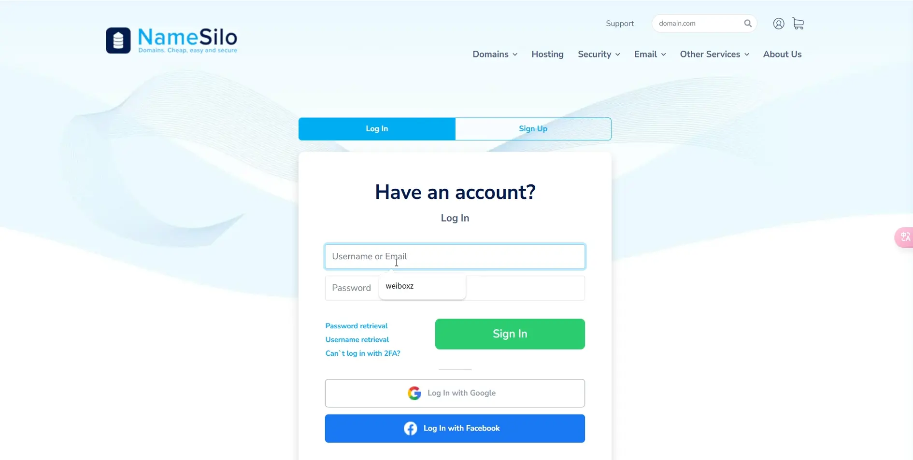

## 第二步、邮箱验证：

### 1、打开联系人管理页面

顶部导航中，点击头像然后选择**My Account**(我的账户)，或直接点击导航栏中的**My Account**(我的账户)，然后点击左侧l **Contact Manager**（联系人管理）。

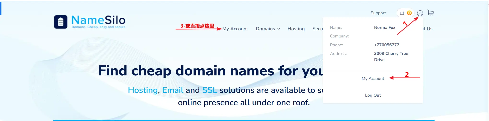

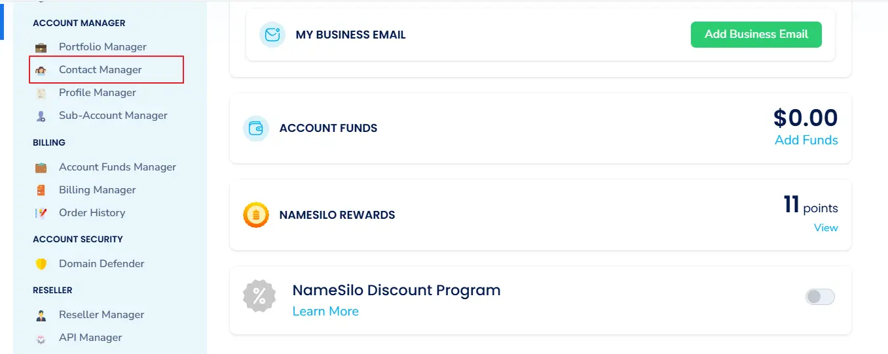

### 2、打开邮箱验证选项卡

在“**Contact Manager**”页面，点击“**Email Verification Manager**”（邮箱验证管理）标签

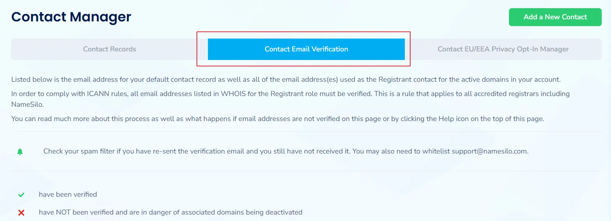

### 3、查看邮箱验证状态

往下拉看到注册的邮箱，如果还未验证会看到邮箱图标，如果已经验证这里显示Verified。

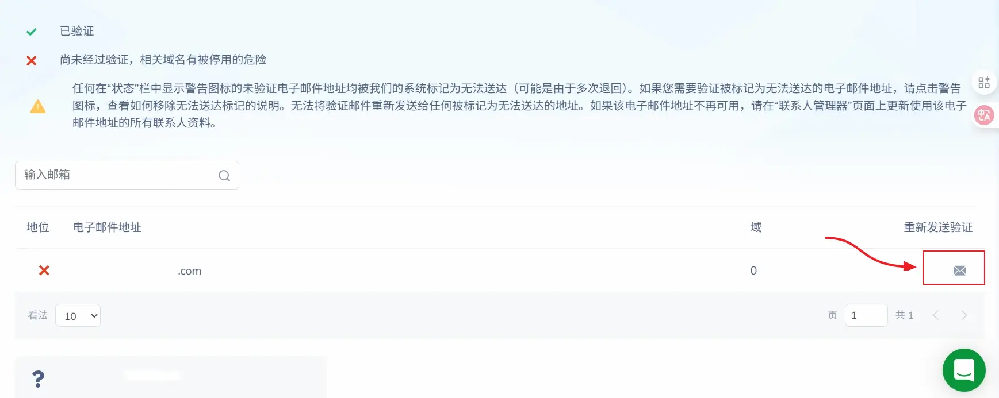

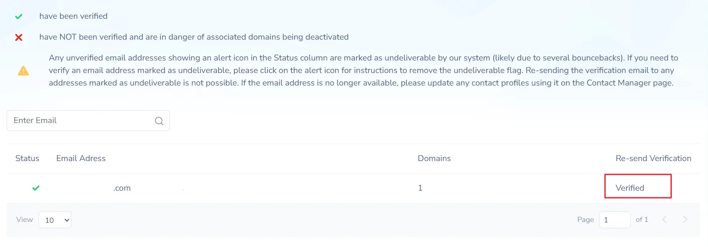

### 4、邮件验证的两种方法

通常在初次注册[NameSilo](https://www.namesilo.com/?rid=f5e9423mw)账号是时，会收到一封验证邮件，其中包含了两种验证方法，

**第一种方法：**一是点击链接直接验证直接验证。

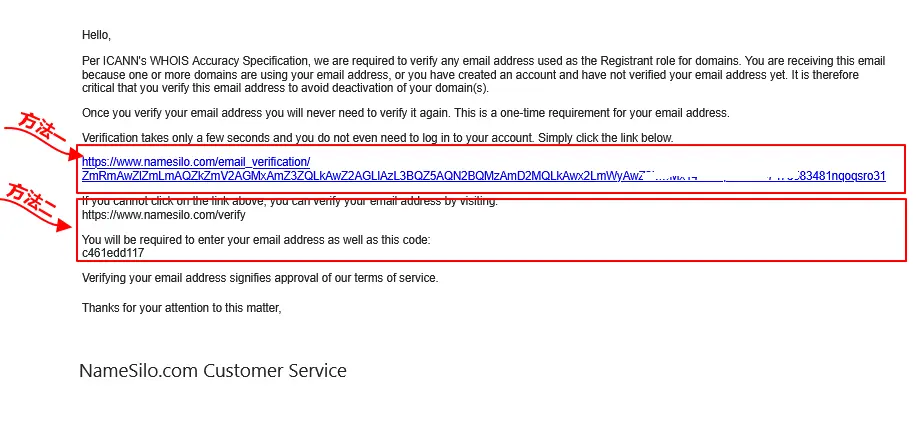

**第二种方法：**二是访问这个网址（[https://www.namesilo.com/verify](https://www.namesilo.com/verify) ）输入邮件中提供的验证码进行验证。在验证页面中输入注册的邮箱和验证码进行验证。如果找不到之前的验证邮件可点这里重发。验证完成后会由Re-send Verification状态，改为Verified状态。

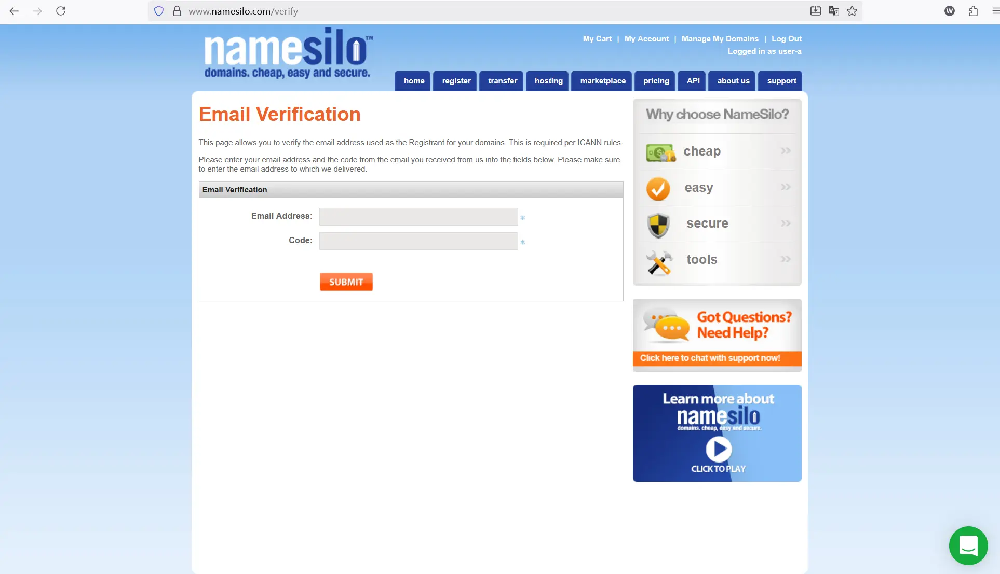

## 第三步、解锁域名：

### 1、打开域名管理页面

点击“**Domain Manager**”或“**Manage**”打开（域名管理）页面

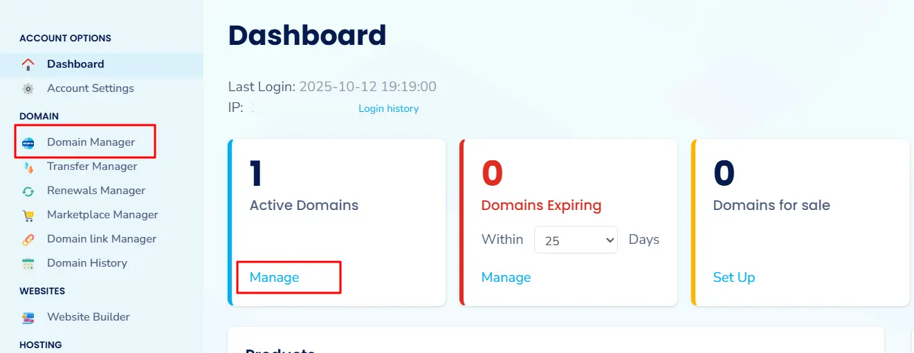

### 2、选择要解锁的域名

在域名列表中，找到要转移的域名并点击进入。

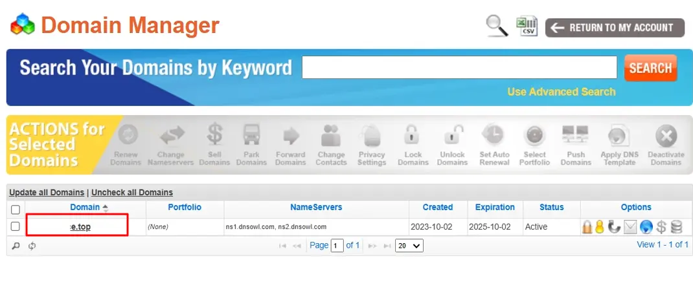

### 3、解锁域名

查看锁图标：如果是**绿色**（**锁定**），点击图标切换为灰色（**解锁**）。

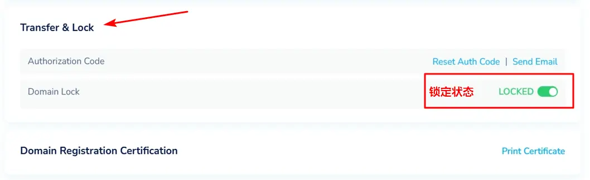

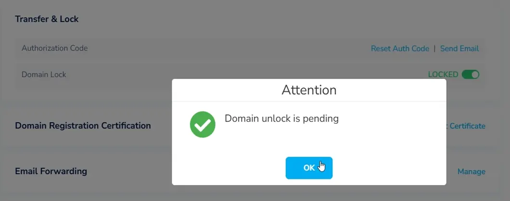

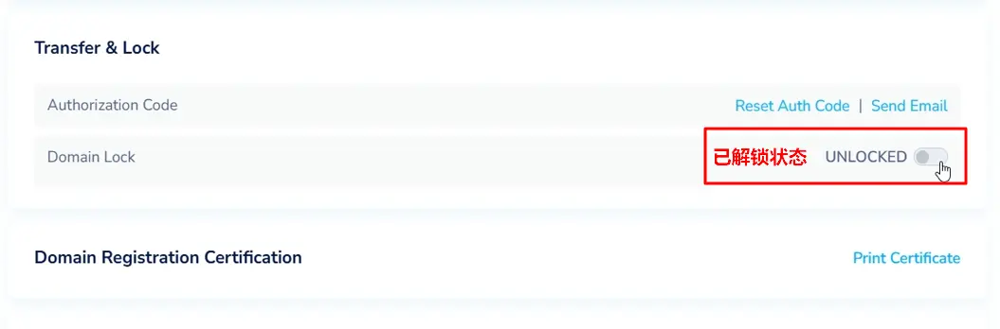

## 第四步、选中域名：

返回域名列表，在域名左侧的复选框中勾选要转移的域名（支持多选）。

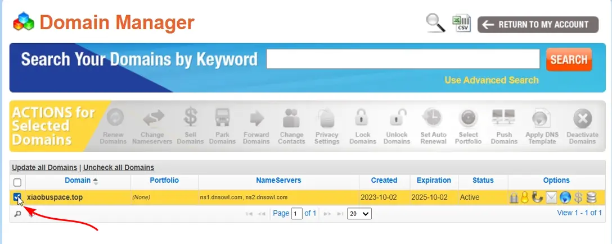

## 第五步、发起推送：

在页面顶部“ACTIONS for Selected Domains”部分，点击“**Push Domains**”图标（推送域名）。

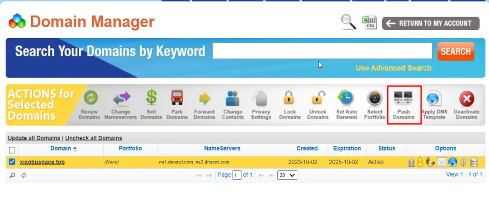

## 第六步、输入信息并提交：

在弹出的页面中，输入您的[NameSilo](https://www.namesilo.com/?rid=f5e9423mw)账户密码。
输入接收方的[NameSilo](https://www.namesilo.com/?rid=f5e9423mw)用户名（**Username**，不是邮箱）。

特别注意：密码与用户名一定不要写错。密码是当前账号的登录密码，不是接收方的登录密码。UserName 这个用户名不是页面显示的用户名，也不是邮箱名，是注册时系统生成或自定义的用户名。

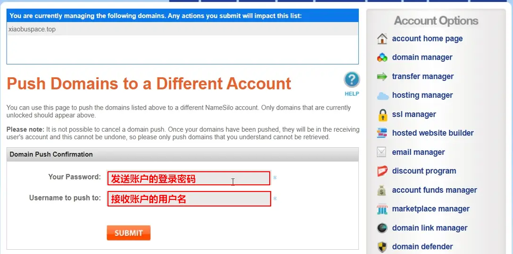

**如何查看用户名：**

### 1、进入账户设置

点击顶部导航中的“**My Account”**打开**Dashboard**页面。

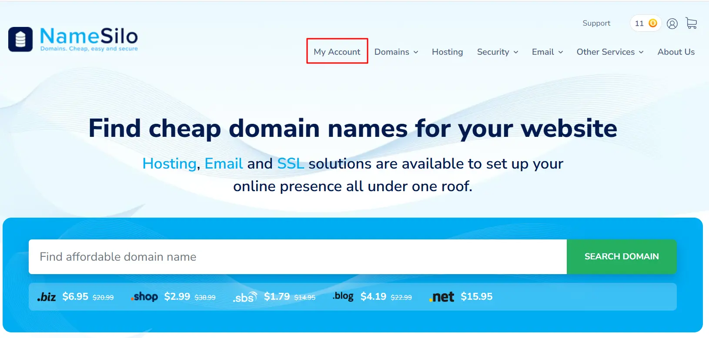

### 2、进入账户管理页面

**点击“Account Settings”** 或 “**Manage”**

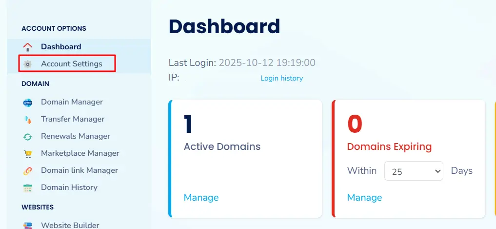

### 3、打开安全选项卡（“Securiy”）

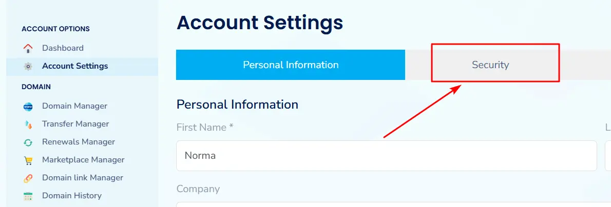

### 4、查看用户名

这里看到的才是推送域名要用到的用户名。这里一定要与接收方确认清楚。

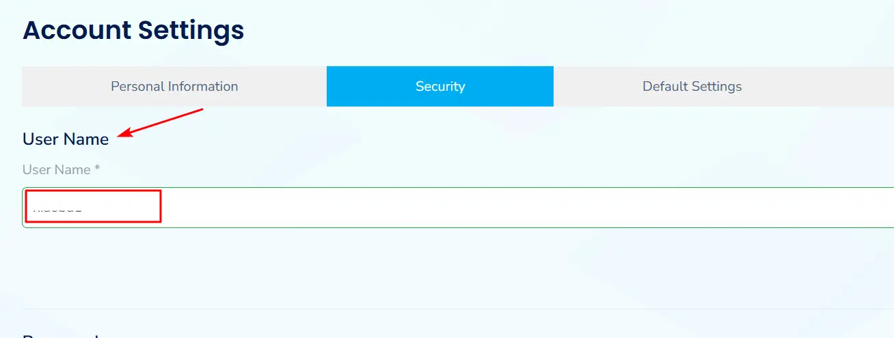

## 第七步、确认转移：

点击“**SUBMIT**”确认提交后，系统会立即处理，域名会转移到接收账户。发送账户中能看到发送成功提示。接收方可在他们的Domain Manager中看到域名，并可自定义设置（如DNS、隐私保护）。

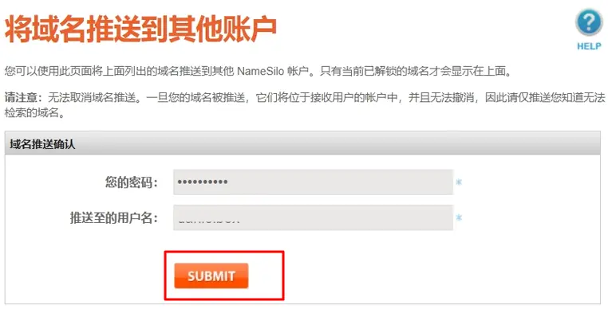

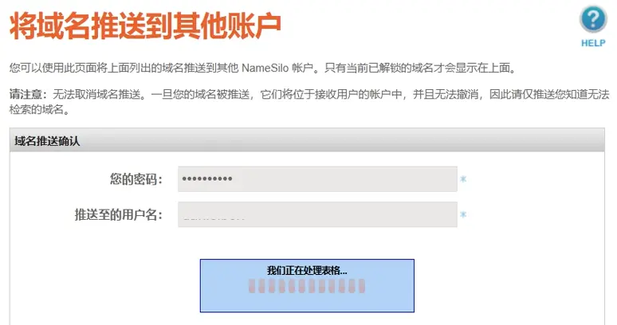

看到如下提示说明域名以及成功推送到对方的NameSilo账户中

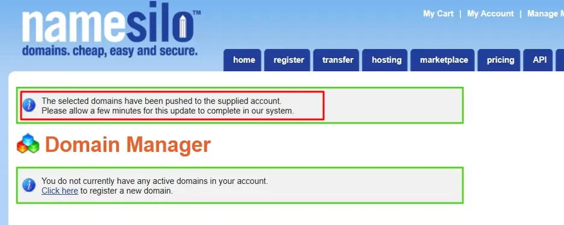

# 域名有效期及是否重复缴费

**域名转移成功后，之前剩余的有效期依然有效**，**不用担心有效期会作废**。比如域名有效期是2025年10月2号，在2025年8月2号将域名Push到了其他的NameSilo账户中。接收账户中的域名有效期依然是2025年10月2号。**并且**不管是接收方还是发送方都**不会产生任何费用**。如果在接收账户中为域名续费一年或多年，有效期也会在原有日期的基础上延续一年或多年。

=============================================

## [ 实用工具 ]

**1、自用VPN工具（PrivadoVPN）**： 
[https://s.ospace.top/PrivadoVPN](https://s.ospace.top/PrivadoVPN) 
零日志，受瑞士隐私法保护，支持中文界面，每月10G免费流量，支持Talkatone注册和登录，
支持：Windows，Android，macOS，ios，FireTV，AndroidTV，tvOS，Chrome等多种客户端。
付费用户：支持无限流量，无限设备，67城市的服务器，最多 10 个设备同时连接，以及Socks5代理，广告拦截器，防病毒扫描等更多功能。
12+3个月：1.33美金/月，24+3个月：1.11美金/月，1个月计划：10.99美金/月。

**2、自用机场订阅Mitce**： 
[https://s.ospace.top/3tps6w](https://s.ospace.top/3tps6w) **9折优惠码：**（**S4E6U9**） 
100GB/0.60美金/月、500GB/1.2美金/月、1000GB/2美金/月，不计量套餐/3美金，四款套餐可选，
包含住宅IP链路，支持多种客户端订阅，注册、养号、上网好帮手。

**3、Eskimo流量卡：**  
[https://s.ospace.top/mw9qyz](https://s.ospace.top/mw9qyz) **邀请码：BD995**  
注册得500MB两年有效期的免费全球数据流量。
Eskimo是流量卡不含号码，支持100多个国家/地区漫游，从第一次激活使用流量开始计时，长达2年有效期，并且非免费赠送流量可转送到其它Eskimo账户。
购买中国区域流量或全球流量，在中国使用走的是新加坡网络链路，获取的是新加坡的原生住宅IP，非常适合申请国外应用及保号。

**4、ReadteaGO流量卡:** 
ReadteaGO链接: [https://esim.redteago.com/?c=i5oq82b3](https://esim.redteago.com/?c=i5oq82b3) 
ReadteaGO优惠码（5% 折扣）：**RTGF8F49L**

**5、域名注册Namesilo：**[https://www.namesilo.com](https://www.namesilo.com/?rid=f5e9423mw) ****（**oupons优惠码**：**092368xb** ） 
**6、SMS-Activate优惠链接**：[https://s.ospace.top/9tzyrx](https://s.ospace.top/9tzyrx) 
**7、Elevenlabs AI生成语音**：[https://try.elevenlabs.io/6xlgbhoqxkc8](https://try.elevenlabs.io/6xlgbhoqxkc8) 