<aside>
😀 本文主要介绍检测VPS线路质量的简单方法，及工具的使用。让已经购买或想购买VPS的朋友，能通过这些简单的方法了解下网络线路的质量。

</aside>

检测目标：网络延迟 / 网络速度 / 路由跟踪

## 一、测试本地到VPS的延迟情况 windows系统下

### 1、打开命令行窗口

按win+r 在弹出的窗口中输入 cmd 后回车

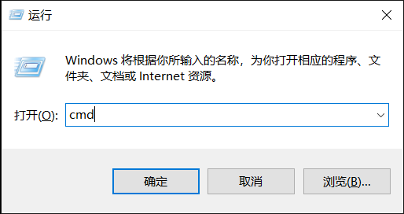

### 2、检测VPS延迟情况

打开窗口中输入ping命令：如：ping 18.154.121.68 -t ，地址换成自己的VPS地址（-t 表示一直不通的运行ping命令，如果想推出按Ctrl+c），时间后面的值越小越好，并且看看是否有丢包情况（下图中丢失后面的数字）。

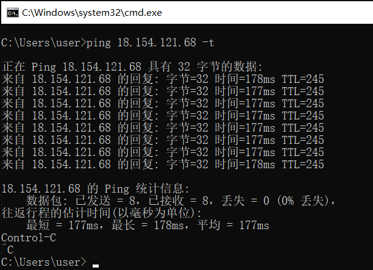

网络检测工具平台：[www.ipip.net](http://www.ipip.net/)  是一个综合的工具平台

## 二、测试全国到VPS的延迟丢包情况

### 方式1：通过IPIP.COM网站检测

[https://tools.ipip.net/ping.php](https://tools.ipip.net/ping.php) **** 网站测试多个国家或地区到VPS的延迟情况

* 1、打开网站点击[工具→Ping]

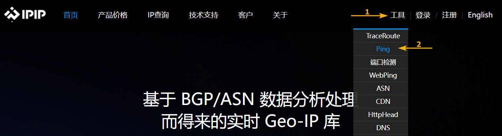

* 2、选自要检测的区域

输入VPS的IP地址，选择国家，点ping按钮开始测试

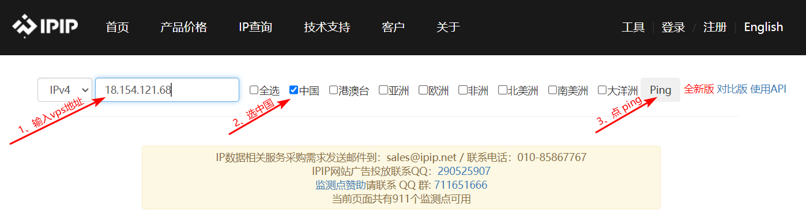

* 3、查看ping值

在列表中可以看到全国多地区返回的延迟情况（可以与自己所在地区进行对照），数值越低越好

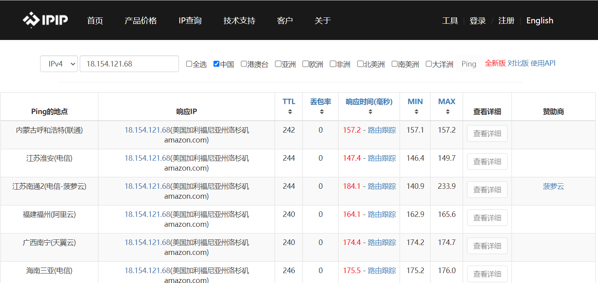

### 方式2：通过PING.PE网站检测

[ping.pe](http://ping.pe/) ****网站测试丢包率及平均延迟情况 

* 1、打开网站，输入vps的ip地址

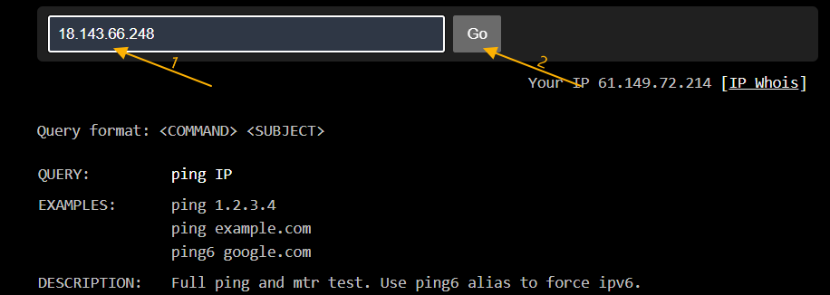

* 2、Loss：丢包率，Avg：平均延迟

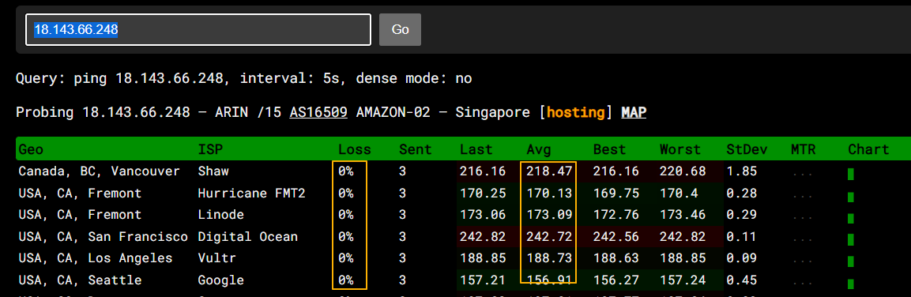

## 三、路由跟踪测试

路由跟踪测试分为去程路由和回程路由两部分，主要查看VPS出国线路及回国线路的质量情况（是直连，是国内绕路，是国外绕路，是CN2线路，是GIA线路）

去程线路：即本地国外VPS的路由，出国方向的线路（比如CN2）

回程线路：即由国外VPS回到国内本地的线路，回程方向的线路（比如GIA）

### 1、去程路由跟踪

为更直观的查看路由情况，这里使用了 [ipip.net](http://ipip.net) 提供的Traceroute工具【BestTrace】（支持多种平台，并且会以节点及图形方式显示去程路由情况） [windows](https://cdn.ipip.net/17mon/besttrace.exe) / [mac](https://apps.apple.com/us/app/best-trace/id1037779758?l=zh&ls=1&mt=12) / [android](https://cdn.ipip.net/17mon/besttrace.apk) / [ios](https://apps.apple.com/cn/app/best-trace/id1026747589?ls=1) / [linux](https://cdn.ipip.net/17mon/besttrace4linux.zip) / 或者到ipip.net官网下载：

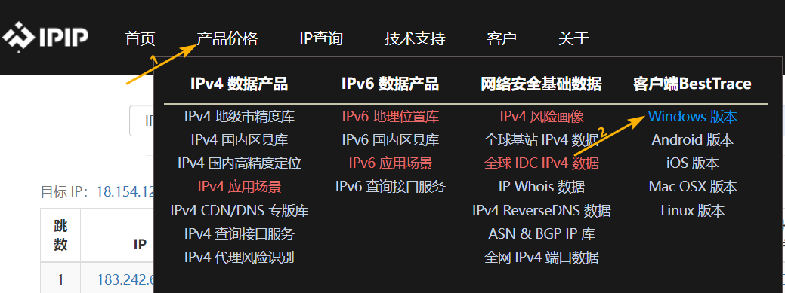

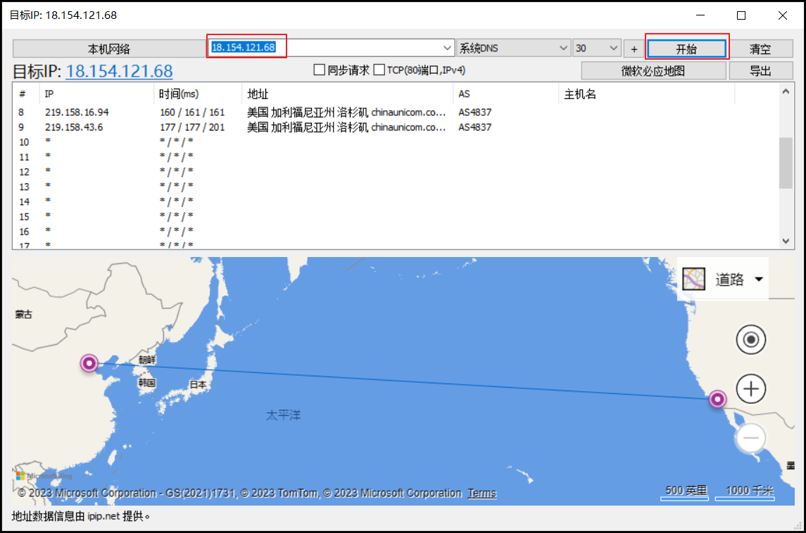

另外使用[https://tools.ipip.net/traceroute.php](https://tools.ipip.net/traceroute.php) 检测国内不同区域到VPS的去程路由情况。

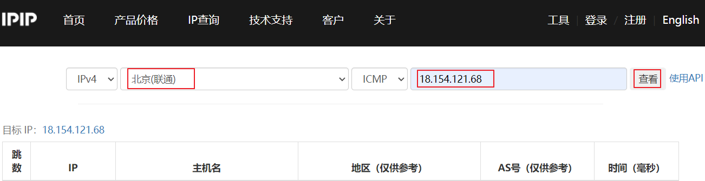

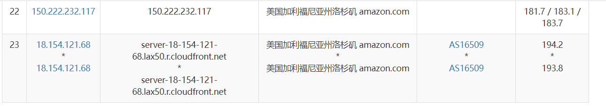

### 2、回程路由跟踪：

即由国外VPS回到国内本地的要经过路由节点，回程路由跟踪需要登录到国外的VPS服务器上才能进行测试。回程线路越好，代理站的访问及下载的速度越好。

* 2.1、查询自己的IP地址：**[http://myip.ipip.net/](http://myip.ipip.net/) 

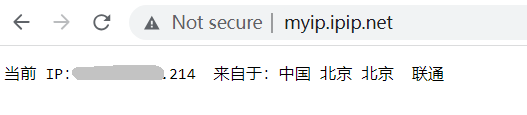

* 2.2、使用SSH工具登录到VPS，然后运行如下代码：**

```jsx
yum install -y wget unzip && wget https://cdn.ipip.net/17mon/besttrace4linux.zip && unzip besttrace4linux.zip && chmod +x  besttrace
```

* 2.3、然后执行以下命令**

```jsx
./besttrace 自己本地ip -g cn
```

## 四、速度测试

### 1、本地测速

* 1.1、以全局模式打开代理软件

* 1.2、运行 [speedtext.net](https://www.speedtest.net/)

### 2、VPS测速

* 2.1、SSH工具登录到VPS后运行如下代码：

```jsx
curl -Lso- https://raw.githubusercontent.com/wn789/Superspeed/master/superbench.sh | bash
```